# <h1 align="center">Laporan Praktikum Modul 1 <br> Code Blocks IDE & Pengenalan Bahasa C++</h1>
<p align="center">HISYAM NURDIATMOKO - 103112400049</p>

## Dasar Teori

Bahasa C++ merupakan bahasa pengembangan dari C yang diciptakan oleh Bjarne Stroustrup, di mana struktur programnya secara fundamental terdiri dari fungsi utama main() dan deklarasi pustaka seperti <iostream> untuk operasi dasar. Di dalam program, digunakan identifier sebagai nama untuk variabel yang menyimpan data dengan tipe tertentu seperti int untuk bilangan bulat atau float untuk desimal dan juga konstanta untuk nilai yang tetap. Interaksi dengan pengguna difasilitasi oleh fungsi input cin dan output cout , sementara alur eksekusi program dikendalikan melalui struktur kondisional seperti if-else atau switch untuk pengambilan keputusan serta perulangan (for, while) untuk menjalankan blok kode berulang kali. Seluruh manipulasi data ini dilakukan dengan berbagai operator, mulai dari aritmatika (+, -), logika (&&, ||), hingga increment (++) dan decrement (--).

## Guided

### Aritmatika

```cpp
#include <iostream>
using namespace std;
int main()
{
    int W, X, Y;
    float Z;
    X = 7;
    Y = 3;
    W = 1;
    Z = (X + Y) / (Y + W);
    cout << "Nilai z = " << Z << endl;
    return 0;
}
```
> Output
> 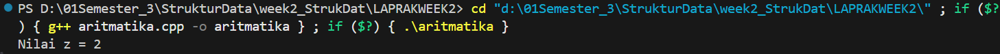

program C++ ini bertujuan untuk melakukan sebuah perhitungan aritmatika sederhana dan menampilkan hasilnya ke layar. Kode tersebut pertama-tama mendeklarasikan tiga variabel integer W, X, dan Y yang masing-masing diberi nilai 1, 7, dan 3, serta satu variabel float Z untuk menampung hasil akhir. Operasi utamanya adalah Z = (X + Y) / (Y + W), yang secara matematis menjadi 10 / 4. Karena pembagian ini dilakukan antara dua bilangan bulat, C++ akan melakukan integer division yang hasilnya membuang sisa desimal, sehingga 10 / 4 menghasilkan 2, bukan 2.5. Nilai 2 ini kemudian disimpan ke dalam variabel Z dan dicetak ke layar, sehingga output program adalah "Nilai z = 2"

### Fungsi

```cpp
#include <iostream>
using namespace std;

// Prosedur: hanya menampilkan hasil, tidak mengembalikan nilai
void tampilkanHasil(double p, double l)
{
    cout << "\n=== Hasil Perhitungan ===" << endl;
    cout << "Panjang : " << p << endl;
    cout << "Lebar   : " << l << endl;
    cout << "Luas    : " << p * l << endl;
    cout << "Keliling: " << 2 * (p + l) << endl;
}

// Fungsi: mengembalikan nilai luas
double hitungLuas(double p, double l)
{
    return p * l;
}

// Fungsi: mengembalikan nilai keliling
double hitungKeliling(double p, double l)
{
    return 2 * (p + l);
}

int main()
{
    double panjang, lebar;

    cout << "Masukkan panjang: ";
    cin >> panjang;
    cout << "Masukkan lebar  : ";
    cin >> lebar;

    // Panggil fungsi
    double luas = hitungLuas(panjang, lebar);
    double keliling = hitungKeliling(panjang, lebar);

    cout << "\nDihitung dengan fungsi:" << endl;
    cout << "Luas      = " << luas << endl;
    cout << "Keliling  = " << keliling << endl;

    // Panggil prosedur
    tampilkanHasil(panjang, lebar);

    return 0;
}
```

> Output
> 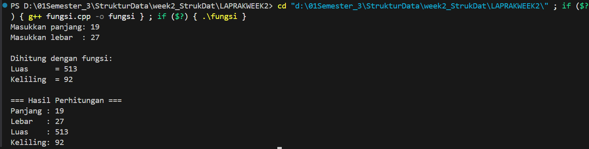

program C++ ini menunjukkan perbedaan antara fungsi (function) dan prosedur (procedure) dengan menghitung luas serta keliling persegi panjang. Program ini meminta pengguna untuk memasukkan nilai panjang dan lebar. Kemudian, program menggunakan dua fungsi terpisah, hitungLuas dan hitungKeliling, yang masing-masing mengembalikan satu nilai (luas dan keliling) untuk disimpan dalam variabel. Hasil dari pemanggilan fungsi ini kemudian ditampilkan ke layar. Setelah itu, program memanggil sebuah prosedur bernama tampilkanHasil yang menerima nilai panjang dan lebar, lalu melakukan semua perhitungan dan menampilkannya langsung di dalam prosedur itu sendiri tanpa mengembalikan nilai apa pun

### Kondisi

```cpp
#include <iostream>
using namespace std;
// int main()
// {
//     double tot_pembelian, diskon;
//     cout << "total pembelian: Rp";
//     cin >> tot_pembelian;
//     diskon = 0;
//     if (tot_pembelian >= 100000)
//         diskon = 0.05 * tot_pembelian;
//     cout << "besar diskon = Rp" << diskon;
// }

// int main()
// {
//     double tot_pembelian, diskon;
//     cout << "total pembelian: Rp";
//     cin >> tot_pembelian;
//     diskon = 0;
//     if (tot_pembelian >= 100000)
//         diskon = 0.05 * tot_pembelian;
//     else
//         diskon = 0;
//     cout << "besar diskon = Rp" << diskon;
// }

int main()
{
    int kode_hari;
    cout << "Menentukan hari kerja/libur\n"<<endl;
    cout << "1=Senin 3=Rabu 5=Jumat 7=Minggu "<<endl;
    cout << "2=Selasa 4=Kamis 6=Sabtu "<<endl;
    cin >> kode_hari;
    switch (kode_hari)
    {
    case 1:
    case 2:
    case 3:
    case 4:
    case 5:
        cout<<"Hari Kerja";
        break;
    case 6:
    case 7:
        cout<<"Hari Libur";
        break;
    default:
        cout<<"Kode masukan salah!!!";
    }
    return 0;
}
```

> Output
> 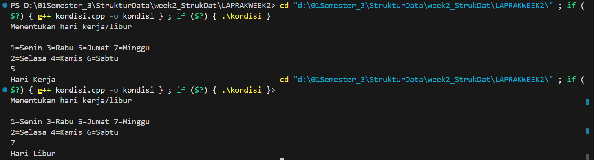

program C++ ini berfungsi untuk menentukan apakah suatu hari adalah hari kerja atau hari libur berdasarkan kode angka yang dimasukkan oleh pengguna. Awalnya, program akan menampilkan menu pilihan kode hari dari 1 (Senin) hingga 7 (Minggu). Kemudian, program akan meminta pengguna memasukkan sebuah kode hari. Menggunakan struktur switch-case, program akan mengevaluasi kode tersebut. Jika pengguna memasukkan angka 1, 2, 3, 4, atau 5, program akan mengeksekusi case yang sama dan mencetak "Hari Kerja". Jika angka yang dimasukkan adalah 6 atau 7, program akan mencetak "Hari Libur". Jika pengguna memasukkan angka lain di luar rentang 1-7, program akan menjalankan case default dan menampilkan pesan kesalahan "Kode masukan salah!!!"

### Perulangan

```cpp
#include <iostream>
using namespace std;
// int main()
// {
//     int jum;
//     cout << "jumlah perulangan: ";
//     cin >> jum;
//     for (int i = 0; i < jum; i++)
//     {
//         cout << "saya sahroni\n";
//     }
//     return 1;
// }

// while
int main()
{
    int i = 1;
    int jum;
    cin >> jum;
    do
    {
        cout << "bahlil ke-" << (i + 1) << endl;
        i++;
    } while (i < jum);
    return 0;
}
```

> Output
> 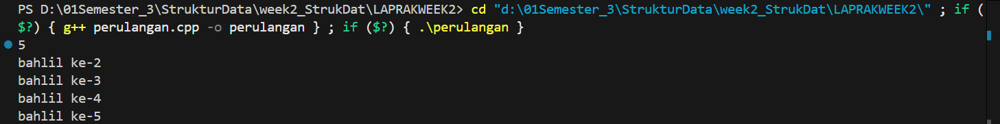

program C++ ini menggunakan perulangan do-while untuk mencetak kalimat "bahlil ke-" secara berulang sesuai dengan jumlah yang dimasukkan oleh pengguna. Awalnya, program menginisialisasi variabel i dengan nilai 1, lalu meminta pengguna untuk memasukkan nilai jum (jumlah perulangan). Berbeda dengan loop while biasa, do-while akan menjalankan blok kode di dalamnya **setidaknya satu kali** sebelum memeriksa kondisi while (i < jum). Di setiap iterasi, program akan mencetak "bahlil ke-" diikuti oleh nilai (i + 1) dan menaikkan nilai i. Perulangan akan terus berlanjut selama nilai i masih lebih kecil dari jum

### Struct

```cpp
#include <iostream>
#include <string>
using namespace std;

// Definisi struct
struct Mahasiswa {
    string nama;
    string nim;
    float ipk;
};

int main() {

    Mahasiswa mhs1;

    cout << "Masukkan Nama Mahasiswa: ";
    getline(cin, mhs1.nama);
    // cin >> mhs1.nama;
    cout << "Masukkan NIM Mahasiswa : ";
    cin >> mhs1.nim;
    cout << "Masukkan IPK Mahasiswa : ";
    cin >> mhs1.ipk;

    cout << "\n=== Data Mahasiswa ===" << endl;
    cout << "Nama : " << mhs1.nama << endl;
    cout << "NIM  : " << mhs1.nim << endl;
    cout << "IPK  : " << mhs1.ipk << endl;

    return 0;
}
```

> Output
> 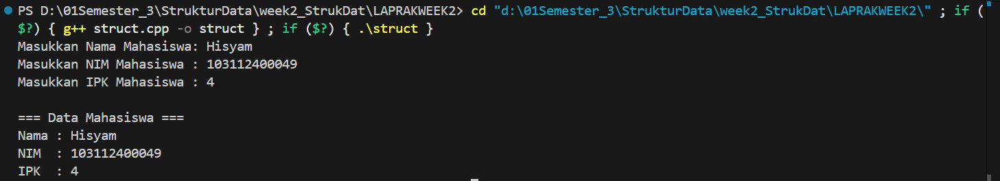

program C++ ini berfungsi untuk mendata informasi seorang mahasiswa—termasuk nama, NIM, dan IPK—menggunakan sebuah struct. Pertama, program mendefinisikan sebuah tipe data bentukan bernama Mahasiswa yang mengelompokkan tiga variabel: nama (string), nim (string), dan ipk (float). Di dalam fungsi main, sebuah variabel bernama mhs1 dideklarasikan dengan tipe Mahasiswa. Program kemudian meminta pengguna untuk memasukkan data nama, NIM, dan IPK, yang masing-masing disimpan ke dalam anggota dari variabel mhs1 (contoh: mhs1.nama). Setelah semua data dimasukkan, program akan menampilkan kembali informasi yang telah dikumpulkan dalam format yang rapi

### Test

```cpp
#include <iostream>
using namespace std;
int main()
{
    string ch;
    cout << "Masukkan sebuah karakter: ";
    // cin >> ch;
    ch = getchar();  //Menggunakan getchar() untuk membaca satu karakter
    cout << "Karakter yang Anda masukkan adalah: " << ch << endl;
    return 0;
}
```

> Output
> 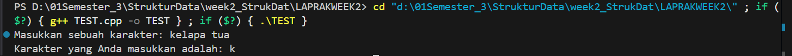

program C++ ini berfungsi untuk membaca satu karakter tunggal dari input keyboard dan menampilkannya kembali. Kode ini secara spesifik menggunakan fungsi getchar() yang akan langsung mengambil karakter pertama yang diketik oleh pengguna, tanpa perlu menunggu tombol Enter ditekan untuk melanjutkan eksekusi. Karakter yang dibaca tersebut kemudian disimpan dalam variabel string ch dan dicetak

## Unguided

### Soal 1

> 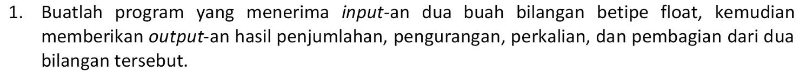

```cpp
#include <iostream>
using namespace std;

int main() {
    float nuy1, nuy2;
    cout << "bilangan pertama : ";
    cin >> nuy1;
    cout << "bilangan kedua   : ";
    cin >> nuy2;
    cout << "penjumlahan : " << nuy1 + nuy2 << endl;
    cout << "pengurangan : " << nuy1 - nuy2 << endl;
    cout << "perkalian   : " << nuy1 * nuy2 << endl;
    cout << "pembagian   : " << nuy1 / nuy2 << endl;
    return 0;
}
```

> Output
> 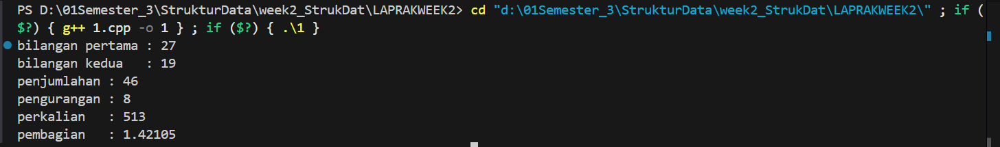

program C++ ini berfungsi sebagai kalkulator sederhana untuk melakukan empat operasi aritmatika dasar. Kode tersebut meminta pengguna untuk memasukkan dua buah bilangan bertipe float (desimal) yang disimpan dalam variabel nuy1 dan nuy2. Setelah menerima kedua input, program akan langsung menghitung dan menampilkan hasil dari operasi penjumlahan, pengurangan, perkalian, dan pembagian dari kedua bilangan tersebut secara berurutan

### Soal 2

> 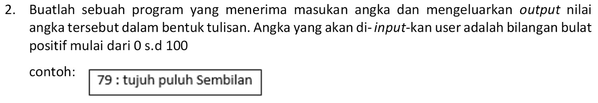

```cpp
#include <iostream>
#include <string>
using namespace std;

string sebut(int nuy) {
    string satuan[] = {"", "satu", "dua", "tiga", "empat", "lima", "enam", "tujuh", "delapan", "sembilan"};
    if (nuy < 0 || nuy > 100) return "angka harus 0 - 100!!!";
    if (nuy == 0) return "nol";
    if (nuy == 10) return "sepuluh";
    if (nuy == 11) return "sebelas";
    if (nuy == 100) return "seratus";
    if (nuy < 10) {
        return satuan[nuy];
    } else if (nuy < 20) {
        return satuan[nuy % 10] + " belas";
    } else {
        string puluhan = satuan[nuy / 10] + " puluh";
        if (nuy % 10 == 0) {
            return puluhan;
        } else {
            return puluhan + " " + satuan[nuy % 10];
        }
    }
}

int main() {
    int nuy;
    cout << "masukkan angka 0 - 100 : ";
    cin >> nuy;
    if (nuy >= 0 && nuy <= 100) {
        cout << nuy << " : " << sebut(nuy) << endl;
    } else {
        cout << "angka harus 0 - 100!!!" << endl;
    }
    return 0;
}
```

> Output
> 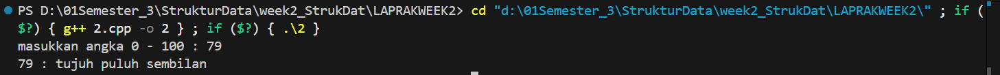

program C++ ini berfungsi untuk mengubah sebuah angka bulat antara 0 hingga 100 menjadi bentuk tulisan dalam Bahasa Indonesia. Logika utama program ini terdapat dalam fungsi sebut yang pertama-tama menangani kasus-kasus khusus seperti 0, 10, 11, dan 100. Untuk angka lainnya, program menggunakan operasi matematika sederhana seperti pembagian dan modulus untuk memisahkan digit puluhan dan satuan, lalu menggabungkannya dengan kata "puluh" atau "belas" sesuai aturan bahasa. Fungsi main bertugas menerima input dari pengguna, memastikan angka yang dimasukkan valid, lalu memanggil fungsi sebut untuk mendapatkan hasil konversi dan menampilkannya ke layar

### Soal 3

> 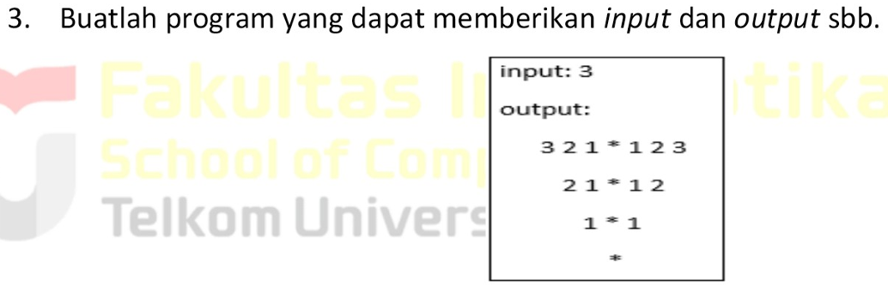

```cpp
#include <iostream>
using namespace std;

int main() {
    int nuy;
    cout << "input: ";
    cin >> nuy;
    cout << "output:" << endl;
    for (int i = nuy; i >= 1; --i) {
        for (int x = 0; x < (nuy - i); ++x) {
            cout << "  ";
        }
        for (int a = i; a >= 1; --a) {
            cout << a;
            if (a > 1) {
                cout << " ";
            }
        }
        cout << " * ";
        for (int k = 1; k <= i; ++k) {
            cout << k;
            if (k < i) {
                cout << " ";
            }
        }
        cout << endl;
    }
    for (int x = 0; x < nuy; ++x) {
        cout << "  ";
    }
    cout << "*" << endl;
    return 0;
}
```

> Output
> 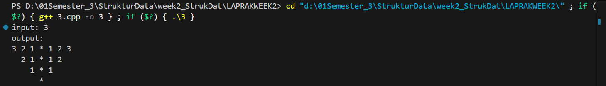

program C++ ini berfungsi untuk membuat pola piramida angka terbalik yang simetris dan miring ke kanan. Pengguna diminta memasukkan sebuah angka (nuy) sebagai nilai awal. Program kemudian menggunakan serangkaian perulangan (for) bersarang: loop pertama menambahkan spasi di awal setiap baris untuk menciptakan efek miring, loop berikutnya mencetak angka secara menurun dari nilai baris saat ini ke 1, lalu mencetak *, diikuti loop yang mencetak angka secara menaik dari 1 hingga nilai baris saat ini. Setelah pola piramida selesai, sebuah loop terakhir akan mencetak spasi untuk menempatkan satu karakter * di baris paling bawah agar sejajar dengan ujung piramida

## Referensi

Stroustrup, B. (2013). The C++ Programming Language (4th ed.). Addison-Wesley Professional.

Prata, S. (2012). C++ Primer Plus (6th ed.). Addison-Wesley Professional.

Lafore, R. (2002). Object-Oriented Programming in C++ (4th ed.). Sams Publishing.

https://www.geeksforgeeks.org/c-plus-plus/

https://cplusplus.com/doc/tutorial/


