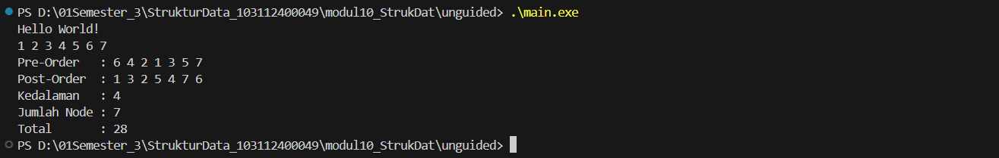

# <h1 align="center">LAPORAN PRAKTIKUM MODUL 10 <br> TREE (BAGIAN PERTAMA) </h1>
<p align="center">HISYAM NURDIATMOKO - 103112400049</p>

## Dasar Teori

### TREE

Konsep dan Kriteria Rekursif Secara harfiah, rekursif didefinisikan sebagai suatu proses pengulangan sesuatu dengan cara kesamaan-diri atau proses yang memanggil dirinya sendiri. Dalam pemrograman, sub program rekursif adalah sub program yang memanggil dirinya sendiri selama kondisi pemanggilan dipenuhi. Penggunaan sub program ini memiliki manfaat utama yaitu meningkatkan readability (mempermudah pembacaan program), modularity (memecah bagian besar menjadi modul kecil), dan reusability (dapat dipakai berulang kali). Agar dapat berjalan dengan benar, sub program rekursif harus memiliki dua kriteria: adanya kondisi khusus (special condition) yang menyebabkan pemanggilan berhenti, dan adanya pemanggilan diri sendiri jika kondisi khusus tersebut belum terpenuhi. Meskipun rekursif dapat menyederhanakan solusi dan penulisan perintah, metode ini memiliki kekurangan yaitu memerlukan lebih banyak memori untuk menyimpan activation record dan waktu proses yang lebih lama.


Definisi dan Karakteristik Tree Berbeda dengan jenis struktur data linear seperti list, stack, dan queue, Tree merupakan struktur data non-linear. Tree digambarkan sebagai suatu graph tak berarah yang terhubung dan tidak mengandung sirkuit. Karakteristik utama dari sebuah Tree adalah memiliki satu node tanpa pendahulu yang disebut akar (root), sedangkan semua node lainnya hanya mempunyai satu node pendahulu. Dalam struktur ini terdapat beberapa terminologi penting, antara lain: Parent (orang tua) dan Child (anak); Sibling (saudara kandung); Degree (derajat/jumlah anak); serta Leaf (daun), yaitu simpul berderajat nol yang tidak mempunyai anak. Selain itu, tinggi (height) atau kedalaman (depth) sebuah tree ditentukan oleh jumlah maksimum node yang terdapat pada cabang tree tersebut.


Jenis-Jenis Tree dan Binary Tree Terdapat beberapa jenis Tree, seperti Ordered Tree di mana urutan anak-anaknya penting. Namun, jenis yang dibahas secara mendalam adalah Binary Tree, di mana setiap node hanya dapat mempunyai maksimum 2 children tanpa pengecualian. Variasi dari Binary Tree meliputi: Complete Binary Tree (lengkap pada setiap level kecuali node terakhir), Extended Binary Tree (setiap node memiliki tepat 0 atau 2 anak), AVL Tree (perbedaan tinggi subtree kiri dan kanan maksimal 1), dan Heap Tree (Minimum atau Maximum Heap). Jenis yang difokuskan pada praktikum ini adalah Binary Search Tree (BST), yaitu tree terurut dengan ketentuan semua Left Child harus lebih kecil dari parent-nya, dan semua Right Child harus lebih besar dari parent maupun Left Child-nya.


Operasi dan Traversal pada Binary Search Tree Dalam Binary Search Tree, operasi penyisipan (insert) mengikuti aturan nilai: jika node yang akan dimasukkan lebih kecil, maka diletakkan pada Left Subtree, dan jika lebih besar diletakkan pada Right Subtree. Proses pencarian (search) juga dilakukan secara rekursif dengan membandingkan nilai yang dicari terhadap root; pointer akan berpindah ke child kiri jika nilai lebih kecil, atau ke child kanan jika nilai lebih besar, hingga data ditemukan atau pointer menunjuk NULL. Selain itu, pembacaan atau traversal pada Binary Tree terbagi menjadi tiga urutan: Pre-order (kunjungi Root, lalu T1/kiri, kemudian T2/kanan), In-order (kunjungi T1/kiri, lalu Root, kemudian T2/kanan), dan Post-order (kunjungi T1/kiri, lalu T2/kanan, kemudian Root).

## Guided

#### tree.cpp

```cpp
#include <iostream>
using namespace std;

struct Node
{
    int data;
    Node *kiri, *kanan;
};

Node *buatNode(int nilai)
{
    Node *baru = new Node();
    baru->data = nilai;
    baru->kiri = baru->kanan = NULL;
    return baru;
}

Node *insert(Node *root, int nilai)
{
    if (root == NULL)
        return buatNode(nilai);
    
    if (nilai < root->data)
        root->kiri = insert(root->kiri, nilai);
    else if (nilai > root->data)
        root->kanan = insert(root->kanan, nilai);

    return root;
}

Node *search(Node *root, int nilai)
{
    if (root == NULL || root->data == nilai)
        return root;

    if (nilai < root->data)
        return search(root->kiri, nilai);

    return search(root->kanan, nilai);
}

Node *nilaiTerkecil(Node *node)
{
    Node *current = node;
    while (current && current->kiri != NULL)
        current = current->kiri;

        return current;
}

Node *hapus(Node *root, int nilai)
{
    if (root == NULL)
        return root;

    if (nilai < root->data)
        root->kiri = hapus(root->kiri, nilai);
    else if (nilai > root->data)
        root->kanan = hapus(root->kanan, nilai);
    else
    {
        if (root->kiri == NULL)
        {
            Node *temp = root->kanan;
            delete root;
            return temp;
        }
        else if (root->kanan == NULL){
            Node *temp = root->kiri;
            delete root;
            return temp;
        }
        Node *temp = nilaiTerkecil(root->kanan);
        root->data = temp->data;
        root->kanan = hapus(root->kanan, temp->data);
    }
    return root;
}

Node *update(Node *root, int Lama, int baru)
{
    if (search(root, Lama) != NULL)
    {
        root = hapus(root, Lama);
        root = insert(root, baru);
        cout << "Data " << Lama << " diupdate menjadi " << baru << endl;
    }
    else
    {
        cout << "Data " << Lama << " tidak ditemukan!" << endl;
    }
    return root;
}

void preOrder(Node *root)
{
    if (root != NULL)
    {
        cout << root->data << " ";
        preOrder(root->kiri);
        preOrder(root->kanan);
    }
}

void inOrder(Node *root)
{
    if (root != NULL)
    {
        inOrder(root->kiri);
        cout << root->data << " ";
        inOrder(root->kanan);
    }
}

void postOrder(Node *root)
{
    if (root != NULL)
    {
        postOrder(root->kiri);
        postOrder(root->kanan);
        cout << root->data << " ";
    }
}

int main()
{
    Node *root = NULL;

    cout << "=== 1. INSERT DATA ===" << endl;
    root = insert(root, 10);
    insert(root, 5);
    insert(root, 20);
    insert(root, 3);
    insert(root, 7);
    insert(root, 15);
    insert(root, 25);
    cout << "Data berhasil dimasukan.\n" << endl;

    cout << "=== 2. TAMPILKAN TREE (TRAVELSAL) ===" << endl;
    cout << "PreOrder : ";
    preOrder(root);
    cout << endl;
    cout << "InOrder : ";
    inOrder(root);
    cout << endl;
    cout << "PostOrder : ";
    postOrder(root);
    cout << "\n" << endl;

    cout << "=== 3. TEST SEARCH ===" << endl;
    int cari1 = 7, cari2 = 99;
    cout << "Cari " << cari1 << ": " << (search(root,cari1) ? "Ketemu" : "Tidak Aada") << endl;
    cout << "Cari " << cari2 << ": " << (search(root,cari2) ? "Ketemu" : "Tidak Aada") << endl;
    cout << endl;

    cout << "=== 4. TEST UPDATE ===" << endl;
    root = update(root, 5, 8);
    cout << "Hasil Order setelah update: ";
    cout << endl;
    cout << endl;

    cout << "PreOrder : ";
    preOrder(root);
    cout << endl;
    cout << "InOrder : ";
    inOrder(root);
    cout << endl;
    cout << "PostOrder : ";
    postOrder(root);
    cout << "\n" << endl;

    cout << "== 5. TEST DELETE ===" << endl;
    cout << "Menghapus angka 20..." << endl;
    root = hapus(root, 20);

    cout << "PreOrder : ";
    preOrder(root);
    cout << endl;
    cout << "InOrder : ";
    inOrder(root);
    cout << endl;
    cout << "PostOrder : ";
    postOrder(root);
    cout << "\n" << endl;

    return 0;
}
```

> Output
> 

Program Guided TREE ini adalah implementasi struktur data Binary Search Tree (BST) dalam bahasa C++. Program ini memungkinkan untuk melakukan operasi dasar seperti menyisipkan data (insert), mencari data (search), menghapus data (hapus), memperbarui data (update), serta menampilkan elemen-elemen pohon menggunakan traversal PreOrder, InOrder, dan PostOrder. Fungsi-fungsi utama seperti insert dan hapus mengatur struktur pohon berdasarkan aturan BST, sementara update memungkinkan untuk memperbarui nilai suatu node dengan menghapus node lama dan menyisipkan node baru. Program juga menyediakan fitur untuk menguji keberadaan elemen dalam pohon dan menampilkan hasilnya dalam berbagai jenis traversal.

### Unguided

1. Buatlah ADT Binary Search Tree menggunakan Linked list sebagai berikut di dalam file “bstree.h”:
```
Type infotype: integer
Type address : pointer to Node
Type Node: <
info : infotype
left, right : address
>
 function alokasi( x : infotype ) → address
procedure insertNode( input/output root : address,
input x : infotype )
function findNode( x : infotype, root : address )→address
procedure printInorder( input root : address )

```
Buatlah implementasi ADT Binary Search Tree pada file “bstree.cpp” dan cobalah hasil implementasi ADT pada file “main.cpp”
```
#include <iostream>
#include "bstree.h"
using namespace std;
int main() {
cout << "Hello World" << endl;
address root = Nil;
insertNode(root,1);
insertNode(root,2);
insertNode(root,6);
insertNode(root,4);
insertNode(root,5);
insertNode(root,3);
insertNode(root,6);
insertNode(root,7);
InOrder(root);
return 0;
}
```

2. Buatlah fungsi untuk menghitung jumlah node dengan fungsi berikut.
➢ fungsi hitungJumlahNode( root:address ) : integer
/* fungsi mengembalikan integer banyak node yang ada di dalam BST*/
➢ fungsi hitungTotalInfo( root:address, start:integer ) : integer
/* fungsi mengembalikan jumlah (total) info dari node-node yang ada di dalam BST*/
➢ fungsi hitungKedalaman( root:address, start:integer ) : integer
/* fungsi rekursif mengembalikan integer kedalaman maksimal dari binary tree */
```
int main() {
cout << "Hello World" << endl;
address root = Nil;
insertNode(root,1);
insertNode(root,2);
insertNode(root,6);
insertNode(root,4);
insertNode(root,5);
insertNode(root,3);
insertNode(root,6);
insertNode(root,7);
InOrder(root);
cout<<"\n";
cout<<"kedalaman : "<<hitungKedalaman(root,0)<<endl;
cout<<"jumlah Node : "<<hitungNode(root)<<endl;
cout<<"total : "<<hitungTotal(root)<<endl;
return 0;
}
```

3. Print tree secara pre-order dan post-order.

### Jawaban

bstree.h
```cpp
#ifndef BSTREE_H
#define BSTREE_H
#include <iostream>
using namespace std;

typedef int infotype;
typedef struct Node *address;

struct Node {
    infotype info;
    address left;
    address right;
};

address alokasi(infotype x);
void insertNode(address &root, infotype x);
address findNode(infotype x, address root);
void printInorder(address root);
void printPreorder(address root);
void printPostorder(address root);

int hitungJumlahNode(address root);
int hitungTotalInfo(address root);
int hitungKedalaman(address root);

#endif
```

bstree.cpp
```
#include "bstree.h"

address alokasi(infotype x) {
    address p = new Node;
    p->info = x;
    p->left = NULL;
    p->right = NULL;
    return p;
}

void insertNode(address &root, infotype x) {
    if (root == NULL) {
        root = alokasi(x);
    } else {
        if (x < root->info) {
            insertNode(root->left, x);
        } else if (x > root->info) {
            insertNode(root->right, x);
        }
    }
}

address findNode(infotype x, address root) {
    if (root == NULL || root->info == x)
        return root;
    if (x < root->info)
        return findNode(x, root->left);
    return findNode(x, root->right);
}

void printPreorder(address root) {
    if (root != NULL) {
        cout << root->info << " ";
        printPreorder(root->left);
        printPreorder(root->right);
    }
}

void printInorder(address root) {
    if (root != NULL) {
        printInorder(root->left);
        cout << root->info << " ";
        printInorder(root->right);
    }
}

void printPostorder(address root) {
    if (root != NULL) {
        printPostorder(root->left);
        printPostorder(root->right);
        cout << root->info << " ";
    }
}

int hitungJumlahNode(address root) {
    if (root == NULL) return 0;
    return 1 + hitungJumlahNode(root->left) + hitungJumlahNode(root->right);
}

int hitungTotalInfo(address root) {
    if (root == NULL) return 0;
    return root->info + hitungTotalInfo(root->left) + hitungTotalInfo(root->right);
}

int hitungKedalaman(address root) {
    if (root == NULL) return 0;
    int kiri = hitungKedalaman(root->left);
    int kanan = hitungKedalaman(root->right);
    if (kiri > kanan) return 1 + kiri;
    else return 1 + kanan;
}
```

main.cpp
```
#include <iostream>
#include "bstree.h"

using namespace std;

int main() {
    address root = NULL;

    insertNode(root, 6);
    insertNode(root, 4);
    insertNode(root, 7);
    insertNode(root, 2);
    insertNode(root, 5);
    insertNode(root, 1);
    insertNode(root, 3);

    cout << "Hello World!" << endl;

    printInorder(root); 
    cout << endl;

    cout << "Pre-Order   : ";
    printPreorder(root);
    cout << endl;

    cout << "Post-Order  : ";
    printPostorder(root);
    cout << endl;

    cout << "Kedalaman   : " << hitungKedalaman(root) << endl;
    cout << "Jumlah Node : " << hitungJumlahNode(root) << endl;
    cout << "Total       : " << hitungTotalInfo(root) << endl;

    return 0;
}
```

> Output
> 

Program Unguided ini mengimplementasikan struktur data Binary Search Tree atau BST yang dipecah menjadi tiga file terpisah yaitu header, source, dan main untuk menerapkan konsep Abstract Data Type. Program ini mencakup fungsi-fungsi rekursif untuk memasukkan data node baru secara terurut, melakukan penelusuran tree menggunakan metode Pre-Order, In-Order, dan Post-Order, serta mencari data tertentu. Selain operasi dasar, terdapat juga fitur statistik untuk menghitung jumlah total node, menjumlahkan seluruh nilai data dalam tree, dan mengukur kedalaman maksimum pohon. Pada bagian utama, program menyusun sebuah tree dengan urutan input tertentu dimulai dari angka 6, lalu menampilkan hasil penelusuran dan perhitungan statistiknya.

## Referensi

Modul 10: TREE (BAGIAN PERTAMA) [Modul Praktikum]. Telkom University, Bandung.

GeeksforGeeks. (2024). Binary Search Tree Data Structure. https://www.geeksforgeeks.org/binary-search-tree-data-structure/ Diakses pada 26 November 2025.

GeeksforGeeks. (2024). Tree Traversal – Inorder, Preorder and Postorder. https://www.geeksforgeeks.org/tree-traversals-inorder-preorder-and-postorder/ Diakses pada 26 November 2025.


