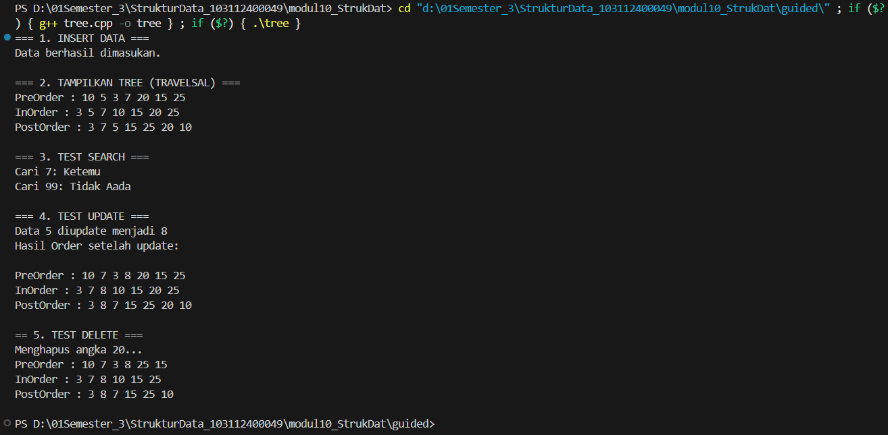

# <h1 align="center">LAPORAN PRAKTIKUM MODUL 10 <br> TREE (BAGIAN PERTAMA) </h1>
<p align="center">HISYAM NURDIATMOKO - 103112400049</p>

## Dasar Teori

### TREE

Konsep dan Kriteria Rekursif Secara harfiah, rekursif didefinisikan sebagai suatu proses pengulangan sesuatu dengan cara kesamaan-diri atau proses yang memanggil dirinya sendiri. Dalam pemrograman, sub program rekursif adalah sub program yang memanggil dirinya sendiri selama kondisi pemanggilan dipenuhi. Penggunaan sub program ini memiliki manfaat utama yaitu meningkatkan readability (mempermudah pembacaan program), modularity (memecah bagian besar menjadi modul kecil), dan reusability (dapat dipakai berulang kali). Agar dapat berjalan dengan benar, sub program rekursif harus memiliki dua kriteria: adanya kondisi khusus (special condition) yang menyebabkan pemanggilan berhenti, dan adanya pemanggilan diri sendiri jika kondisi khusus tersebut belum terpenuhi. Meskipun rekursif dapat menyederhanakan solusi dan penulisan perintah, metode ini memiliki kekurangan yaitu memerlukan lebih banyak memori untuk menyimpan activation record dan waktu proses yang lebih lama.


Definisi dan Karakteristik Tree Berbeda dengan jenis struktur data linear seperti list, stack, dan queue, Tree merupakan struktur data non-linear. Tree digambarkan sebagai suatu graph tak berarah yang terhubung dan tidak mengandung sirkuit. Karakteristik utama dari sebuah Tree adalah memiliki satu node tanpa pendahulu yang disebut akar (root), sedangkan semua node lainnya hanya mempunyai satu node pendahulu. Dalam struktur ini terdapat beberapa terminologi penting, antara lain: Parent (orang tua) dan Child (anak); Sibling (saudara kandung); Degree (derajat/jumlah anak); serta Leaf (daun), yaitu simpul berderajat nol yang tidak mempunyai anak. Selain itu, tinggi (height) atau kedalaman (depth) sebuah tree ditentukan oleh jumlah maksimum node yang terdapat pada cabang tree tersebut.


Jenis-Jenis Tree dan Binary Tree Terdapat beberapa jenis Tree, seperti Ordered Tree di mana urutan anak-anaknya penting. Namun, jenis yang dibahas secara mendalam adalah Binary Tree, di mana setiap node hanya dapat mempunyai maksimum 2 children tanpa pengecualian. Variasi dari Binary Tree meliputi: Complete Binary Tree (lengkap pada setiap level kecuali node terakhir), Extended Binary Tree (setiap node memiliki tepat 0 atau 2 anak), AVL Tree (perbedaan tinggi subtree kiri dan kanan maksimal 1), dan Heap Tree (Minimum atau Maximum Heap). Jenis yang difokuskan pada praktikum ini adalah Binary Search Tree (BST), yaitu tree terurut dengan ketentuan semua Left Child harus lebih kecil dari parent-nya, dan semua Right Child harus lebih besar dari parent maupun Left Child-nya.


Operasi dan Traversal pada Binary Search Tree Dalam Binary Search Tree, operasi penyisipan (insert) mengikuti aturan nilai: jika node yang akan dimasukkan lebih kecil, maka diletakkan pada Left Subtree, dan jika lebih besar diletakkan pada Right Subtree. Proses pencarian (search) juga dilakukan secara rekursif dengan membandingkan nilai yang dicari terhadap root; pointer akan berpindah ke child kiri jika nilai lebih kecil, atau ke child kanan jika nilai lebih besar, hingga data ditemukan atau pointer menunjuk NULL. Selain itu, pembacaan atau traversal pada Binary Tree terbagi menjadi tiga urutan: Pre-order (kunjungi Root, lalu T1/kiri, kemudian T2/kanan), In-order (kunjungi T1/kiri, lalu Root, kemudian T2/kanan), dan Post-order (kunjungi T1/kiri, lalu T2/kanan, kemudian Root).

## Guided

### Guided Queue

#### queue.cpp

```cpp
#include <iostream>
using namespace std;

struct Node
{
    int data;
    Node *kiri, *kanan;
};

Node *buatNode(int nilai)
{
    Node *baru = new Node();
    baru->data = nilai;
    baru->kiri = baru->kanan = NULL;
    return baru;
}

Node *insert(Node *root, int nilai)
{
    if (root == NULL)
        return buatNode(nilai);
    
    if (nilai < root->data)
        root->kiri = insert(root->kiri, nilai);
    else if (nilai > root->data)
        root->kanan = insert(root->kanan, nilai);

    return root;
}

Node *search(Node *root, int nilai)
{
    if (root == NULL || root->data == nilai)
        return root;

    if (nilai < root->data)
        return search(root->kiri, nilai);

    return search(root->kanan, nilai);
}

Node *nilaiTerkecil(Node *node)
{
    Node *current = node;
    while (current && current->kiri != NULL)
        current = current->kiri;

        return current;
}

Node *hapus(Node *root, int nilai)
{
    if (root == NULL)
        return root;

    if (nilai < root->data)
        root->kiri = hapus(root->kiri, nilai);
    else if (nilai > root->data)
        root->kanan = hapus(root->kanan, nilai);
    else
    {
        if (root->kiri == NULL)
        {
            Node *temp = root->kanan;
            delete root;
            return temp;
        }
        else if (root->kanan == NULL){
            Node *temp = root->kiri;
            delete root;
            return temp;
        }
        Node *temp = nilaiTerkecil(root->kanan);
        root->data = temp->data;
        root->kanan = hapus(root->kanan, temp->data);
    }
    return root;
}

Node *update(Node *root, int Lama, int baru)
{
    if (search(root, Lama) != NULL)
    {
        root = hapus(root, Lama);
        root = insert(root, baru);
        cout << "Data " << Lama << " diupdate menjadi " << baru << endl;
    }
    else
    {
        cout << "Data " << Lama << " tidak ditemukan!" << endl;
    }
    return root;
}

void preOrder(Node *root)
{
    if (root != NULL)
    {
        cout << root->data << " ";
        preOrder(root->kiri);
        preOrder(root->kanan);
    }
}

void inOrder(Node *root)
{
    if (root != NULL)
    {
        inOrder(root->kiri);
        cout << root->data << " ";
        inOrder(root->kanan);
    }
}

void postOrder(Node *root)
{
    if (root != NULL)
    {
        postOrder(root->kiri);
        postOrder(root->kanan);
        cout << root->data << " ";
    }
}

int main()
{
    Node *root = NULL;

    cout << "=== 1. INSERT DATA ===" << endl;
    root = insert(root, 10);
    insert(root, 5);
    insert(root, 20);
    insert(root, 3);
    insert(root, 7);
    insert(root, 15);
    insert(root, 25);
    cout << "Data berhasil dimasukan.\n" << endl;

    cout << "=== 2. TAMPILKAN TREE (TRAVELSAL) ===" << endl;
    cout << "PreOrder : ";
    preOrder(root);
    cout << endl;
    cout << "InOrder : ";
    inOrder(root);
    cout << endl;
    cout << "PostOrder : ";
    postOrder(root);
    cout << "\n" << endl;

    cout << "=== 3. TEST SEARCH ===" << endl;
    int cari1 = 7, cari2 = 99;
    cout << "Cari " << cari1 << ": " << (search(root,cari1) ? "Ketemu" : "Tidak Aada") << endl;
    cout << "Cari " << cari2 << ": " << (search(root,cari2) ? "Ketemu" : "Tidak Aada") << endl;
    cout << endl;

    cout << "=== 4. TEST UPDATE ===" << endl;
    root = update(root, 5, 8);
    cout << "Hasil Order setelah update: ";
    cout << endl;
    cout << endl;

    cout << "PreOrder : ";
    preOrder(root);
    cout << endl;
    cout << "InOrder : ";
    inOrder(root);
    cout << endl;
    cout << "PostOrder : ";
    postOrder(root);
    cout << "\n" << endl;

    cout << "== 5. TEST DELETE ===" << endl;
    cout << "Menghapus angka 20..." << endl;
    root = hapus(root, 20);

    cout << "PreOrder : ";
    preOrder(root);
    cout << endl;
    cout << "InOrder : ";
    inOrder(root);
    cout << endl;
    cout << "PostOrder : ";
    postOrder(root);
    cout << "\n" << endl;

    return 0;
}
```

> Output
> 

Program Guided TREE ini adalah implementasi struktur data Binary Search Tree (BST) dalam bahasa C++. Program ini memungkinkan untuk melakukan operasi dasar seperti menyisipkan data (insert), mencari data (search), menghapus data (hapus), memperbarui data (update), serta menampilkan elemen-elemen pohon menggunakan traversal PreOrder, InOrder, dan PostOrder. Fungsi-fungsi utama seperti insert dan hapus mengatur struktur pohon berdasarkan aturan BST, sementara update memungkinkan untuk memperbarui nilai suatu node dengan menghapus node lama dan menyisipkan node baru. Program juga menyediakan fitur untuk menguji keberadaan elemen dalam pohon dan menampilkan hasilnya dalam berbagai jenis traversal.

## Unguided

### Soal 1

1. Buatlah ADT Queue menggunakan ARRAY sebagai berikut di dalam file “queue.h”:
```
Type infotype: integer
Type Queue: <
    info : array [5] of infotype {index array dalam C++
    dimulai dari 0}
    head, tail : integer
>
procedure CreateQueue (input/output Q: Queue)
function isEmptyQueue (Q: Queue) → boolean
function isFullQueue (Q: Queue) → boolean
procedure enqueue (input/output Q: Queue, input x: infotype)
function dequeue (input/output Q: Queue) → infotype
procedure printInfo (input Q: Queue)
```
Buatlah implementasi ADT Queue pada file “queue.cpp” dengan menerapkan mekanisme queue Alternatif 1 (head diam, tail bergerak).
```
int main() {
    cout << "Hello World" << endl;
    Queue Q;
    createQueue(Q);
    
    cout<<"----------------------"<<endl;
    cout<<" H - T \t | Queue info"<<endl;
    cout<<"----------------------"<<endl;
    printInfo(Q);
    enqueue(Q,5); printInfo(Q);
    enqueue(Q,2); printInfo(Q);
    enqueue(Q,7); printInfo(Q);
    dequeue(Q); printInfo(Q);
    enqueue(Q,4); printInfo(Q);
    dequeue(Q); printInfo(Q);
    dequeue(Q); printInfo(Q);

    return 0;
}
```

queue.h
```cpp
#ifndef QUEUE_H
#define QUEUE_H

#include <iostream>
using namespace std;

#define MAX 5

typedef int infotype;

struct Queue {
    infotype info[MAX];
    int head;
    int tail;
};

void createQueue(Queue &Q);
bool isEmptyQueue(Queue Q);
bool isFullQueue(Queue Q);
void enqueue(Queue &Q, infotype x);
void dequeue(Queue &Q);
void printInfo(Queue Q);

#endif 
```

queue.cpp (alternatif 1)
```
#include "queue.h"

void createQueue(Queue &Q) {
    Q.head = -1;
    Q.tail = -1;
}

bool isEmptyQueue(Queue Q) {
    return (Q.head == -1 && Q.tail == -1);
}

bool isFullQueue(Queue Q) {
    return (Q.tail == MAX - 1);
}

void enqueue(Queue &Q, infotype x) {
    if (isFullQueue(Q)) {
        cout << "queue penuh, tidak bisa menambah data" << endl;
    } else {
        if (isEmptyQueue(Q)) {
            Q.head = 0;
        }
        Q.tail++;
        Q.info[Q.tail] = x;
    }
}

void dequeue(Queue &Q) {
    if (isEmptyQueue(Q)) {
        cout << "queue kosong" << endl;
    } else {
        if (Q.head == Q.tail) {
            createQueue(Q);
        } else {
            for (int i = Q.head; i < Q.tail; i++) {
                Q.info[i] = Q.info[i + 1];
            }
            Q.tail--;
        }
    }
}

void printInfo(Queue Q) {
    cout << Q.head << " \t " << Q.tail << " \t | ";
    if (isEmptyQueue(Q)) {
        cout << "empty queue" << endl;
    } else {
        for (int i = Q.head; i <= Q.tail; i++) {
            cout << Q.info[i] << " ";
        }
        cout << endl;
    }
}
```

main.cpp
```
#include <iostream>
#include "queue.h"

using namespace std;

int main() {
    Queue Q;
    
    cout << "H \t T \t | Queue info" << endl;
    cout << "----------------------------------" << endl;

    createQueue(Q);
    printInfo(Q);

    enqueue(Q, 5);
    printInfo(Q);

    enqueue(Q, 2);
    printInfo(Q);

    enqueue(Q, 7);
    printInfo(Q);

    dequeue(Q);
    printInfo(Q);

    enqueue(Q, 4);
    printInfo(Q);

    dequeue(Q);
    printInfo(Q);

    dequeue(Q);
    printInfo(Q);
    
    dequeue(Q);
    printInfo(Q);

    return 0;
}
```

> Output
> 

Program soal 1 ini adalah program C++ yang mengimplementasikan struktur data Queue menggunakan representasi array (tabel) dengan ukuran maksimal 5 elemen. Program ini secara spesifik menggunakan metode yang dijelaskan dalam Alternatif 1 pada modul Anda, di mana head (setelah elemen pertama masuk) selalu dianggap berada di indeks 0. Fungsi enqueue menambahkan elemen ke posisi tail, dan tail bertambah. Fungsi dequeue mengambil elemen dari head (indeks 0), dan kemudian menggeser semua elemen sisa di dalam antrean satu posisi ke kiri. Ini adalah implementasi yang fungsional, namun, seperti yang disebutkan di modul Anda, bisa menjadi tidak efisien karena operasi pergeseran elemen.

### Soal 2

Buatlah implementasi ADT Queue pada file “queue.cpp” dengan menerapkan mekanisme
queue Alternatif 2 (head bergerak, tail bergerak).

untuk file header (queue.h) dan program utama (main.cpp) sama dengan nomor 1 yang berbeda hanya file queue.cpp

queue.h
```cpp
#ifndef QUEUE_H
#define QUEUE_H

#include <iostream>
using namespace std;

#define MAX 5

typedef int infotype;

struct Queue {
    infotype info[MAX];
    int head;
    int tail;
};

void createQueue(Queue &Q);
bool isEmptyQueue(Queue Q);
bool isFullQueue(Queue Q);
void enqueue(Queue &Q, infotype x);
void dequeue(Queue &Q);
void printInfo(Queue Q);

#endif 
```

queue.cpp (alternatif 2)
```
#include "queue.h"

void createQueue(Queue &Q) {
    Q.head = -1;
    Q.tail = -1;
}

bool isEmptyQueue(Queue Q) {
    return (Q.head == -1);
}

bool isFullQueue(Queue Q) {
    return (Q.tail == MAX - 1);
}

void enqueue(Queue &Q, infotype x) {
    if (isFullQueue(Q)) {
        if (Q.head > 0) {
            for (int i = Q.head; i <= Q.tail; i++) {
                Q.info[i - Q.head] = Q.info[i];
            }
            Q.tail = Q.tail - Q.head;
            Q.head = 0;
            
            Q.tail++;
            Q.info[Q.tail] = x;
        } else {
            cout << "queue kosong, tidak bisa menambah data" << endl;
        }
    } else {
        if (isEmptyQueue(Q)) {
            Q.head = 0;
        }
        Q.tail++;
        Q.info[Q.tail] = x;
    }
}

void dequeue(Queue &Q) {
    if (isEmptyQueue(Q)) {
        cout << "queue kosong" << endl;
    } else {
        if (Q.head == Q.tail) {
            createQueue(Q);
        } else {
            Q.head++;
        }
    }
}

void printInfo(Queue Q) {
    cout << Q.head << " \t " << Q.tail << " \t | ";
    
    if (isEmptyQueue(Q)) {
        cout << "empty queue" << endl;
    } else {
        for (int i = Q.head; i <= Q.tail; i++) {
            cout << Q.info[i] << " ";
        }
        cout << endl;
    }
}
```

main.cpp
```
#include <iostream>
#include "queue.h"

using namespace std;

int main() {
    Queue Q;
    
    cout << "H \t T \t | Queue info" << endl;
    cout << "----------------------------------" << endl;

    createQueue(Q);
    printInfo(Q);

    enqueue(Q, 5);
    printInfo(Q);

    enqueue(Q, 2);
    printInfo(Q);

    enqueue(Q, 7);
    printInfo(Q);

    dequeue(Q);
    printInfo(Q);

    enqueue(Q, 4);
    printInfo(Q);

    dequeue(Q);
    printInfo(Q);

    dequeue(Q);
    printInfo(Q);
    
    dequeue(Q);
    printInfo(Q);

    return 0;
}
```

> Output
> 

Program C++ soal 2 ini mengimplementasikan Alternatif 2 dari modul Anda, di mana head dan tail sama-sama bergerak. Logika kuncinya adalah pada dequeue, yang kini sangat efisien karena hanya memajukan head (Q.head++) tanpa menggeser seluruh elemen. Sebagai konsekuensinya, enqueue harus menangani kondisi "penuh semu" (pseudo-full), yaitu ketika tail mencapai akhir array namun di bagian awal masih ada ruang kosong. Fungsi enqueue Anda mengatasi ini dengan melakukan pergeseran elemen kembali ke awal array, tetapi hanya jika kondisi "penuh semu" itu terjadi dan elemen baru akan ditambahkan.

### Soal 3

Buatlah implementasi ADT Queue pada file “queue.cpp” dengan menerapkan mekanisme
queue Alternatif 3 (head dan tail berputar).

untuk file header (queue.h) dan program utama (main.cpp) sama dengan nomor 1 yang berbeda hanya file queue.cpp

queue.h
```cpp
#ifndef QUEUE_H
#define QUEUE_H

#include <iostream>
using namespace std;

#define MAX 5

typedef int infotype;

struct Queue {
    infotype info[MAX];
    int head;
    int tail;
};

void createQueue(Queue &Q);
bool isEmptyQueue(Queue Q);
bool isFullQueue(Queue Q);
void enqueue(Queue &Q, infotype x);
void dequeue(Queue &Q);
void printInfo(Queue Q);

#endif 
```

queue.cpp (alternatif 3)
```
#include "queue.h"

void createQueue(Queue &Q) {
    Q.head = -1;
    Q.tail = -1;
}

bool isEmptyQueue(Queue Q) {
    return (Q.head == -1);
}

bool isFullQueue(Queue Q) {
    return ((Q.tail + 1) % MAX == Q.head);
}

void enqueue(Queue &Q, infotype x) {
    if (isFullQueue(Q)) {
        cout << "queue penuh, tidak bisa menambah data" << endl;
    } else {
        if (isEmptyQueue(Q)) {
            Q.head = 0;
        }
        Q.tail = (Q.tail + 1) % MAX;
        Q.info[Q.tail] = x;
    }
}

void dequeue(Queue &Q) {
    if (isEmptyQueue(Q)) {
        cout << "queue kosong" << endl;
    } else {
        if (Q.head == Q.tail) {
            createQueue(Q);
        } else {
            Q.head = (Q.head + 1) % MAX;
        }
    }
}

void printInfo(Queue Q) {
    cout << Q.head << " \t " << Q.tail << " \t | ";
    
    if (isEmptyQueue(Q)) {
        cout << "empty queue" << endl;
    } else {
        int i = Q.head;
        while (true) {
            cout << Q.info[i] << " ";
            if (i == Q.tail) {
                break;
            }
            i = (i + 1) % MAX;
        }
        cout << endl;
    }
}
```

main.cpp
```
#include <iostream>
#include "queue.h"

using namespace std;

int main() {
    Queue Q;
    
    cout << "H \t T \t | Queue info" << endl;
    cout << "----------------------------------" << endl;

    createQueue(Q);
    printInfo(Q);

    enqueue(Q, 5);
    printInfo(Q);

    enqueue(Q, 2);
    printInfo(Q);

    enqueue(Q, 7);
    printInfo(Q);

    dequeue(Q);
    printInfo(Q);

    enqueue(Q, 4);
    printInfo(Q);

    dequeue(Q);
    printInfo(Q);

    dequeue(Q);
    printInfo(Q);
    
    dequeue(Q);
    printInfo(Q);

    return 0;
}
```

> Output
> 

Program C++ soal 3 ini mengimplementasikan Alternatif 3 (circular buffer) dari modul Anda, yang merupakan metode paling efisien. Inti dari logika ini adalah penggunaan operator modulo (% MAX) baik pada fungsi enqueue maupun dequeue. Saat tail atau head mencapai akhir array, mereka secara otomatis "berputar" kembali ke indeks 0. Desain ini secara elegan menyelesaikan masalah "penuh semu" dari Alternatif 2 dan sepenuhnya menghilangkan kebutuhan untuk pergeseran elemen yang tidak efisien. Fungsi isFullQueue dan printInfo juga telah disesuaikan untuk menangani logika perputaran ini dengan benar.

## Referensi

Modul 8: QUEUE [Modul Praktikum]. Telkom University, Bandung.

GeeksforGeeks Queue Data Structure. https://www.geeksforgeeks.org/queue-data-structure/ Diakses pada 13 November 2025


