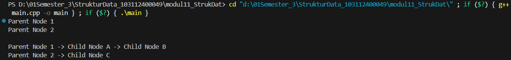
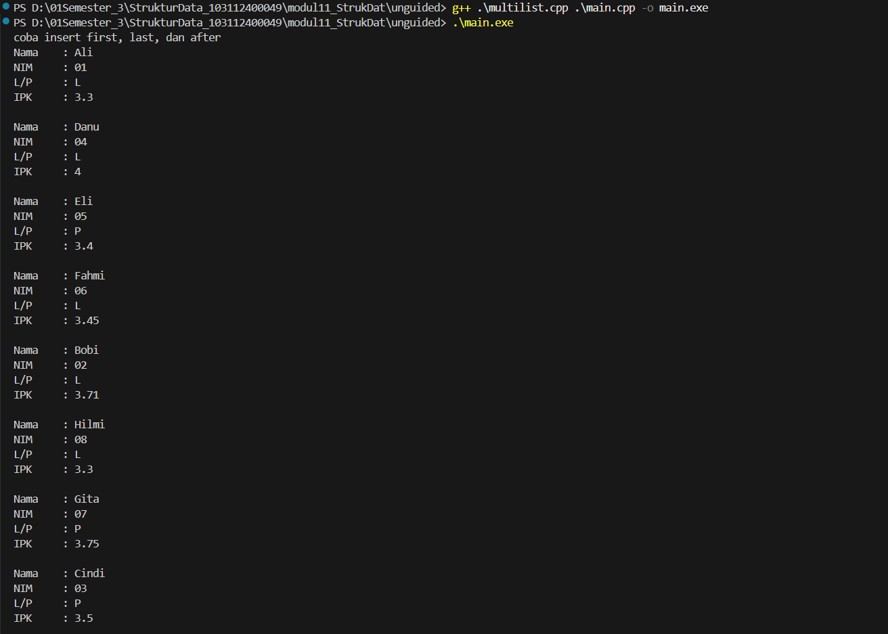

# <h1 align="center">LAPORAN PRAKTIKUM MODUL 13 <br> MULTI LINKED LIST </h1>
<p align="center">HISYAM NURDIATMOKO - 103112400049</p>

## Dasar Teori

### MULTI LINKED LIST

Multi Linked List merupakan sebuah struktur data dinamis yang terdiri dari sekumpulan list yang berbeda namun memiliki keterhubungan satu sama lain. Dalam struktur ini, setiap elemen di dalam list memiliki kemampuan untuk membentuk list tersendiri, yang secara umum dikategorikan menjadi dua bagian utama, yaitu list induk (parent) dan list anak (child). Implementasi dari struktur ini dapat dilihat pada kasus data kepegawaian, di mana terdapat list pegawai sebagai list induk yang menunjuk pada satu buah list anak, sehingga menciptakan relasi data yang terstruktur antara entitas utama dan sub-entitasnya.

Dalam pengoperasian manipulasi data, Multi Linked List memiliki prosedur khusus terutama pada operasi penyisipan (insert) dan penghapusan (delete). Untuk operasi penambahan elemen induk, konsep yang digunakan sama dengan operasi insert pada struktur data Singly, Doubly, maupun Circular Linked List pada umumnya. Berbeda halnya dengan penambahan elemen anak, di mana proses ini mewajibkan program untuk mengetahui atau mencari posisi elemen induknya terlebih dahulu sebelum elemen anak baru dapat disisipkan ke dalam list yang sesuai.

Aturan ketergantungan yang ketat juga berlaku pada operasi penghapusan data. Sama seperti proses insert, penghapusan elemen anak mengharuskan identifikasi terhadap elemen induknya agar pointer dapat diakses dengan tepat. Selain itu, terdapat aturan krusial pada penghapusan elemen induk; apabila sebuah elemen induk dihapus, maka seluruh elemen anak yang bernaung di bawah induk tersebut juga harus ikut dihapus. Hal ini memastikan bahwa tidak ada data anak yang tertinggal tanpa induk (dangling) yang dapat menyebabkan inkonsistensi data dalam memori.

## Guided

#### main.cpp

```cpp
#include <iostream>
#include <string>
using namespace std;

struct ChildNode
{
    string info;
    ChildNode *next;
};

struct ParentNode
{
    string info;
    ChildNode *childHead;
    ParentNode *next;
};

ParentNode *createParent(string info)
{
    ParentNode *newNode = new ParentNode;
    newNode->info = info;
    newNode->childHead = NULL;
    newNode->next = NULL;
    return newNode;
}

ChildNode *createChild(string info)
{
    ChildNode *newNode = new ChildNode;
    newNode->info = info;
    newNode->next = NULL;
    return newNode;
}

void insertParent(ParentNode *&head, string info)
{
    ParentNode *newNode = createParent(info);
    if (head == NULL)
    {
        head = newNode;
    }
    else
    {
        ParentNode *temp = head;
        while (temp->next != NULL)
        {
            temp = temp->next;
        }
        temp->next = newNode;
    }
}

void insertChild(ParentNode *head, string parentInfo, string childInfo)
{
    ParentNode *p = head;
    while (p != NULL && p->info != parentInfo)
    {
        p = p->next;
    }
    
    if (p != NULL)
    {
        ChildNode *newChild = createChild(childInfo);
        
        if (p->childHead == NULL)
        {
            p->childHead = newChild;
        }
        else
        {
            ChildNode *c = p->childHead;
            while (c->next != NULL)
            {
                c = c->next;
            }
            c->next = newChild;
        }
    }
}

void printAll(ParentNode *head)
{
    ParentNode *p = head;
    while (p != NULL)
    {
        cout << p->info;
        ChildNode *c = p->childHead;
        if (c != NULL)
        {
            while (c != NULL)
            {
                cout << " -> " << c->info;
                c = c->next;
            }
        }
     cout << endl;
        p = p->next;
    }
}

int main()
{
    ParentNode *list = NULL;
    
    insertParent(list, "Parent Node 1");
    insertParent(list, "Parent Node 2");
    
    printAll(list);
    cout << "\n";
    
    insertChild(list, "Parent Node 1", "Child Node A");
    insertChild(list, "Parent Node 1", "Child Node B");
    insertChild(list, "Parent Node 2", "Child Node C");
    
    printAll(list);
    
    return 0;
}
```

> Output
> 

Program Guided MULTI LINKED LIST ini merupakan implementasi sederhana dari struktur data Multi Linked List menggunakan bahasa C++, yang dirancang untuk merepresentasikan relasi hierarkis one-to-many antara simpul induk (ParentNode) dan simpul anak (ChildNode). Melalui penggunaan dua struktur data yang saling terhubung pointer, program ini memfasilitasi penambahan elemen induk ke dalam senarai utama serta memungkinkan penyisipan elemen anak secara spesifik di bawah induk yang sesuai berdasarkan pencarian nilai string-nya. Keseluruhan logika program diakhiri dengan fungsi traversal yang mencetak setiap induk diikuti oleh seluruh rangkaian anak yang dimilikinya secara berurutan, memvisualisasikan hubungan keterkaitan data tersebut.

### Unguided

1. Buatlah ADT Binary Search Tree menggunakan Linked list sebagai berikut di dalam file “bstree.h”:
```
Type infotype: integer
Type address : pointer to Node
Type Node: <
info : infotype
left, right : address
>
 function alokasi( x : infotype ) → address
procedure insertNode( input/output root : address,
input x : infotype )
function findNode( x : infotype, root : address )→address
procedure printInorder( input root : address )

```
Buatlah implementasi ADT Binary Search Tree pada file “bstree.cpp” dan cobalah hasil implementasi ADT pada file “main.cpp”
```
#include <iostream>
#include "bstree.h"
using namespace std;
int main() {
cout << "Hello World" << endl;
address root = Nil;
insertNode(root,1);
insertNode(root,2);
insertNode(root,6);
insertNode(root,4);
insertNode(root,5);
insertNode(root,3);
insertNode(root,6);
insertNode(root,7);
InOrder(root);
return 0;
}
```

2. Buatlah fungsi untuk menghitung jumlah node dengan fungsi berikut.
➢ fungsi hitungJumlahNode( root:address ) : integer
/* fungsi mengembalikan integer banyak node yang ada di dalam BST*/
➢ fungsi hitungTotalInfo( root:address, start:integer ) : integer
/* fungsi mengembalikan jumlah (total) info dari node-node yang ada di dalam BST*/
➢ fungsi hitungKedalaman( root:address, start:integer ) : integer
/* fungsi rekursif mengembalikan integer kedalaman maksimal dari binary tree */
```
int main() {
cout << "Hello World" << endl;
address root = Nil;
insertNode(root,1);
insertNode(root,2);
insertNode(root,6);
insertNode(root,4);
insertNode(root,5);
insertNode(root,3);
insertNode(root,6);
insertNode(root,7);
InOrder(root);
cout<<"\n";
cout<<"kedalaman : "<<hitungKedalaman(root,0)<<endl;
cout<<"jumlah Node : "<<hitungNode(root)<<endl;
cout<<"total : "<<hitungTotal(root)<<endl;
return 0;
}
```

3. Print tree secara pre-order dan post-order.

### Jawaban

bstree.h
```cpp
#ifndef BSTREE_H
#define BSTREE_H
#include <iostream>
using namespace std;

typedef int infotype;
typedef struct Node *address;

struct Node {
    infotype info;
    address left;
    address right;
};

address alokasi(infotype x);
void insertNode(address &root, infotype x);
address findNode(infotype x, address root);
void printInorder(address root);
void printPreorder(address root);
void printPostorder(address root);

int hitungJumlahNode(address root);
int hitungTotalInfo(address root);
int hitungKedalaman(address root);

#endif
```

bstree.cpp
```
#include "bstree.h"

address alokasi(infotype x) {
    address p = new Node;
    p->info = x;
    p->left = NULL;
    p->right = NULL;
    return p;
}

void insertNode(address &root, infotype x) {
    if (root == NULL) {
        root = alokasi(x);
    } else {
        if (x < root->info) {
            insertNode(root->left, x);
        } else if (x > root->info) {
            insertNode(root->right, x);
        }
    }
}

address findNode(infotype x, address root) {
    if (root == NULL || root->info == x)
        return root;
    if (x < root->info)
        return findNode(x, root->left);
    return findNode(x, root->right);
}

void printPreorder(address root) {
    if (root != NULL) {
        cout << root->info << " ";
        printPreorder(root->left);
        printPreorder(root->right);
    }
}

void printInorder(address root) {
    if (root != NULL) {
        printInorder(root->left);
        cout << root->info << " ";
        printInorder(root->right);
    }
}

void printPostorder(address root) {
    if (root != NULL) {
        printPostorder(root->left);
        printPostorder(root->right);
        cout << root->info << " ";
    }
}

int hitungJumlahNode(address root) {
    if (root == NULL) return 0;
    return 1 + hitungJumlahNode(root->left) + hitungJumlahNode(root->right);
}

int hitungTotalInfo(address root) {
    if (root == NULL) return 0;
    return root->info + hitungTotalInfo(root->left) + hitungTotalInfo(root->right);
}

int hitungKedalaman(address root) {
    if (root == NULL) return 0;
    int kiri = hitungKedalaman(root->left);
    int kanan = hitungKedalaman(root->right);
    if (kiri > kanan) return 1 + kiri;
    else return 1 + kanan;
}
```

main.cpp
```
#include <iostream>
#include "bstree.h"

using namespace std;

int main() {
    address root = NULL;

    insertNode(root, 6);
    insertNode(root, 4);
    insertNode(root, 7);
    insertNode(root, 2);
    insertNode(root, 5);
    insertNode(root, 1);
    insertNode(root, 3);

    cout << "Hello World!" << endl;

    printInorder(root); 
    cout << endl;

    cout << "Pre-Order   : ";
    printPreorder(root);
    cout << endl;

    cout << "Post-Order  : ";
    printPostorder(root);
    cout << endl;

    cout << "Kedalaman   : " << hitungKedalaman(root) << endl;
    cout << "Jumlah Node : " << hitungJumlahNode(root) << endl;
    cout << "Total       : " << hitungTotalInfo(root) << endl;

    return 0;
}
```

> Output
> 

Program Unguided ini mengimplementasikan struktur data Binary Search Tree atau BST yang dipecah menjadi tiga file terpisah yaitu header, source, dan main untuk menerapkan konsep Abstract Data Type. Program ini mencakup fungsi-fungsi rekursif untuk memasukkan data node baru secara terurut, melakukan penelusuran tree menggunakan metode Pre-Order, In-Order, dan Post-Order, serta mencari data tertentu. Selain operasi dasar, terdapat juga fitur statistik untuk menghitung jumlah total node, menjumlahkan seluruh nilai data dalam tree, dan mengukur kedalaman maksimum pohon. Pada bagian utama, program menyusun sebuah tree dengan urutan input tertentu dimulai dari angka 6, lalu menampilkan hasil penelusuran dan perhitungan statistiknya.

## Referensi

Modul 10: TREE (BAGIAN PERTAMA) [Modul Praktikum]. Telkom University, Bandung.

GeeksforGeeks. (2024). Binary Search Tree Data Structure. https://www.geeksforgeeks.org/binary-search-tree-data-structure/ Diakses pada 26 November 2025.

GeeksforGeeks. (2024). Tree Traversal – Inorder, Preorder and Postorder. https://www.geeksforgeeks.org/tree-traversals-inorder-preorder-and-postorder/ Diakses pada 26 November 2025.


