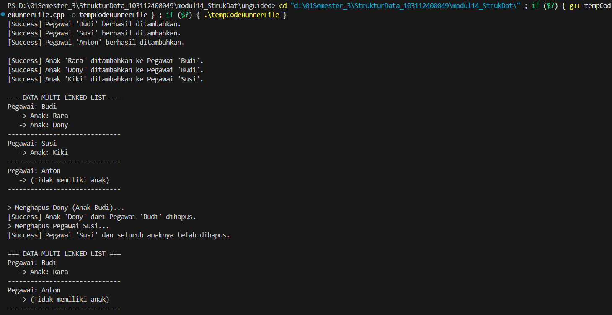

# <h1 align="center">LAPORAN PRAKTIKUM MODUL 14 <br> GRAPH </h1>
<p align="center">HISYAM NURDIATMOKO - 103112400049</p>

## Dasar Teori

### GRAPH

Graph didefinisikan sebagai himpunan tidak kosong yang terdiri dari node (atau disebut juga vertex) dan garis penghubung yang disebut edge. Struktur data ini digunakan untuk merepresentasikan hubungan antar objek, di mana node mewakili entitas tertentu, seperti tempat atau lokasi, sedangkan edge mewakili hubungan atau jalan yang menghubungkan entitas-entitas tersebut. Konsep dasar yang penting dalam graph adalah ketetanggaan, di mana suatu node dikatakan bertetangga dengan node lain jika keduanya dihubungkan secara langsung oleh sebuah edge. Edge dalam graph juga dapat memiliki nilai atau bobot yang merepresentasikan jarak, biaya, atau atribut lain dari hubungan tersebut.

Berdasarkan arah hubungannya, graph dibedakan menjadi dua jenis utama, yaitu Graph Berarah (Directed Graph) dan Graph Tidak Berarah (Undirected Graph). Pada Directed Graph, setiap edge memiliki arah yang spesifik, sehingga jika node A terhubung ke node B, belum tentu node B terhubung kembali ke node A. Sebaliknya, pada Undirected Graph, hubungan antar node tidak memiliki arah, yang berarti jika node A terhubung dengan node B, maka secara otomatis terbentuk hubungan timbal balik antara keduanya. Representasi graph di dalam pemrograman dapat dilakukan menggunakan Matrik Ketetanggaan (Array 2 Dimensi) atau Multi Linked List. Dalam praktikum ini, representasi yang digunakan adalah Multi Linked List karena sifatnya yang dinamis dalam menangani penambahan data. Struktur ini melibatkan penggunaan pointer di mana node induk berisi informasi node dan pointer ke node anak atau edge, sementara node anak merepresentasikan hubungan ke node tujuan.

Untuk menelusuri atau mengunjungi node-node di dalam graph, terdapat dua metode pencarian utama, yaitu Breadth First Search (BFS) dan Depth First Search (DFS). BFS bekerja dengan mengunjungi node mulai dari root (kedalaman 0), kemudian menyusur ke seluruh node pada kedalaman 1, kedalaman 2, dan seterusnya secara melebar, yang biasanya diimplementasikan menggunakan struktur data Queue. Sementara itu, DFS bekerja dengan mengunjungi root dan kemudian menelusuri sedalam mungkin ke subtree node tersebut secara rekursif sebelum kembali (backtracking), yang umumnya diimplementasikan menggunakan struktur data Stack. Selain metode penelusuran, terdapat juga konsep Topological Sort, yaitu proses pengurutan linear dari elemen-elemen yang memiliki keterurutan parsial, seperti prasyarat mata kuliah atau urutan pengerjaan tugas dalam sebuah proyek, di mana elemen yang tidak memiliki predecessor akan diproses terlebih dahulu.

## Guided

#### main.cpp

```cpp
#include <iostream>
#include <string>

using namespace std;

struct Anak
{
    string namaAnak;
    Anak *next;
    Anak *prev;
};

struct Pegawai
{
    string namaPegawai;

    Pegawai *next;
    Pegawai *prev;

    Anak *headAnak;
    Anak *tailAnak;
};

struct MultiList
{
    Pegawai *head;
    Pegawai *tail;
};

void createList(MultiList &L)
{
    L.head = NULL;
    L.tail = NULL;
}

bool isEmpty(MultiList L)
{
    return L.head == NULL;
}

Pegawai *findPegawai(MultiList L, string nama)
{
    Pegawai *P = L.head;
    while (P != NULL)
    {
        if (P->namaPegawai == nama)
        {
            return P;
        }
        P = P->next;
    }
    return NULL;
}

void insertPegawai(MultiList &L, string nama)
{
    Pegawai *baru = new Pegawai;
    baru->namaPegawai = nama;
    baru->next = NULL;
    baru->prev = NULL;
    baru->headAnak = NULL;
    baru->tailAnak = NULL;

    if (isEmpty(L))
    {
        L.head = baru;
        L.tail = baru;
    }
    else
    {
        L.tail->next = baru;
        baru->prev = L.tail;
        L.tail = baru;
    }
    cout << "[Success] Pegawai '" << nama << "' berhasil ditambahkan." << endl;
}

void insertAnak(MultiList &L, string namaPegawai, string namaAnak)
{
    Pegawai *P = findPegawai(L, namaPegawai);

    if (P == NULL)
    {
        cout << "[Error] Pegawai '" << namaPegawai << "' tidak ditemukan. Gagal tambah anak." << endl;
        return;
    }
    Anak *baru = new Anak;
    baru->namaAnak = namaAnak;
    baru->next = NULL;
    baru->prev = NULL;
    if (P->headAnak == NULL)
    {
        P->headAnak = baru;
        P->tailAnak = baru;
    }
    else
    {
        P->tailAnak->next = baru;
        baru->prev = P->tailAnak;
        P->tailAnak = baru;
    }
    cout << "[Success] Anak '" << namaAnak << "' ditambahkan ke Pegawai '" << namaPegawai << "'." << endl;
}

void deletePegawai(MultiList &L, string nama)
{
    Pegawai *P = findPegawai(L, nama);

    if (P == NULL)
    {
        cout << "[Error] Pegawai '" << nama << "' tidak ditemukan." << endl;
        return;
    }
    Anak *A = P->headAnak;
    while (A != NULL)
    {
        Anak *hapusAnak = A;
        A = A->next;
        delete hapusAnak;
    }
    if (P == L.head)
    {
        L.head = P->next;
        if (L.head != NULL)
            L.head->prev = NULL;
        else
            L.tail = NULL;
    }
    else if (P == L.tail)
    {
        L.tail = P->prev;
        L.tail->next = NULL;
    }
    else
    {
        P->prev->next = P->next;
        P->next->prev = P->prev;
    }

    delete P;
    cout << "[Success] Pegawai '" << nama << "' dan seluruh anaknya telah dihapus." << endl;
}

void deleteAnak(MultiList &L, string namaPegawai, string namaAnak)
{
    Pegawai *P = findPegawai(L, namaPegawai);
    if (P == NULL)
    {
        cout << "[Error] Pegawai tidak ditemukan." << endl;
        return;
    }
    Anak *A = P->headAnak;
    while (A != NULL)
    {
        if (A->namaAnak == namaAnak)
        {
            if (A == P->headAnak)
            {
                P->headAnak = A->next;
                if (P->headAnak != NULL)
                    P->headAnak->prev = NULL;
                else
                    P->tailAnak = NULL;
            }
            else if (A == P->tailAnak)
            {
                P->tailAnak = A->prev;
                P->tailAnak->next = NULL;
            }
            else
            {
                A->prev->next = A->next;
                A->next->prev = A->prev;
            }
            delete A;
            cout << "[Success] Anak '" << namaAnak << "' dari Pegawai '" << namaPegawai << "' dihapus." << endl;
            return;
        }
        A = A->next;
    }
    cout << "[Error] Anak '" << namaAnak << "' tidak ditemukan pada Pegawai ini." << endl;
}

void printAll(MultiList L)
{
    if (isEmpty(L))
    {
        cout << "List Kosong." << endl;
        return;
    }

    Pegawai *P = L.head;
    cout << "\n=== DATA MULTI LINKED LIST ===" << endl;
    while (P != NULL)
    {
        cout << "Pegawai: " << P->namaPegawai << endl;

        Anak *A = P->headAnak;
        if (A == NULL)
        {
            cout << "   -> (Tidak memiliki anak)" << endl;
        }
        else
        {
            while (A != NULL)
            {
                cout << "   -> Anak: " << A->namaAnak << endl;
                A = A->next;
            }
        }
        cout << "------------------------------" << endl;
        P = P->next;
    }
    cout << endl;
}

int main()
{
    MultiList listPegawai;
    createList(listPegawai);
    insertPegawai(listPegawai, "Budi");
    insertPegawai(listPegawai, "Susi");
    insertPegawai(listPegawai, "Anton");

    cout << "\n";
    insertAnak(listPegawai, "Budi", "Rara");
    insertAnak(listPegawai, "Budi", "Dony");
    insertAnak(listPegawai, "Susi", "Kiki");   
    printAll(listPegawai);
    cout << "> Menghapus Dony (Anak Budi)..." << endl;
    deleteAnak(listPegawai, "Budi", "Dony"); 
    cout << "> Menghapus Pegawai Susi..." << endl;
    deletePegawai(listPegawai, "Susi");
    printAll(listPegawai);

    return 0;
}
```

> Output
> 

Program guided graph ini merupakan implementasi struktur data Multi-Linked List (list di dalam list) menggunakan bahasa C++ yang memodelkan hubungan hierarkis antara Pegawai sebagai parent list dan Anak sebagai child list. Menggunakan struktur Doubly Linked List untuk kedua level, program ini menyediakan fungsionalitas lengkap untuk manajemen data dinamis, meliputi penambahan (insert) pegawai dan anak, pencarian (search), penayangan seluruh data, serta penghapusan (delete) data spesifik; di mana logika penghapusan pegawai dirancang untuk secara otomatis membersihkan seluruh data anak yang terkait guna mencegah kebocoran memori (memory leak).

### Unguided

1. Buatlah ADT Binary Search Tree menggunakan Linked list sebagai berikut di dalam file “graph.h”:
```
Type infoGraph: char
Type adrNode : pointer to ElmNode
Type adrEdge : pointer to ElmNode
Type ElmNode <
info : infoGraph
visited : integer
firstEdge : adrEdge
Next : adrNode
>
Type ElmEdge <
Node : adrNode
Next : adrEdge
>
Type Graph <
first : adrNode
>
procedure CreateGraph (input/output G : Graph)
procedure InsertNode (input/output G : Graph,
 input X : infotype)
procedure ConnectNode (input/output N1, N2 : adrNode)
procedure PrintInfoGraph (input G : Graph)
```
Buatlah implementasi ADT Graph pada file “graph.cpp” dan cobalah hasil implementasi ADT
pada file “main.cpp”.

2. Buatlah prosedur untuk menampilkanhasil penelusuran DFS. prosedur PrintDFS (Graph G, adrNode N);

3. Buatlah prosedur untuk menampilkanhasil penelusuran DFS. prosedur PrintBFS (Graph G, adrNode N);

graph.h
```cpp
#ifndef GRAPH_H
#define GRAPH_H
#include <iostream>

using namespace std;

typedef char infoGraph;
typedef struct ElmNode *adrNode;
typedef struct ElmEdge *adrEdge;

struct ElmNode {
    infoGraph info;
    int visited;
    adrEdge firstEdge;
    adrNode Next;
};

struct ElmEdge {
    adrNode Node;
    adrEdge Next;
};

struct Graph {
    adrNode first;
};

void CreateGraph(Graph &G);
adrNode AllocateNode(infoGraph X);
adrEdge AllocateEdge(adrNode N);
void InsertNode(Graph &G, infoGraph X);
void ConnectNode(adrNode N1, adrNode N2);
void PrintInfoGraph(Graph G);
adrNode FindNode(Graph G, infoGraph X);
void ResetVisited(Graph &G);
void PrintDFS(Graph G, adrNode N);
void PrintBFS(Graph G, adrNode N);

#endif
```

graph.cpp
```
#include "graph.h"

struct QNode {
    adrNode data;
    QNode *next;
};

struct Queue {
    QNode *head;
    QNode *tail;
};

void createQueue(Queue &Q) {
    Q.head = NULL;
    Q.tail = NULL;
}

bool isEmptyQ(Queue Q) {
    return Q.head == NULL;
}

void enqueue(Queue &Q, adrNode N) {
    QNode *newQ = new QNode;
    newQ->data = N;
    newQ->next = NULL;
    if (isEmptyQ(Q)) {
        Q.head = newQ;
        Q.tail = newQ;
    } else {
        Q.tail->next = newQ;
        Q.tail = newQ;
    }
}

adrNode dequeue(Queue &Q) {
    if (isEmptyQ(Q)) return NULL;
    QNode *temp = Q.head;
    adrNode N = temp->data;
    Q.head = Q.head->next;
    if (Q.head == NULL) {
        Q.tail = NULL;
    }
    delete temp;
    return N;
}

void CreateGraph(Graph &G) {
    G.first = NULL;
}

adrNode AllocateNode(infoGraph X) {
    adrNode N = new ElmNode;
    N->info = X;
    N->visited = 0;
    N->firstEdge = NULL;
    N->Next = NULL;
    return N;
}

adrEdge AllocateEdge(adrNode N) {
    adrEdge E = new ElmEdge;
    E->Node = N;
    E->Next = NULL;
    return E;
}

void InsertNode(Graph &G, infoGraph X) {
    adrNode N = AllocateNode(X);
    if (G.first == NULL) {
        G.first = N;
    } else {
        adrNode P = G.first;
        while (P->Next != NULL) {
            P = P->Next;
        }
        P->Next = N;
    }
}

void ConnectNode(adrNode N1, adrNode N2) {
    if (N1 != NULL && N2 != NULL) {
        adrEdge E1 = AllocateEdge(N2);
        E1->Next = N1->firstEdge;
        N1->firstEdge = E1;

        adrEdge E2 = AllocateEdge(N1);
        E2->Next = N2->firstEdge;
        N2->firstEdge = E2;
    }
}

void PrintInfoGraph(Graph G) {
    adrNode P = G.first;
    while (P != NULL) {
        cout << "Node " << P->info << " terhubung dengan : ";
        adrEdge E = P->firstEdge;
        while (E != NULL) {
            cout << E->Node->info << " ";
            E = E->Next;
        }
        cout << endl;
        P = P->Next;
    }
}

adrNode FindNode(Graph G, infoGraph X) {
    adrNode P = G.first;
    while (P != NULL) {
        if (P->info == X) {
            return P;
        }
        P = P->Next;
    }
    return NULL;
}

void ResetVisited(Graph &G) {
    adrNode P = G.first;
    while (P != NULL) {
        P->visited = 0;
        P = P->Next;
    }
}

void DFS_Helper(adrNode N) {
    if (N == NULL || N->visited == 1) return;
    
    N->visited = 1;
    cout << N->info << " ";
    
    adrEdge E = N->firstEdge;
    while (E != NULL) {
        if (E->Node->visited == 0) {
            DFS_Helper(E->Node);
        }
        E = E->Next;
    }
}

void PrintDFS(Graph G, adrNode N) {
    ResetVisited(G);
    DFS_Helper(N);
    cout << endl;
}

void PrintBFS(Graph G, adrNode N) {
    ResetVisited(G);
    if (N == NULL) return;

    Queue Q;
    createQueue(Q);
    
    enqueue(Q, N);
    N->visited = 1;

    while (!isEmptyQ(Q)) {
        adrNode current = dequeue(Q);
        cout << current->info << " ";

        adrEdge E = current->firstEdge;
        while (E != NULL) {
            if (E->Node->visited == 0) {
                E->Node->visited = 1;
                enqueue(Q, E->Node);
            }
            E = E->Next;
        }
    }
    cout << endl;
}
```

main.cpp
```
#include "graph.h"

int main() {
    Graph G;
    CreateGraph(G);

    InsertNode(G, 'A');
    InsertNode(G, 'B');
    InsertNode(G, 'C');
    InsertNode(G, 'D');
    InsertNode(G, 'E');
    InsertNode(G, 'F');
    InsertNode(G, 'G');
    InsertNode(G, 'H');

    adrNode A = FindNode(G, 'A');
    adrNode B = FindNode(G, 'B');
    adrNode C = FindNode(G, 'C');
    adrNode D = FindNode(G, 'D');
    adrNode E = FindNode(G, 'E');
    adrNode F = FindNode(G, 'F');
    adrNode G_Node = FindNode(G, 'G');
    adrNode H = FindNode(G, 'H');

    ConnectNode(A, B);
    ConnectNode(A, C);
    ConnectNode(B, D);
    ConnectNode(B, E);
    ConnectNode(C, F);
    ConnectNode(C, G_Node);
    ConnectNode(D, H);
    ConnectNode(E, H);
    ConnectNode(F, H);
    ConnectNode(G_Node, H);

    PrintInfoGraph(G);
    cout << endl;

    cout << "DFS TRAVERSAL: ";
    PrintDFS(G, A);

    cout << "BFS TRAVERSAL: ";
    PrintBFS(G, A);

    return 0;
}
```

> Output
> 

Program unguided ini adalah implementasi struktur data Graf tak berarah menggunakan representasi adjacency list dalam bahasa C++. Kode ini mencakup definisi tipe data abstrak untuk node dan edge, serta menyediakan operasi dasar seperti penambahan node, penghubungan antar node, dan penayangan informasi koneksi graf. Selain itu, program ini mengimplementasikan dua algoritma penelusuran utama, yaitu Depth First Search (DFS) secara rekursif dan Breadth First Search (BFS) menggunakan bantuan struktur data queue buatan sendiri, yang didemonstrasikan melalui simulasi koneksi node A hingga H di fungsi utama.

## Referensi

Modul 14: GRAPH [Modul Praktikum]. Telkom University, Bandung.

GeeksforGeeks. (2024). Singly Linked List. Diakses pada 4 Desember 2025

GeeksforGeeks. (2023). Multi-level Linked List Implementation. https://www.geeksforgeeks.org/flatten-a-linked-list-with-next-and-child-pointers/ Diakses pada 4 Desember 2025


