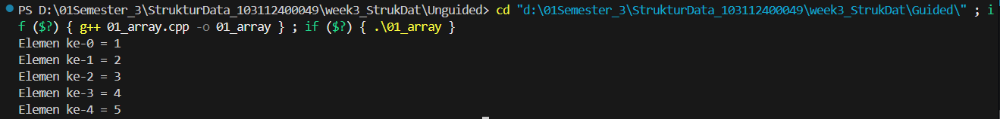
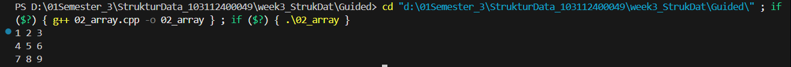
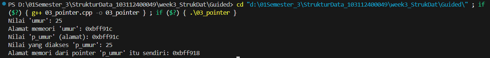
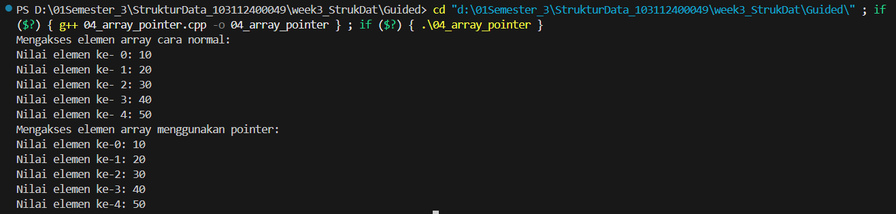
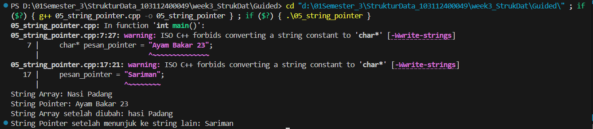
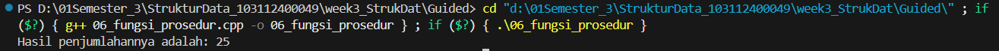
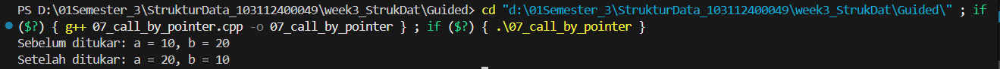
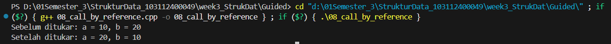
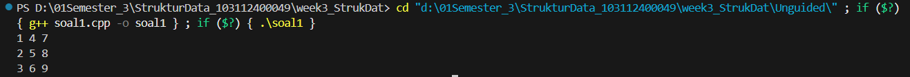
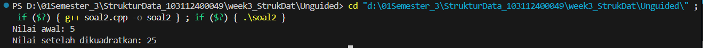

# <h1 align="center">LAPORAN PRAKTIKUM MODUL 2 <br> PENGENALAN BAHASA C++ (BAGIAN KEDUA)</h1>
<p align="center">HISYAM NURDIATMOKO - 103112400049</p>

## Dasar Teori

### Array
Array adalah kumpulan data bertipe sama yang disimpan dengan satu nama variabel. Setiap elemen data diakses menggunakan indeks, yang dimulai dari 0. Array dapat berupa satu dimensi (satu larik), dua dimensi (mirip tabel), atau multi-dimensi (lebih dari dua indeks).

### Pointer
Pointer adalah variabel yang berfungsi untuk menyimpan alamat memori dari variabel lain. Terdapat dua operator kunci: 
 
  `&` (Address-of) Untuk mendapatkan alamat memori suatu variabel.
  
  `*` (Dereference) Untuk mengakses nilai yang ada di alamat yang ditunjuk pointer.
  
Pointer memiliki hubungan yang sangat erat dengan array, di mana nama array dapat berfungsi sebagai pointer ke elemen pertamanya.

### Fungsi dan Prosedur
Fungsi adalah blok kode yang dirancang untuk menjalankan tugas khusus, sering kali dengan mengolah data masukan (parameter) dan memberikan nilai kembalian (return value). Tujuannya adalah membuat program lebih terstruktur dan mengurangi duplikasi kode. Prosedur dalam C++ adalah istilah untuk fungsi yang tidak mengembalikan nilai, yang dideklarasikan menggunakan tipe void.

Ada tiga cara utama untuk melewatkan parameter ke dalam fungsi:

Call by Value: Nilai dari parameter aktual disalin ke parameter formal. Perubahan di dalam fungsi tidak memengaruhi variabel asli.

Call by Pointer: Alamat memori dari variabel aktual dilewatkan ke fungsi. Ini memungkinkan fungsi untuk mengubah nilai variabel asli secara langsung.

Call by Reference: Sebuah alias (referensi) dari variabel aktual dilewatkan ke fungsi. Cara ini juga mengizinkan perubahan pada variabel asli, namun dengan sintaks pemanggilan yang lebih sederhana dibandingkan pointer.

## Guided

### Array 1

```cpp
#include <iostream>
using namespace std;

int main()
{
    int nilai[5] = {1, 2, 3, 4, 5};

    for (int i = 0; i < 5; ++i)
    {
        cout << "Elemen ke-" << i << " = " << nilai[i] << endl;
    }
    return 0;
}
```
> Output
> 

program C++ ini bertujuan untuk mendeklarasikan sebuah array integer bernama nilai dengan lima elemen (1, 2, 3, 4, 5), lalu menampilkannya ke layar. Program menggunakan perulangan for untuk mengakses setiap elemen array satu per satu, mulai dari indeks ke-0 hingga ke-4. Di dalam setiap putaran loop, program akan mencetak nomor indeks dan nilai elemen yang sesuai pada indeks tersebut, sehingga menghasilkan output yang menampilkan seluruh isi array secara berurutan.

### Array 2

```cpp
#include <iostream>
using namespace std;

int main()

{
    int matriks[3][3] = {
        {1, 2, 3},
        {4, 5, 6},
        {7, 8, 9}};

    for (int i = 0; i < 3; ++i)
    {
        for (int j = 0; j < 3; ++j)
        {
            cout << matriks[i][j] << " ";
        }
        cout << endl;
    }
    return 0;
}
```

> Output
> 

program C++ ini mendeklarasikan sebuah **array dua dimensi** (matriks) berukuran 3x3 bernama `matriks` dan langsung mengisinya dengan angka 1 sampai 9. Kemudian, program menggunakan **perulangan bersarang** (*nested for loop*) untuk mengakses setiap elemen. Perulangan luar (`i`) bertugas untuk berpindah baris, sementara perulangan dalam (`j`) bertugas untuk mencetak setiap elemen pada kolom di baris tersebut. Setelah semua kolom dalam satu baris tercetak, perintah `cout << endl;` akan membuat baris baru, sehingga hasil akhirnya adalah tampilan matriks 3x3 yang utuh dan rapi di layar

### Pointer

```cpp
#include <iostream>
using namespace std;

int main()
{
    int umur = 25;
    int *p_umur;

    p_umur = &umur;

    cout << "Nilai 'umur': " << umur << endl;
    cout << "Alamat memeori 'umur': " << &umur << endl;
    cout << "Nilai 'p_umur' (alamat): " <<p_umur << endl;
    cout << "Nilai yang diakses 'p_umur': " << *p_umur << endl;
    cout << "Alamat memori dari pointer 'p_umur' itu sendiri: " << &p_umur << endl;

    return 0;
}
```

> Output
> 

program C++ tersebut mendemonstrasikan konsep dasar **pointer**, yaitu variabel khusus yang menyimpan alamat memori variabel lain. Secara spesifik, kode ini menginisialisasi sebuah variabel integer `umur`, kemudian mendeklarasikan sebuah pointer `p_umur` yang ditugaskan untuk menyimpan alamat memori dari `umur` menggunakan operator `&`. Selanjutnya, program mencetak nilai dan alamat dari `umur`, nilai yang disimpan oleh pointer `p_umur` (yang merupakan alamat `umur`), nilai yang diakses melalui pointer menggunakan operator `*` (dereference), serta alamat memori dari pointer itu sendiri untuk menunjukkan bahwa pointer juga merupakan variabel yang memiliki lokasinya sendiri di memori.

### Array Pointer

```cpp
#include <iostream>
using namespace std;

int main()
{
    int data[5] = {10, 20, 30, 40, 50};
    int *p_data = data;

    cout << "Mengakses elemen array cara normal: " << endl;

    for (int i = 0; i < 5; ++i)
    {
        cout << "Nilai elemen ke- " << i << ": " << data[i] << endl;
    }

    cout << "Mengakses elemen array menggunakan pointer:" << endl;

    for (int i = 0; i < 5; ++i)
    {
        cout << "Nilai elemen ke-" << i << ": " << *(p_data + i) << endl;
    }
    return 0;
}
```

> Output
> 

program C++ ini mendemonstrasikan dua metode yang setara untuk mengakses elemen-elemen dari sebuah array data. Pertama, program menginisialisasi sebuah array integer dan sebuah pointer p_data yang menunjuk ke alamat memori elemen pertama array tersebut. Program kemudian menampilkan seluruh isi array sebanyak dua kali: perulangan pertama menggunakan akses berbasis indeks yang umum (data[i]), dan perulangan kedua menggunakan aritmetika pointer (p_data + i) yang digabungkan dengan operator dereferensi (*) untuk mengambil nilai pada alamat yang ditunjuk. Kedua metode ini menghasilkan output yang identik, membuktikan bahwa notasi data[i] dan *(p_data + i) adalah dua cara berbeda untuk melakukan hal yang sama.

### String Pointer

```cpp
#include <iostream>
using namespace std;

int main()
{
    char pesan_array[] = "Nasi Padang";
    char* pesan_pointer = "Ayam Bakar 23";

    cout << "String Array: " << pesan_array << endl;
    cout << "String Pointer: " << pesan_pointer << endl;

    // Mengubah karakter dalam array diperbolehkan
    pesan_array[0] = 'h';
    cout << "String Array setelah diubah: " << pesan_array << endl;

    // Pointer dapat diubah untuk menunjuk ke string lain
    pesan_pointer = "Sariman";
    cout << "String Pointer setelah menunjuk ke string lain: " << pesan_pointer << endl;

    return 0;
}
```

> Output
> 

program C++ ini mendemonstrasikan perbedaan mendasar antara char array (pesan_array) dan char pointer (pesan_pointer) dalam menangani string. pesan_array membuat salinan string "Nasi Padang" ke dalam memori yang dapat diubah, sehingga isinya bisa dimodifikasi secara langsung (contohnya mengubah 'N' menjadi 'h'). Sebaliknya, pesan_pointer hanya menyimpan alamat memori dari sebuah string literal ("Ayam Bakar 23") yang biasanya bersifat read-only. Oleh karena itu, program tidak mengubah isi string tersebut, melainkan mengubah pointernya agar menunjuk ke alamat string literal yang baru ("Sariman").

### Fungsi Prosedur

```cpp
#include <iostream>

int hitungJumlah(int a, int b)
{
    return a + b;
}

void tampilkanHasil(int hasil)
{
    std::cout << "Hasil penjumlahannya adalah: " << hasil << std::endl;
}

int main()
{
    int angka1 = 15;
    int angka2 = 10;
    int hasilJumlah;

    hasilJumlah = hitungJumlah(angka1, angka2);
    tampilkanHasil(hasilJumlah);

    return 0;
}
```

> Output
> 

program C++ ini mendemonstrasikan penggunaan fungsi untuk memecah tugas menjadi dua bagian: satu untuk perhitungan dan satu untuk penampilan hasil. Fungsi hitungJumlah bertanggung jawab untuk menerima dua angka, menjumlahkannya, dan mengembalikan (return) nilai hasilnya. Sementara itu, fungsi void bernama tampilkanHasil bertugas untuk menerima sebuah angka dan hanya menampilkannya ke layar. Di dalam fungsi main, program memanggil hitungJumlah terlebih dahulu, menyimpan hasilnya dalam sebuah variabel, lalu memberikan variabel hasil tersebut ke fungsi tampilkanHasil untuk dicetak ke konsol.

### Call By Pointer

```cpp
#include <iostream>
using namespace std;

void tukar(int *px, int *py)
{
    int temp = *px;
    *px = *py;
    *py = temp;
}

int main()
{
    int a = 10, b = 20;
    cout << "Sebelum ditukar: a = " << a << ", b = " << b << endl;
    tukar(&a, &b);
    cout << "Setelah ditukar: a = " << a << ", b = " << b << endl;
    return 0;
}
```
> Output
> 

program C++ ini menunjukkan cara menukar nilai dua variabel, a dan b, melalui sebuah fungsi yang menggunakan pointer. Fungsi tukar menerima alamat memori dari variabel-variabel tersebut, bukan salinan nilainya. Di dalam main, alamat a dan b dikirim ke fungsi tukar menggunakan operator &. Fungsi tukar lalu menggunakan operator dereferensi * untuk mengakses nilai asli di alamat itu dan melakukan pertukaran secara langsung, sehingga perubahan pada a dan b bersifat permanen.

### Call By Reference

```cpp
#include <iostream>
using namespace std;

void tukar(int &x, int &y)
{
    int temp = x;
    x = y;
    y = temp;
}

int main()
{
    int a = 10, b = 20;
    cout << "Sebelum ditukar: a = " << a << ", b = " << b << endl;
    tukar(a, b);
    cout << "Setelah ditukar: a = " << a << ", b = " << b << endl;
    return 0;
}
```
> Output
> 

program C++ ini mendemonstrasikan cara menukar nilai dua variabel menggunakan metode pass-by-reference. Berbeda dengan versi pointer, fungsi `tukar` kali ini menerima parameternya sebagai referensi, yang ditandai dengan simbol `&` pada deklarasi `int &x`. Ini berarti `x` dan `y` di dalam fungsi menjadi nama alias untuk variabel asli `a` dan `b` di `main`. Akibatnya, setiap operasi pada `x` dan `y` akan secara langsung mengubah nilai `a` dan `b`. Saat fungsi `tukar(a, b)` dipanggil, pertukaran nilai terjadi pada variabel aslinya, sehingga perubahan tersebut bersifat permanen.

## Unguided

### Soal 1

Buatlah sebuah program untuk melakukan transpose pada sebuah matriks persegi berukuran 3x3. Operasi transpose adalah mengubah baris menjadi kolom dan sebaliknya. Inisialisasi matriks awal di dalam kode, kemudian buat logika untuk melakukan transpose dan simpan hasilnya ke dalam matriks baru. Terakhir, tampilkan matriks awal dan matriks hasil transpose.

```cpp
#include <iostream>
using namespace std;

int main()

{
    int matriks[3][3] = {
        {1, 2, 3},
        {4, 5, 6},
        {7, 8, 9}};
        
    for (int i = 0; i < 3; ++i)
    {
        for (int j = 0; j < 3; ++j)
        {
            cout << matriks[j][i] << " ";
        }
        cout << endl;
    }
    return 0;
}
```

> Output
> 

program C++ ini menginisialisasi sebuah matriks berukuran 3x3, kemudian menampilkannya ke layar dengan cara yang tidak biasa. Melalui perulangan bersarang, program mengakses setiap elemen matriks, namun dengan membalik urutan indeksnya menjadi matriks[j][i]. Pembalikan indeks ini, di mana indeks untuk baris dan kolom ditukar, menyebabkan program mencetak hasil transposisi dari matriks aslinya. Dengan kata lain, program ini mengubah baris-baris dari matriks asli menjadi kolom-kolom pada hasil keluarannya.

### Soal 2

Buatlah program yang menunjukkan penggunaan call by reference. Buat sebuah prosedur bernama kuadratkan yang menerima satu parameter integer secara referensi (&). Prosedur ini akan mengubah nilai asli variabel yang dilewatkan dengan nilai kuadratnya. Tampilkan nilai variabel di main() sebelum dan sesudah memanggil prosedur untuk membuktikan perubahannya. 

```cpp
#include <iostream>
using namespace std;

void kuadratkan(int &angka) {
    angka = angka * angka;
}

int main() 

{
    int nilai = 5;
    
    cout << "Nilai awal: " << nilai << endl;
    kuadratkan(nilai);
    cout << "Nilai setelah dikuadratkan: " << nilai << endl;

    return 0;
}
```

> Output
> 

program C++ ini menunjukkan bagaimana sebuah fungsi dapat mengubah nilai variabel asli menggunakan metode pass-by-reference. Fungsi `kuadratkan` menerima parameternya sebagai referensi, yang ditandai dengan simbol `&`, sehingga `angka` di dalam fungsi menjadi alias atau nama lain untuk variabel `nilai` yang ada di fungsi `main`. Ketika `kuadratkan(nilai)` dipanggil, operasi perkalian di dalamnya langsung memodifikasi variabel `nilai` yang asli. Hasilnya, nilai variabel yang awalnya 5 berubah secara permanen menjadi 25 setelah fungsi tersebut dieksekusi, seperti yang ditunjukkan pada output akhir.

## Referensi

Modul 2: Pengenalan Bahasa C++ (Bagian Kedua). Bandung: Laboratorium Informatika, Fakultas Informatika, Telkom University.

https://www.geeksforgeeks.org/cpp/ (diakses pada 30 September 2025).

http://www.cplusplus.com/doc/tutorial/ (diakses pada 30 September 2025).
