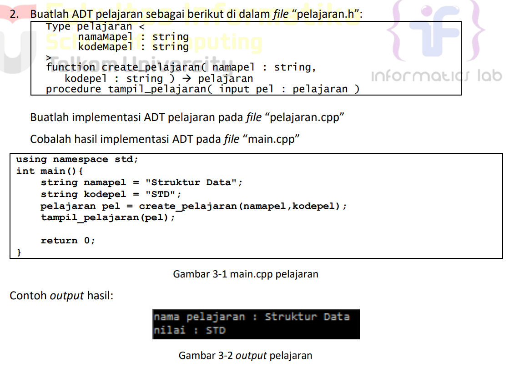
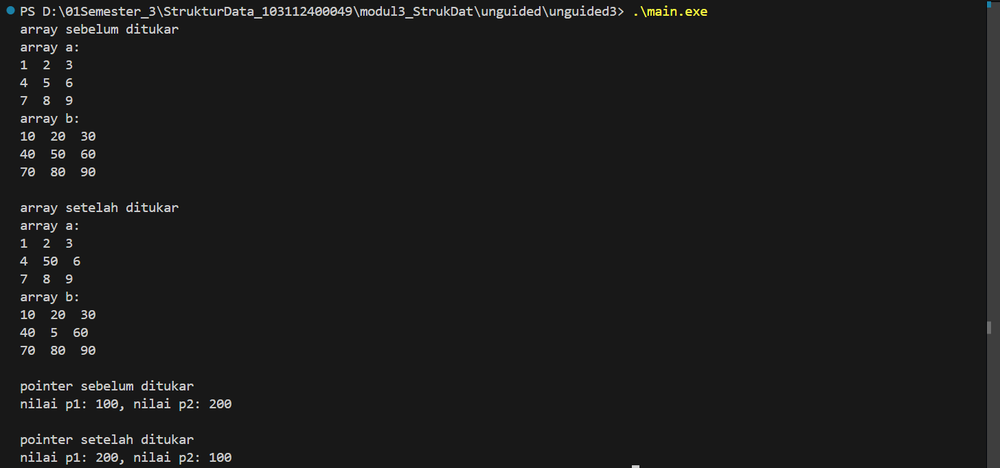

# <h1 align="center">LAPORAN PRAKTIKUM MODUL 3 <br> ABSTRACT DATA TYPE (ADT)</h1>
<p align="center">HISYAM NURDIATMOKO - 103112400049</p>

## Dasar Teori

### Abstract Data Type (ADT)
adalah sebuah tipe data yang didefinisikan berdasarkan perilakunya (apa yang bisa ia lakukan) dan sekumpulan operasinya, bukan berdasarkan bagaimana cara ia dibuat. Konsep ini menyembunyikan detail implementasi dari pengguna, yang hanya perlu tahu cara memakai operasi dasar atau primitif yang disediakan.


Primitif-primitif utama meliputi:

Konstruktor: Untuk membuat objek ADT

Selektor: Untuk mengakses atau membaca data dari komponen ADT

Mutator: Untuk mengubah nilai komponen ADT

### Implementasi ADT dalam C++ 
dilakukan dengan memisahkan definisi dan realisasi ke dalam file yang berbeda untuk menciptakan abstraksi:


File Header (.h): Berisi definisi struct dan deklarasi fungsi-fungsi primitif

File Implementasi (.cpp): Berisi kode atau body dari setiap fungsi yang dideklarasikan di file header

## Guided

### Guided 1

#### mahasiswa.h

```cpp
#ifndef MAHASISWA_H_INCLUDED
#define MAHASISWA_H_INCLUDED
struct mahasiswa
{
    char nim[10];
    int nilai1, nilai2;
};
void inputMhs(mahasiswa &m);
float rata2(mahasiswa m);
#endif
```

#### mahasiswa.cpp

```cpp
#include "mahasiswa.h"
#include <iostream>
using namespace std;

void inputMhs(mahasiswa &m)
{
    cout << "input nama = ";
    cin >> (m).nim;
    cout << "input nilai = ";
    cin >> (m).nilai1;
    cout << "input nilai2 = ";
    cin >> (m).nilai2;
}
float rata2(mahasiswa m)
{
    return float(m.nilai1 + m.nilai2) / 2;
}
```

#### main.cpp

```cpp
#include <iostream>
#include "mahasiswa.h"
using namespace std;

int main()
{
    mahasiswa mhs;
    inputMhs(mhs);
    cout << "rata - rata = " << rata2(mhs);
    return 0;
}
```

> Output
> 

program C++ ini didesain secara modular untuk mengelola data seorang mahasiswa. Program ini menggunakan sebuah struct mahasiswa yang menyimpan NIM dan dua nilai. Melalui fungsi terpisah, program meminta pengguna untuk memasukkan data NIM dan kedua nilai tersebut. Setelah data diterima, program akan menghitung nilai rata-rata dari dua nilai yang telah diinput dan kemudian menampilkan hasil rata-rata tersebut ke terminal.

## Unguided

### Soal 1

Buat program yang dapat menyimpan data mahasiswa (max. 10) ke dalam sebuah array dengan field nama, nim, uts, uas, tugas, dan nilai akhir. Nilai akhir diperoleh dari FUNGSI dengan rumus 0.3*uts+0.4*uas+0.3*tugas.

#### unguided1.h

```cpp
#ifndef MAHASISWA_H_INCLUDED
#define MAHASISWA_H_INCLUDED
#include <string>
using namespace std;

struct Mahasiswa {
    string nama;
    string nim;
    float uts;
    float uas;
    float tugas;
    float nilaiAkhir;
};

void inputMahasiswa(Mahasiswa& mhs);
void hitungDanSetNilaiAkhir(Mahasiswa& mhs);
void tampilkanMahasiswa(const Mahasiswa& mhs);

#endif
```

#### unguided1.cpp

```cpp
#include "unguided1.h"
#include <iostream>
using namespace std;

void inputMahasiswa(Mahasiswa& mhs) {
    cout << "Nama: ";
    cin >> ws;
    getline(cin, mhs.nama);
    cout << "NIM: ";
    cin >> mhs.nim;
    cout << "Nilai UTS: ";
    cin >> mhs.uts;
    cout << "Nilai UAS: ";
    cin >> mhs.uas;
    cout << "Nilai Tugas: ";
    cin >> mhs.tugas;
}

void hitungDanSetNilaiAkhir(Mahasiswa& mhs) {
    mhs.nilaiAkhir = (0.3 * mhs.uts) + (0.4 * mhs.uas) + (0.3 * mhs.tugas);
}

void tampilkanMahasiswa(const Mahasiswa& mhs) {
    cout << "Nama: " << mhs.nama << endl;
    cout << "NIM: " << mhs.nim << endl;
    cout << "UTS: " << mhs.uts << endl;
    cout << "UAS: " << mhs.uas << endl;
    cout << "Tugas: " << mhs.tugas << endl;
    cout << "Nilai Akhir: " << mhs.nilaiAkhir << endl;
}
```

#### main.cpp

```cpp
#include <iostream>
#include "unguided1.h"
using namespace std;

int main() {
    Mahasiswa daftarMahasiswa[10];
    int jumlahMahasiswa = 0;
    char lanjut;
    
    do {
        if (jumlahMahasiswa >= 10) {
            cout << "kapasitas maksimal mahasiswa telah tercapai" << endl;
            break;
        }

        cout << "\nmasukkan data mahasiswa ke-" << jumlahMahasiswa + 1 << ":" << endl;
        inputMahasiswa(daftarMahasiswa[jumlahMahasiswa]);
        hitungDanSetNilaiAkhir(daftarMahasiswa[jumlahMahasiswa]);

        jumlahMahasiswa++;

        cout << "\ntambah data mahasiswa lagi? (y/n): ";
        cin >> lanjut;

    } while (lanjut == 'y' || lanjut == 'Y');

    cout << "\ndata lengkap mahasiswa" << endl;
    for (int i = 0; i < jumlahMahasiswa; ++i) {
        cout << "----------------------" << endl;
        tampilkanMahasiswa(daftarMahasiswa[i]);
    }
    cout << "----------------------" << endl;

    return 0;
}
```

> Output
> 

program C++ ini adalah sistem pendataan nilai mahasiswa yang dirancang secara modular, memungkinkan pengguna untuk memasukkan data hingga 10 mahasiswa. Setiap data mahasiswa mencakup nama, NIM, serta tiga komponen nilai yaitu UTS, UAS, dan tugas. Setelah data diinput, program secara otomatis menghitung nilai akhir dengan rumus pembobotan (30% UTS, 40% UAS, dan 30% tugas). Ketika pengguna selesai menambahkan data, program akan menampilkan daftar lengkap semua mahasiswa yang telah dimasukkan beserta rincian nilai dan nilai akhir yang sudah dihitung.

### Soal 2

> 

#### unguided2.h

```cpp
#ifndef PELAJARAN_H_INCLUDED
#define PELAJARAN_H_INCLUDED
#include <string>
using namespace std;

struct pelajaran {
    string namamapel;
    string kodemapel;
};

pelajaran create_pelajaran(string namapel, string kodepel);
void tampil_pelajaran(pelajaran pel);

#endif
```

#### unguided2.cpp

```cpp
#include <iostream>
#include "unguided2.h"
using namespace std;

pelajaran create_pelajaran(string namapel, string kodepel) {
    pelajaran p;
    p.namamapel = namapel;
    p.kodemapel = kodepel;
    return p;
}

void tampil_pelajaran(pelajaran pel) {
    cout << "nama pelajaran: " << pel.namamapel << endl;
    cout << "nilai: " << pel.kodemapel << endl;
}
```

#### main.cpp

```cpp
#include <iostream>
#include "unguided2.h"
using namespace std;

int main() {
    string namapel = "Struktur Data";
    string kodepel = "STD";
    pelajaran pel = create_pelajaran(namapel, kodepel);
    tampil_pelajaran(pel);
    return 0;
}
```

> Output
> 

program C++ ini menunjukkan penggunaan struct untuk mengelola data mata pelajaran dalam desain yang modular. Program mendefinisikan sebuah struct bernama pelajaran untuk menyimpan nama dan kode mata pelajaran. Fungsi main kemudian menginisialisasi data untuk mata pelajaran "Struktur Data" dengan kode "STD" secara hardcode, lalu memanggil fungsi create_pelajaran untuk membuat sebuah objek dari data tersebut. Akhirnya, program menggunakan fungsi tampil_pelajaran untuk mencetak atau menampilkan detail nama dan kode dari mata pelajaran yang telah dibuat ke terminal.

### Soal 3

```
Buatlah program dengan ketentuan :
- 2 buah array 2D integer berukuran 3x3 dan 2 buah pointer integer
- fungsi/prosedur yang menampilkan isi sebuah array integer 2D
- fungsi/prosedur yang akan menukarkan isi dari 2 array integer 2D pada posisi tertentu
- fungsi/prosedur yang akan menukarkan isi dari variabel yang ditunjuk oleh 2 buah pointer
```

#### unguided3.h

```cpp
#ifndef ARRAY_POINTER_UTIL_H_INCLUDED
#define ARRAY_POINTER_UTIL_H_INCLUDED

void tampilkanArray(int ar[3][3]);
void tukarElemenArray(int ar1[3][3], int ar2[3][3], int baris, int kolom);
void tukarPointer(int* ptr1, int* ptr2);

#endif
```

#### unguided3.cpp

```cpp
#include "unguided3.h"
#include <iostream>
using namespace std;

void tampilkanArray(int ar[3][3]) {
    for (int i = 0; i < 3; ++i) {
        for (int j = 0; j < 3; ++j) {
            cout << ar[i][j] << "  ";
        }
        cout << endl;
    }
}

void tukarElemenArray(int ar1[3][3], int ar2[3][3], int baris, int kolom) {
    if (baris >= 0 && baris < 3 && kolom >= 0 && kolom < 3) {
        int temp = ar1[baris][kolom];
        ar1[baris][kolom] = ar2[baris][kolom];
        ar2[baris][kolom] = temp;
    }
}

void tukarPointer(int* ptr1, int* ptr2) {
    int temp = *ptr1;
    *ptr1 = *ptr2;
    *ptr2 = temp;
}
```

#### main.cpp

```cpp
#include <iostream>
#include "unguided3.h"
using namespace std;

int main() {
    int arrayA[3][3] = { {1, 2, 3}, {4, 5, 6}, {7, 8, 9} };
    int arrayB[3][3] = { {10, 20, 30}, {40, 50, 60}, {70, 80, 90} };

    cout << "array sebelum ditukar" << endl;
    cout << "array a:" << endl;
    tampilkanArray(arrayA);
    cout << "array b:" << endl;
    tampilkanArray(arrayB);

    tukarElemenArray(arrayA, arrayB, 1, 1);

    cout << "\narray setelah ditukar" << endl;
    cout << "array a:" << endl;
    tampilkanArray(arrayA);
    cout << "array b:" << endl;
    tampilkanArray(arrayB);

    int var1 = 100;
    int var2 = 200;
    int* p1 = &var1;
    int* p2 = &var2;

    cout << "\npointer sebelum ditukar" << endl;
    cout << "nilai p1: " << *p1 << ", nilai p2: " << *p2 << endl;

    tukarPointer(p1, p2);

    cout << "\npointer setelah ditukar" << endl;
    cout << "nilai p1: " << *p1 << ", nilai p2: " << *p2 << endl;
    
    return 0;
}
```

> Output
> 

program C++ ini mendemonstrasikan dua metode pertukaran nilai (swapping) yang berbeda menggunakan desain modular. Pertama, program ini menginisialisasi dua buah array dua dimensi 3x3, lalu menunjukkan cara menukar satu elemen spesifik (pada indeks [1][1]) di antara kedua array tersebut menggunakan fungsi tukarElemenArray. Kedua, program ini juga mendemonstrasikan cara menukar nilai dari dua variabel dengan melewatkan alamat memori mereka ke sebuah fungsi (tukarPointer) yang memanipulasi nilai melalui pointer. Hasil sebelum dan sesudah dari kedua operasi pertukaran tersebut kemudian ditampilkan ke terminal untuk menunjukkan perubahannya.

## Referensi

Modul 2: Pengenalan Bahasa C++ (Bagian Kedua). Bandung: Laboratorium Informatika, Fakultas Informatika, Telkom University.

https://www.geeksforgeeks.org/cpp/ (diakses pada 30 September 2025).

http://www.cplusplus.com/doc/tutorial/ (diakses pada 30 September 2025).

