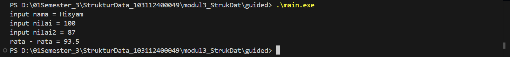

# <h1 align="center">LAPORAN PRAKTIKUM MODUL 3 <br> ABSTRACT DATA TYPE (ADT)</h1>
<p align="center">HISYAM NURDIATMOKO - 103112400049</p>

## Dasar Teori

### Abstract Data Type (ADT)
adalah sebuah tipe data yang didefinisikan berdasarkan perilakunya (apa yang bisa ia lakukan) dan sekumpulan operasinya, bukan berdasarkan bagaimana cara ia dibuat. Konsep ini menyembunyikan detail implementasi dari pengguna, yang hanya perlu tahu cara memakai operasi dasar atau primitif yang disediakan.


Primitif-primitif utama meliputi:

Konstruktor: Untuk membuat objek ADT

Selektor: Untuk mengakses atau membaca data dari komponen ADT

Mutator: Untuk mengubah nilai komponen ADT

### Implementasi ADT dalam C++ 
dilakukan dengan memisahkan definisi dan realisasi ke dalam file yang berbeda untuk menciptakan abstraksi:


File Header (.h): Berisi definisi struct dan deklarasi fungsi-fungsi primitif

File Implementasi (.cpp): Berisi kode atau body dari setiap fungsi yang dideklarasikan di file header

## Guided

### Guided 1

#### mahasiswa.h

```cpp
#ifndef MAHASISWA_H_INCLUDED
#define MAHASISWA_H_INCLUDED
struct mahasiswa
{
    char nim[10];
    int nilai1, nilai2;
};
void inputMhs(mahasiswa &m);
float rata2(mahasiswa m);
#endif
```

#### mahasiswa.cpp

```cpp
#include "mahasiswa.h"
#include <iostream>
using namespace std;

void inputMhs(mahasiswa &m)
{
    cout << "input nama = ";
    cin >> (m).nim;
    cout << "input nilai = ";
    cin >> (m).nilai1;
    cout << "input nilai2 = ";
    cin >> (m).nilai2;
}
float rata2(mahasiswa m)
{
    return float(m.nilai1 + m.nilai2) / 2;
}
```

#### main.cpp

```cpp
#include <iostream>
#include "mahasiswa.h"
using namespace std;

int main()
{
    mahasiswa mhs;
    inputMhs(mhs);
    cout << "rata - rata = " << rata2(mhs);
    return 0;
}
```

> Output
> 

program C++ ini didesain secara modular untuk mengelola data seorang mahasiswa. Program ini menggunakan sebuah struct mahasiswa yang menyimpan NIM dan dua nilai. Melalui fungsi terpisah, program meminta pengguna untuk memasukkan data NIM dan kedua nilai tersebut. Setelah data diterima, program akan menghitung nilai rata-rata dari dua nilai yang telah diinput dan kemudian menampilkan hasil rata-rata tersebut ke terminal.

## Unguided

### Soal 1

Buat program yang dapat menyimpan data mahasiswa (max. 10) ke dalam sebuah array dengan field nama, nim, uts, uas, tugas, dan nilai akhir. Nilai akhir diperoleh dari FUNGSI dengan rumus 0.3*uts+0.4*uas+0.3*tugas.

#### unguided1.h

```cpp
#ifndef MAHASISWA_H_INCLUDED
#define MAHASISWA_H_INCLUDED
#include <string>
using namespace std;

struct Mahasiswa {
    string nama;
    string nim;
    float uts;
    float uas;
    float tugas;
    float nilaiAkhir;
};

void inputMahasiswa(Mahasiswa& mhs);
void hitungDanSetNilaiAkhir(Mahasiswa& mhs);
void tampilkanMahasiswa(const Mahasiswa& mhs);

#endif
```

#### unguided1.cpp

```cpp
#include "unguided1.h"
#include <iostream>
using namespace std;

void inputMahasiswa(Mahasiswa& mhs) {
    cout << "Nama: ";
    cin >> ws;
    getline(cin, mhs.nama);
    cout << "NIM: ";
    cin >> mhs.nim;
    cout << "Nilai UTS: ";
    cin >> mhs.uts;
    cout << "Nilai UAS: ";
    cin >> mhs.uas;
    cout << "Nilai Tugas: ";
    cin >> mhs.tugas;
}

void hitungDanSetNilaiAkhir(Mahasiswa& mhs) {
    mhs.nilaiAkhir = (0.3 * mhs.uts) + (0.4 * mhs.uas) + (0.3 * mhs.tugas);
}

void tampilkanMahasiswa(const Mahasiswa& mhs) {
    cout << "Nama: " << mhs.nama << endl;
    cout << "NIM: " << mhs.nim << endl;
    cout << "UTS: " << mhs.uts << endl;
    cout << "UAS: " << mhs.uas << endl;
    cout << "Tugas: " << mhs.tugas << endl;
    cout << "Nilai Akhir: " << mhs.nilaiAkhir << endl;
}
```

#### main.cpp

```cpp
#include <iostream>
#include "unguided1.h"
using namespace std;

int main() {
    Mahasiswa daftarMahasiswa[10];
    int jumlahMahasiswa = 0;
    char lanjut;
    
    do {
        if (jumlahMahasiswa >= 10) {
            cout << "kapasitas maksimal mahasiswa telah tercapai" << endl;
            break;
        }

        cout << "\nmasukkan data mahasiswa ke-" << jumlahMahasiswa + 1 << ":" << endl;
        inputMahasiswa(daftarMahasiswa[jumlahMahasiswa]);
        hitungDanSetNilaiAkhir(daftarMahasiswa[jumlahMahasiswa]);

        jumlahMahasiswa++;

        cout << "\ntambah data mahasiswa lagi? (y/n): ";
        cin >> lanjut;

    } while (lanjut == 'y' || lanjut == 'Y');

    cout << "\ndata lengkap mahasiswa" << endl;
    for (int i = 0; i < jumlahMahasiswa; ++i) {
        cout << "----------------------" << endl;
        tampilkanMahasiswa(daftarMahasiswa[i]);
    }
    cout << "----------------------" << endl;

    return 0;
}
```

> Output
> 

program C++ ini adalah sistem pendataan nilai mahasiswa yang dirancang secara modular, memungkinkan pengguna untuk memasukkan data hingga 10 mahasiswa. Setiap data mahasiswa mencakup nama, NIM, serta tiga komponen nilai yaitu UTS, UAS, dan tugas. Setelah data diinput, program secara otomatis menghitung nilai akhir dengan rumus pembobotan (30% UTS, 40% UAS, dan 30% tugas). Ketika pengguna selesai menambahkan data, program akan menampilkan daftar lengkap semua mahasiswa yang telah dimasukkan beserta rincian nilai dan nilai akhir yang sudah dihitung.

### Soal 2

Buatlah program yang menunjukkan penggunaan call by reference. Buat sebuah prosedur bernama kuadratkan yang menerima satu parameter integer secara referensi (&). Prosedur ini akan mengubah nilai asli variabel yang dilewatkan dengan nilai kuadratnya. Tampilkan nilai variabel di main() sebelum dan sesudah memanggil prosedur untuk membuktikan perubahannya. 

```cpp
#include <iostream>
using namespace std;

void kuadratkan(int &angka) {
    angka = angka * angka;
}

int main() 

{
    int nilai = 5;
    
    cout << "Nilai awal: " << nilai << endl;
    kuadratkan(nilai);
    cout << "Nilai setelah dikuadratkan: " << nilai << endl;

    return 0;
}
```

> Output
> 

program C++ ini menunjukkan bagaimana sebuah fungsi dapat mengubah nilai variabel asli menggunakan metode pass-by-reference. Fungsi `kuadratkan` menerima parameternya sebagai referensi, yang ditandai dengan simbol `&`, sehingga `angka` di dalam fungsi menjadi alias atau nama lain untuk variabel `nilai` yang ada di fungsi `main`. Ketika `kuadratkan(nilai)` dipanggil, operasi perkalian di dalamnya langsung memodifikasi variabel `nilai` yang asli. Hasilnya, nilai variabel yang awalnya 5 berubah secara permanen menjadi 25 setelah fungsi tersebut dieksekusi, seperti yang ditunjukkan pada output akhir.

## Referensi

Modul 2: Pengenalan Bahasa C++ (Bagian Kedua). Bandung: Laboratorium Informatika, Fakultas Informatika, Telkom University.

https://www.geeksforgeeks.org/cpp/ (diakses pada 30 September 2025).

http://www.cplusplus.com/doc/tutorial/ (diakses pada 30 September 2025).

