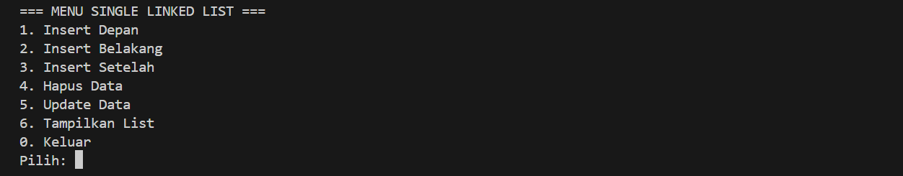
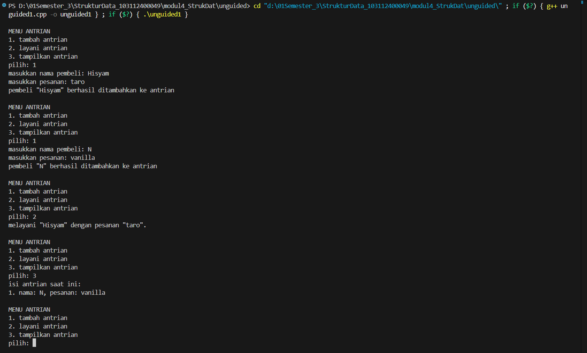
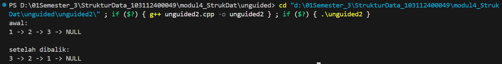

# <h1 align="center">LAPORAN PRAKTIKUM MODUL 4 <br> SINGLY LINKED LIST (BAGIAN PERTAMA)</h1>
<p align="center">HISYAM NURDIATMOKO - 103112400049</p>

## Dasar Teori

### Linked List

Linked list adalah sebuah struktur data yang bersifat dinamis, terdiri dari serangkaian elemen data yang disebut node dan saling terhubung melalui pointer. Sifatnya yang fleksibel memungkinkan ukurannya untuk bertambah atau berkurang sesuai kebutuhan, menjadikannya alternatif yang efektif dibandingkan array yang statis. Salah satu jenisnya adalah Singly Linked List, di mana setiap node-nya hanya memiliki satu pointer yang menunjuk ke node berikutnya, sehingga penelusuran data hanya bisa dilakukan dalam satu arah (maju). Setiap node pada singly linked list memiliki dua komponen utama: data sebagai informasi yang disimpan, dan next (successor) sebagai pointer yang menyimpan alamat dari elemen berikutnya. Node terakhir dalam list akan memiliki pointer next yang menunjuk ke NULL, menandakan akhir dari rangkaian.

Operasi fundamental pada singly linked list dimulai dari inisialisasi list kosong (CreateList) , diikuti dengan manajemen memori untuk setiap node melalui alokasi (menggunakan new) dan dealokasi (menggunakan delete). Elemen dapat ditambahkan ke dalam list melalui beberapa metode penyisipan, seperti di bagian awal (Insert First), di bagian akhir (Insert Last), atau setelah node tertentu (Insert After). Sebaliknya, elemen juga dapat dihapus dari awal (Delete First), dari akhir (Delete Last), atau setelah node tertentu (Delete After). Untuk melihat keseluruhan isinya, operasi penelusuran (View) digunakan untuk menampilkan data dari node pertama hingga terakhir.

## Guided

### Guided 1

#### linkedlist.cpp

```cpp
#include <iostream>
using namespace std;

// Struktur Node
struct Node {
    int data;
    Node* next;
};

// Pointer awal dan akhir
Node* head = nullptr;

// Fungsi untuk membuat node baru
Node* createNode(int data) {
    Node* newNode = new Node();
    newNode->data = data;
    newNode->next = nullptr;
    return newNode;
}

void insertDepan(int data) {
    Node* newNode = createNode(data);
    newNode->next = head;
    head = newNode;
    cout << "Data " << data << " berhasil ditambahkan di depan.\n";
}

void insertBelakang(int data) {
    Node* newNode = createNode(data);
    if (head == nullptr) {
        head = newNode;
    } else {
        Node* temp = head;
        while (temp->next != nullptr) {
            temp = temp->next;
        }
        temp->next = newNode;
    }
    cout << "Data " << data << " berhasil ditambahkan di belakang.\n";
}

void insertSetelah(int target, int dataBaru) {
    Node* temp = head;
    while (temp != nullptr && temp->data != target) {
        temp = temp->next;
    }

    if (temp == nullptr) {
        cout << "Data " << target << " tidak ditemukan!\n";
    } else {
        Node* newNode = createNode(dataBaru);
        newNode->next = temp->next;
        temp->next = newNode;
        cout << "Data " << dataBaru << " berhasil disisipkan setelah " << target << ".\n";
    }
}

// ========== DELETE FUNCTION ==========
void hapusNode(int data) {
    if (head == nullptr) {
        cout << "List kosong!\n";
        return;
    }

    Node* temp = head;
    Node* prev = nullptr;

    // Jika data di node pertama
    if (temp != nullptr && temp->data == data) {
        head = temp->next;
        delete temp;
        cout << "Data " << data << " berhasil dihapus.\n";
        return;
    }

    // Cari node yang akan dihapus
    while (temp != nullptr && temp->data != data) {
        prev = temp;
        temp = temp->next;
    }

    // Jika data tidak ditemukan
    if (temp == nullptr) {
        cout << "Data " << data << " tidak ditemukan!\n";
        return;
    }

    prev->next = temp->next;
    delete temp;
    cout << "Data " << data << " berhasil dihapus.\n";
}

// ========== UPDATE FUNCTION ==========
void updateNode(int dataLama, int dataBaru) {
    Node* temp = head;
    while (temp != nullptr && temp->data != dataLama) {
        temp = temp->next;
    }

    if (temp == nullptr) {
        cout << "Data " << dataLama << " tidak ditemukan!\n";
    } else {
        temp->data = dataBaru;
        cout << "Data " << dataLama << " berhasil diupdate menjadi " << dataBaru << ".\n";
    }
}

// ========== DISPLAY FUNCTION ==========
void tampilkanList() {
    if (head == nullptr) {
        cout << "List kosong!\n";
        return;
    }

    Node* temp = head;
    cout << "Isi Linked List: ";
    while (temp != nullptr) {
        cout << temp->data << " -> ";
        temp = temp->next;
    }
    cout << "NULL\n";
}

// ========== MAIN PROGRAM ==========
int main() {
    int pilihan, data, target, dataBaru;

    do {
        cout << "\n=== MENU SINGLE LINKED LIST ===\n";
        cout << "1. Insert Depan\n";
        cout << "2. Insert Belakang\n";
        cout << "3. Insert Setelah\n";
        cout << "4. Hapus Data\n";
        cout << "5. Update Data\n";
        cout << "6. Tampilkan List\n";
        cout << "0. Keluar\n";
        cout << "Pilih: ";
        cin >> pilihan;

        switch (pilihan) {
            case 1:
                cout << "Masukkan data: ";
                cin >> data;
                insertDepan(data);
                break;
            case 2:
                cout << "Masukkan data: ";
                cin >> data;
                insertBelakang(data);
                break;
            case 3:
                cout << "Masukkan data target: ";
                cin >> target;
                cout << "Masukkan data baru: ";
                cin >> dataBaru;
                insertSetelah(target, dataBaru);
                break;
            case 4:
                cout << "Masukkan data yang ingin dihapus: ";
                cin >> data;
                hapusNode(data);
                break;
            case 5:
                cout << "Masukkan data lama: ";
                cin >> data;
                cout << "Masukkan data baru: ";
                cin >> dataBaru;
                updateNode(data, dataBaru);
                break;
            case 6:
                tampilkanList();
                break;
            case 0:
                cout << "Program selesai.\n";
                break;
            default:
                cout << "Pilihan tidak valid!\n";
        }
    } while (pilihan != 0);

    return 0;
}
```

> Output
> 

program C++ ini adalah implementasi dari struktur data Single Linked List yang memungkinkan pengguna untuk mengelola serangkaian data integer melalui sebuah menu interaktif. Pengguna dapat melakukan operasi dasar seperti menambah data (di depan, di belakang, atau setelah data tertentu), menghapus data, mengubah (update) data, serta menampilkan keseluruhan isi list. Program ini menggunakan pointer untuk menghubungkan setiap elemen data (node) secara berurutan, dimulai dari pointer head, dan akan terus berjalan hingga pengguna memilih opsi untuk keluar.

## Unguided

### Soal 1

buatlah single linked list untuk Antrian yang menyimpan data pembeli( nama dan pesanan). program memiliki beberapa menu seperti tambah antrian,  layani antrian(hapus), dan tampilkan antrian. \*antrian pertama harus yang pertama dilayani

```cpp
#include <iostream>
#include <string>
using namespace std;

struct Pembeli {
    string nama;
    string pesanan;
};

struct Node {
    Pembeli data;
    Node* next;
};

Node* head = nullptr;
Node* tail = nullptr;

Node* createNode(Pembeli data) {
    Node* newNode = new Node();
    newNode->data = data;
    newNode->next = nullptr;
    return newNode;
}

void tambahAntrian(Pembeli data) {
    Node* newNode = createNode(data);
    if (head == nullptr) {
        head = newNode;
        tail = newNode;
    } else {
        tail->next = newNode;
        tail = newNode;
    }
    cout << "pembeli \"" << data.nama << "\" berhasil ditambahkan ke antrian\n";
}

void layaniAntrian() {
    if (head == nullptr) {
        cout << "antrian kosong\n";
        return;
    }

    Node* temp = head;
    cout << "melayani \"" << temp->data.nama << "\" dengan pesanan \"" << temp->data.pesanan << "\".\n";

    head = head->next;
    delete temp;

    if (head == nullptr) {
        tail = nullptr;
    }
}

void tampilkanAntrian() {
    if (head == nullptr) {
        cout << "antrian kosong!\n";
        return;
    }

    Node* temp = head;
    cout << "isi antrian saat ini:\n";
    int nomor = 1;
    while (temp != nullptr) {
        cout << nomor << ". nama: " << temp->data.nama << ", pesanan: " << temp->data.pesanan << "\n";
        temp = temp->next;
        nomor++;
    }
}

int main() {
    int pilihan;
    Pembeli dataPembeli;

    while (true) {
        cout << "\nMENU ANTRIAN\n";
        cout << "1. tambah antrian\n";
        cout << "2. layani antrian\n";
        cout << "3. tampilkan antrian\n";
        cout << "pilih: ";
        cin >> pilihan;

        switch (pilihan) {
            case 1:
                cout << "masukkan nama pembeli: ";
                cin.ignore();
                getline(cin, dataPembeli.nama);
                cout << "masukkan pesanan: ";
                getline(cin, dataPembeli.pesanan);
                tambahAntrian(dataPembeli);
                break;
            case 2:
                layaniAntrian();
                break;
            case 3:
                tampilkanAntrian();
                break;
            default:
                cout << "pilihan tidak valdi\n";
        }
    }

    return 0;
}
```

> Output
> 

program C++ ini merupakan implementasi sistem antrian (queue) menggunakan struktur data singly linked list untuk mengelola data pembeli yang mencakup nama dan pesanan. Program ini berjalan secara terus-menerus dan menyediakan menu interaktif bagi pengguna untuk melakukan tiga operasi dasar: menambah pembeli baru ke akhir antrian (tambahAntrian), melayani pembeli pertama dari awal antrian (layaniAntrian), dan menampilkan seluruh daftar pembeli yang sedang mengantri (tampilkanAntrian). Pembeli yang datang lebih dulu akan dilayani terlebih dahulu, menjadikannya simulasi antrian yang sederhana namun fungsional.

### Soal 2

buatlah program kode untuk membalik (reverse) singly linked list (1-2-3 menjadi 3-2-1) 

```cpp
#include <iostream>
using namespace std;

struct Node {
    int data;
    Node* next;
};

Node* head = nullptr;

Node* createNode(int data) {
    Node* newNode = new Node();
    newNode->data = data;
    newNode->next = nullptr;
    return newNode;
}

void insertBelakang(int data) {
    Node* newNode = createNode(data);
    if (head == nullptr) {
        head = newNode;
    } else {
        Node* temp = head;
        while (temp->next != nullptr) {
            temp = temp->next;
        }
        temp->next = newNode;
    }
}

void tampilkanList() {
    if (head == nullptr) {
        cout << "list kosong\n";
        return;
    }

    Node* temp = head;
    while (temp != nullptr) {
        cout << temp->data << " -> ";
        temp = temp->next;
    }
    cout << "NULL\n";
}

void reverseList() {
    Node* prev = nullptr;
    Node* temp = head;
    Node* next = nullptr;

    while (temp != nullptr) {
        next = temp->next;
        temp->next = prev;
        prev = temp;
        temp = next;
    }
    head = prev;
}

int main() {
    insertBelakang(1);
    insertBelakang(2);
    insertBelakang(3);

    cout << "awal:\n";
    tampilkanList();

    reverseList();

    cout << "\nsetelah dibalik:\n";
    tampilkanList();

    return 0;
}
```

> Output
> 

program C++ ini mendemonstrasikan operasi dasar pada struktur data singly linked list. Awalnya, program membuat sebuah list dengan menambahkan tiga elemen angka (1, 2, dan 3) secara berurutan ke bagian belakang menggunakan fungsi insertBelakang. Setelah menampilkan kondisi awal list, program kemudian memanggil fungsi reverseList untuk membalik urutan semua elemen di dalamnya. Terakhir, program kembali menampilkan isi list untuk menunjukkan hasilnya setelah urutannya dibalik, dari yang semula 1 -> 2 -> 3 menjadi 3 -> 2 -> 1.

## Referensi

Laboratorium Dasar Teknik Informatika. (n.d.). Modul 4: Singly Linked List (Bagian Pertama) [Modul Praktikum]. Telkom University, Bandung.

[GeeksforGeeks. (2024). Singly Linked List.](https://www.geeksforgeeks.org/data-structures/linked-list/singly-linked-list/) Diakses pada 8 Oktober 2025


