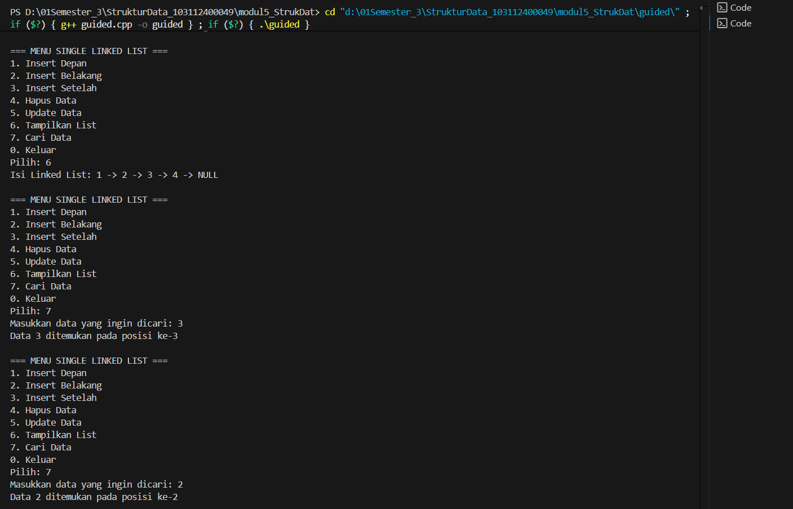
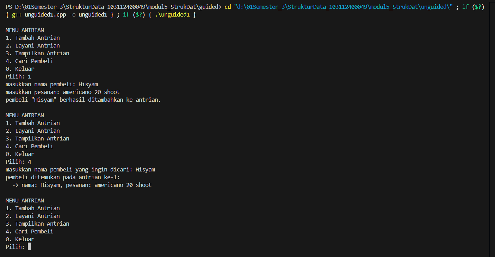
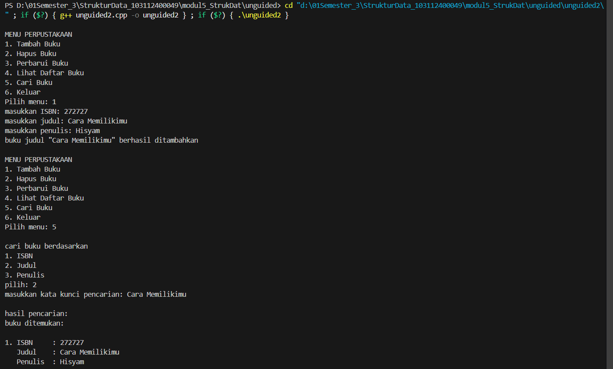

# <h1 align="center">LAPORAN PRAKTIKUM MODUL 5 <br> SINGLY LINKED LIST (BAGIAN KEDUA)</h1>
<p align="center">HISYAM NURDIATMOKO - 103112400049</p>

## Dasar Teori

### Linked List

Linked list adalah sebuah struktur data yang bersifat dinamis, terdiri dari serangkaian elemen data yang disebut node dan saling terhubung melalui pointer. Sifatnya yang fleksibel memungkinkan ukurannya untuk bertambah atau berkurang sesuai kebutuhan, menjadikannya alternatif yang efektif dibandingkan array yang statis. Salah satu jenisnya adalah Singly Linked List, di mana setiap node-nya hanya memiliki satu pointer yang menunjuk ke node berikutnya, sehingga penelusuran data hanya bisa dilakukan dalam satu arah (maju). Setiap node pada singly linked list memiliki dua komponen utama: data sebagai informasi yang disimpan, dan next (successor) sebagai pointer yang menyimpan alamat dari elemen berikutnya. Node terakhir dalam list akan memiliki pointer next yang menunjuk ke NULL, menandakan akhir dari rangkaian.

Operasi fundamental pada singly linked list dimulai dari inisialisasi list kosong (CreateList) , diikuti dengan manajemen memori untuk setiap node melalui alokasi (menggunakan new) dan dealokasi (menggunakan delete). Elemen dapat ditambahkan ke dalam list melalui beberapa metode penyisipan, seperti di bagian awal (Insert First), di bagian akhir (Insert Last), atau setelah node tertentu (Insert After). Sebaliknya, elemen juga dapat dihapus dari awal (Delete First), dari akhir (Delete Last), atau setelah node tertentu (Delete After). Untuk melihat keseluruhan isinya, operasi penelusuran (View) digunakan untuk menampilkan data dari node pertama hingga terakhir.

Searching merupakan operasi dasar list dengan melakukan aktivitas pencarian terhadap node tertentu. Proses ini berjalan dengan mengunjungi setiap node dan berhenti setelah node yang dicari ketemu. Dengan melakukan operasi searching, operasi-operasi seperti insert after, delete after, dan update akan lebih mudah.

## Guided

### Guided 1

#### linkedlist.cpp

```cpp
#include <iostream>
using namespace std;

struct Node {
    int data;
    Node* next;
};

Node* head = nullptr;

Node* createNode(int data) {
    Node* newNode = new Node();
    newNode->data = data;
    newNode->next = nullptr;
    return newNode;
}

void insertDepan(int data) {
    Node* newNode = createNode(data);
    newNode->next = head;
    head = newNode;
    cout << "Data " << data << " berhasil ditambahkan di depan.\n";
}

void insertBelakang(int data) {
    Node* newNode = createNode(data);
    if (head == nullptr) {
        head = newNode;
    } else {
        Node* temp = head;
        while (temp->next != nullptr) {
            temp = temp->next;
        }
        temp->next = newNode;
    }
    cout << "Data " << data << " berhasil ditambahkan di belakang.\n";
}

void insertSetelah(int target, int dataBaru) {
    Node* temp = head;
    while (temp != nullptr && temp->data != target) {
        temp = temp->next;
    }

    if (temp == nullptr) {
        cout << "Data " << target << " tidak ditemukan!\n";
    } else {
        Node* newNode = createNode(dataBaru);
        newNode->next = temp->next;
        temp->next = newNode;
        cout << "Data " << dataBaru << " berhasil disisipkan setelah " << target << ".\n";
    }
}

void hapusNode(int data) {
    if (head == nullptr) {
        cout << "List kosong!\n";
        return;
    }

    Node* temp = head;
    Node* prev = nullptr;

    if (temp != nullptr && temp->data == data) {
        head = temp->next;
        delete temp;
        cout << "Data " << data << " berhasil dihapus.\n";
        return;
    }

    while (temp != nullptr && temp->data != data) {
        prev = temp;
        temp = temp->next;
    }

    if (temp == nullptr) {
        cout << "Data " << data << " tidak ditemukan!\n";
        return;
    }

    prev->next = temp->next;
    delete temp;
    cout << "Data " << data << " berhasil dihapus.\n";
}

void updateNode(int dataLama, int dataBaru) {
    Node* temp = head;
    while (temp != nullptr && temp->data != dataLama) {
        temp = temp->next;
    }

    if (temp == nullptr) {
        cout << "Data " << dataLama << " tidak ditemukan!\n";
    } else {
        temp->data = dataBaru;
        cout << "Data " << dataLama << " berhasil diupdate menjadi " << dataBaru << ".\n";
    }
}

void tampilkanList() {
    if (head == nullptr) {
        cout << "List kosong!\n";
        return;
    }

    Node* temp = head;
    cout << "Isi Linked List: ";
    while (temp != nullptr) {
        cout << temp->data << " -> ";
        temp = temp->next;
    }
    cout << "NULL\n";
}

void searchData(int key) {
    Node* temp = head;
    int pos = 1;
    bool found = false;

    if (head == nullptr) {
        cout << "List kosong! Tidak ada data yang bisa dicari.\n";
        return;
    }

    while (temp != nullptr) {
        if (temp->data == key) {
            cout << "Data " << key << " ditemukan pada posisi ke-" << pos << endl;
            found = true;
            break;
        }
        temp = temp->next;
        pos++;
    }

    if (!found) {
        cout << "Data " << key << " tidak ditemukan dalam list.\n";
    }
}

int main() {
    int pilihan, data, target, dataBaru;

    do {
        cout << "\n=== MENU SINGLE LINKED LIST ===\n";
        cout << "1. Insert Depan\n";
        cout << "2. Insert Belakang\n";
        cout << "3. Insert Setelah\n";
        cout << "4. Hapus Data\n";
        cout << "5. Update Data\n";
        cout << "6. Tampilkan List\n";
        cout << "7. Cari Data\n";
        cout << "0. Keluar\n";
        cout << "Pilih: ";
        cin >> pilihan;

        switch (pilihan) {
            case 1:
                cout << "Masukkan data: ";
                cin >> data;
                insertDepan(data);
                break;
            case 2:
                cout << "Masukkan data: ";
                cin >> data;
                insertBelakang(data);
                break;
            case 3:
                cout << "Masukkan data target: ";
                cin >> target;
                cout << "Masukkan data baru: ";
                cin >> dataBaru;
                insertSetelah(target, dataBaru);
                break;
            case 4:
                cout << "Masukkan data yang ingin dihapus: ";
                cin >> data;
                hapusNode(data);
                break;
            case 5:
                cout << "Masukkan data lama: ";
                cin >> data;
                cout << "Masukkan data baru: ";
                cin >> dataBaru;
                updateNode(data, dataBaru);
                break;
            case 6:
                tampilkanList();
                break;
            case 7:
                cout << "Masukkan data yang ingin dicari: ";
                cin >> data;
                searchData(data);
                break;
            case 0:
                cout << "Program selesai. Sampai jumpa! 👋\n";
                break;
            default:
                cout << "Pilihan tidak valid!\n";
        }
    } while (pilihan != 0);

    return 0;
}
```

> Output
> 

program C++ ini adalah implementasi dari struktur data singly linked list untuk mengelola serangkaian data bilangan bulat. Program menyediakan menu interaktif berbasis teks yang memungkinkan pengguna untuk melakukan berbagai operasi dasar pada linked list, seperti menambahkan data di depan, di belakang, atau setelah data tertentu. Selain itu, pengguna juga dapat menghapus, memperbarui (update), mencari, dan menampilkan seluruh isi dari linked list tersebut hingga pengguna memilih opsi untuk keluar dari program.

## Unguided

### Soal 1

buatlah searcing untuk mencari nama pembeli pada unguided sebelumnya

```cpp
#include <iostream>
#include <string>

using namespace std;

struct Pembeli {
    string nama;
    string pesanan;
};

struct Node {
    Pembeli data;
    Node* next;
};

Node* head = nullptr;
Node* tail = nullptr;

Node* createNode(Pembeli data) {
    Node* newNode = new Node();
    newNode->data = data;
    newNode->next = nullptr;
    return newNode;
}

void tambahAntrian(Pembeli data) {
    Node* newNode = createNode(data);
    if (head == nullptr) {
        head = newNode;
        tail = newNode;
    } else {
        tail->next = newNode;
        tail = newNode;
    }
    cout << "pembeli \"" << data.nama << "\" berhasil ditambahkan ke antrian.\n";
}

void layaniAntrian() {
    if (head == nullptr) {
        cout << "antrian kosong.\n";
        return;
    }

    Node* temp = head;
    cout << "melayani \"" << temp->data.nama << "\" dengan pesanan \"" << temp->data.pesanan << "\".\n";

    head = head->next;
    delete temp;

    if (head == nullptr) {
        tail = nullptr;
    }
}

void tampilkanAntrian() {
    if (head == nullptr) {
        cout << "antrian kosong!\n";
        return;
    }

    Node* temp = head;
    cout << "isi antrian saat ini:\n";
    int nomor = 1;
    while (temp != nullptr) {
        cout << nomor << ". nama: " << temp->data.nama << ", pesanan: " << temp->data.pesanan << "\n";
        temp = temp->next;
        nomor++;
    }
}

void cariPembeli(string namaDicari) {
    if (head == nullptr) {
        cout << "antrian kosong!\n";
        return;
    }

    Node* temp = head;
    int posisi = 1;
    bool ditemukan = false;

    while (temp != nullptr) {
        if (temp->data.nama == namaDicari) {
            cout << "pembeli ditemukan pada antrian ke-" << posisi << ":\n";
            cout << "  -> nama: " << temp->data.nama << ", pesanan: " << temp->data.pesanan << "\n";
            ditemukan = true;
        }
        temp = temp->next;
        posisi++;
    }

    if (!ditemukan) {
        cout << "pembeli dengan nama \"" << namaDicari << "\" tidak ditemukan di antrian\n";
    }
}

int main() {
    int pilihan;
    Pembeli dataPembeli;

    do {
        cout << "\nMENU ANTRIAN\n";
        cout << "1. Tambah Antrian\n";
        cout << "2. Layani Antrian\n";
        cout << "3. Tampilkan Antrian\n";
        cout << "4. Cari Pembeli\n";
        cout << "0. Keluar\n";
        cout << "Pilih: ";
        cin >> pilihan;

        switch (pilihan) {
            case 1:
                cout << "masukkan nama pembeli: ";
                cin.ignore();
                getline(cin, dataPembeli.nama);
                cout << "masukkan pesanan: ";
                getline(cin, dataPembeli.pesanan);
                tambahAntrian(dataPembeli);
                break;
            case 2:
                layaniAntrian();
                break;
            case 3:
                tampilkanAntrian();
                break;
            case 4: {
                if (head == nullptr) {
                    cout << "antrian kosong\n";
                } else {
                    string namaDicari;
                    cout << "masukkan nama pembeli yang ingin dicari: ";
                    cin.ignore();
                    getline(cin, namaDicari);
                    cariPembeli(namaDicari);
                }
                break;
            }
            case 0:
                cout << "tengkyu\n";
                break;
            default:
                cout << "pilihan tidak valdi\n";
        }
    } while (pilihan != 0);

    return 0;
}
```

> Output
> 

program C++ ini merupakan implementasi dari sistem antrean (queue) menggunakan struktur data singly linked list untuk mengelola data pembeli dan pesanan mereka. Program ini bekerja berdasarkan prinsip First-In, First-Out (FIFO), di mana pembeli yang pertama datang akan dilayani terlebih dahulu. Melalui menu interaktif, pengguna dapat melakukan beberapa operasi dasar seperti menambahkan pembeli baru ke akhir antrean (tambahAntrian), melayani (menghapus) pembeli dari awal antrean (layaniAntrian), menampilkan seluruh daftar antrean saat ini (tampilkanAntrian), serta mencari pembeli spesifik berdasarkan nama di dalam antrean.

### Soal 2

gunakan latihan pada pertemuan minggun ini dan tambahkan seardhing untuk mencari buku berdasarkan judul, penulis, dan ISBN

```cpp
#include <iostream>
#include <string>
using namespace std;

struct Buku {
    string isbn;
    string judul;
    string penulis;
};

struct Node {
    Buku data;
    Node* next;
};

Node* head = nullptr;
Node* tail = nullptr;

Node* createNode(Buku data) {
    Node* newNode = new Node();
    newNode->data = data;
    newNode->next = nullptr;
    return newNode;
}

void tambahBuku(Buku data) {
    Node* newNode = createNode(data);
    if (head == nullptr) {
        head = newNode;
        tail = newNode;
    } else {
        tail->next = newNode;
        tail = newNode;
    }
    cout << "buku judul \"" << data.judul << "\" berhasil ditambahkan" << endl;
}

void hapusBuku(string isbn) {
    if (head == nullptr) {
        cout << "daftar buku kosong" << endl;
        return;
    }

    Node* temp = head;
    Node* prev = nullptr;

    if (temp != nullptr && temp->data.isbn == isbn) {
        head = temp->next;
        if (head == nullptr) {
            tail = nullptr;
        }
        cout << "buku dengan ISBN " << temp->data.isbn << " berhasil dihapus" << endl;
        delete temp;
        return;
    }

    while (temp != nullptr && temp->data.isbn != isbn) {
        prev = temp;
        temp = temp->next;
    }

    if (temp == nullptr) {
        cout << "buku dengan ISBN " << isbn << " tidak ditemukan" << endl;
        return;
    }

    prev->next = temp->next;

    if (prev->next == nullptr) {
        tail = prev;
    }
    
    cout << "buku dengan ISBN " << temp->data.isbn << " berhasil dihapus" << endl;
    delete temp;
}

void perbaruiBuku(string isbn) {
     if (head == nullptr) {
        cout << "daftar buku kosong" << endl;
        return;
    }
    
    Node* temp = head;
    bool ditemukan = false;
    
    while (temp != nullptr) {
        if (temp->data.isbn == isbn) {
            cout << "masukkan judul buku baru: ";
            cin.ignore();
            getline(cin, temp->data.judul);
            cout << "masukkan penulis buku baru: ";
            getline(cin, temp->data.penulis);
            cout << "data buku dengan ISBN " << isbn << " berhasil diperbarui" << endl;
            ditemukan = true;
            break;
        }
        temp = temp->next;
    }
    
    if (!ditemukan) {
        cout << "buku dengan ISBN " << isbn << " tidak ditemukan" << endl;
    }
}

void lihatBuku() {
    if (head == nullptr) {
        cout << "daftar buku kosong" << endl;
        return;
    }

    Node* temp = head;
    cout << "\ndaftar Buku:\n";
    int nomor = 1;
    while (temp != nullptr) {
        cout << nomor << ". ISBN     : " << temp->data.isbn << "\n";
        cout << "   Judul    : " << temp->data.judul << "\n";
        cout << "   Penulis  : " << temp->data.penulis << "\n\n";
        temp = temp->next;
        nomor++;
    }
}

void cariBuku() {
    if (head == nullptr) {
        cout << "daftar buku kosong" << endl;
        return;
    }

    int pilihanCari;
    string query;
    cout << "\ncari buku berdasarkan\n";
    cout << "1. ISBN\n";
    cout << "2. Judul\n";
    cout << "3. Penulis\n";
    cout << "pilih: ";
    cin >> pilihanCari;
    
    cout << "masukkan kata kunci pencarian: ";
    cin.ignore();
    getline(cin, query);

    Node* temp = head;
    bool ditemukan = false;
    int nomor = 1;

    cout << "\nhasil pencarian:\n";
    while (temp != nullptr) {
        bool cocok = false;
        switch (pilihanCari) {
            case 1:
                if (temp->data.isbn == query) {
                    cocok = true;
                }
                break;
            case 2:
                if (temp->data.judul.find(query) != string::npos) {
                    cocok = true;
                }
                break;
            case 3:
                if (temp->data.penulis.find(query) != string::npos) {
                    cocok = true;
                }
                break;
            default:
                cout << "pilihan pencarian tidak valdi" << endl;
                return;
        }

        if (cocok) {
            if (!ditemukan) {
                 cout << "buku ditemukan:\n\n";
            }
            cout << nomor << ". ISBN     : " << temp->data.isbn << "\n";
            cout << "   Judul    : " << temp->data.judul << "\n";
            cout << "   Penulis  : " << temp->data.penulis << "\n\n";
            ditemukan = true;
            nomor++;
        }
        temp = temp->next;
    }

    if (!ditemukan) {
        cout << "buku dengan kata kunci \"" << query << "\" tidak ada" << endl;
    }
}

int main() {
    int pilihan;
    Buku dataBuku;
    string isbn;

    while (true) {
        cout << "\nMENU PERPUSTAKAAN\n";
        cout << "1. Tambah Buku\n";
        cout << "2. Hapus Buku\n";
        cout << "3. Perbarui Buku\n";
        cout << "4. Lihat Daftar Buku\n";
        cout << "5. Cari Buku\n";
        cout << "6. Keluar\n";
        cout << "Pilih menu: ";
        cin >> pilihan;

        switch (pilihan) {
            case 1:
                cout << "masukkan ISBN: ";
                cin >> dataBuku.isbn;
                cout << "masukkan judul: ";
                cin.ignore(); 
                getline(cin, dataBuku.judul);
                cout << "masukkan penulis: ";
                getline(cin, dataBuku.penulis);
                tambahBuku(dataBuku);
                break;
            case 2:
                cout << "masukkan ISBN buku yang akan dihapus: ";
                cin >> isbn;
                hapusBuku(isbn);
                break;
            case 3:
                cout << "masukkan ISBN buku yang akan diperbarui: ";
                cin >> isbn;
                perbaruiBuku(isbn);
                break;
            case 4:
                lihatBuku();
                break;
            case 5:
                cariBuku();
                break;
            case 6:
                cout << "Ttengkyuu" << endl;
                return 0;
            default:
                cout << "pilihan tidak valdi" << endl;
        }
    }

    return 0;
}
```

> Output
> 

program C++ ini adalah sebuah sistem manajemen perpustakaan sederhana yang menggunakan struktur data singly linked list untuk mengelola koleksi buku. Melalui antarmuka menu berbasis teks, pengguna dapat melakukan operasi dasar seperti menambahkan buku baru ke dalam daftar, menghapus buku berdasarkan ISBN, memperbarui detail buku (judul dan penulis) yang sudah ada, serta menampilkan keseluruhan daftar buku. Selain itu, program ini juga menyediakan fitur pencarian buku yang fleksibel, memungkinkan pengguna untuk menemukan buku berdasarkan ISBN, judul, atau nama penulis.

## Referensi

Modul 5: Singly Linked List (Bagian Kedua) [Modul Praktikum]. Telkom University, Bandung.

[GeeksforGeeks. (2024). Singly Linked List.](https://www.geeksforgeeks.org/data-structures/linked-list/singly-linked-list/) Diakses pada 18 Oktober 2025


