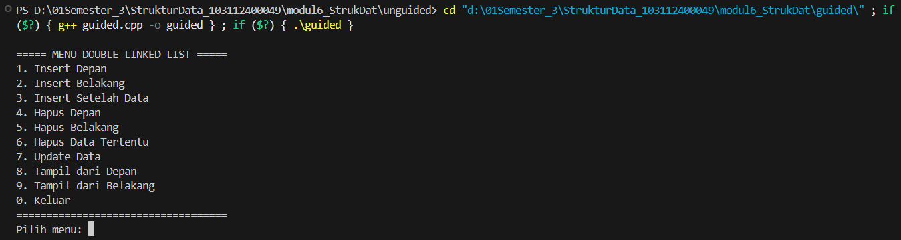
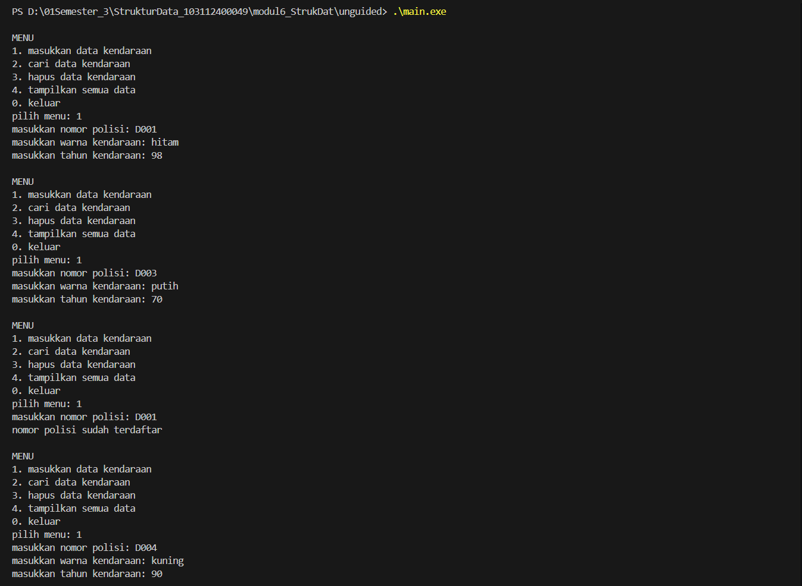
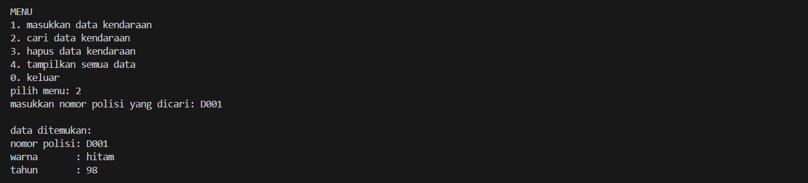
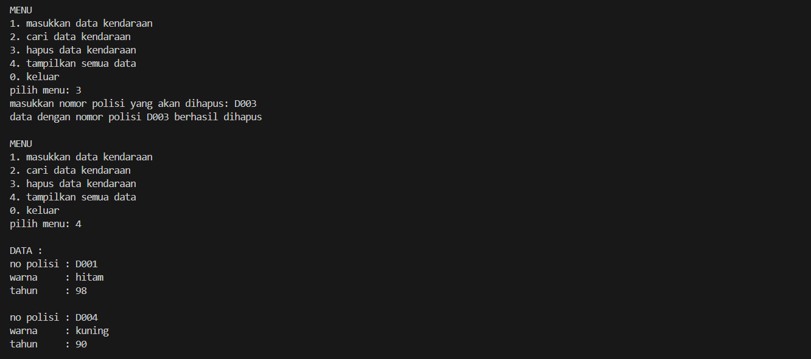

# <h1 align="center">LAPORAN PRAKTIKUM MODUL 6 <br> DOUBLY LINKED LIST (BAGIAN PERTAMA)</h1>
<p align="center">HISYAM NURDIATMOKO - 103112400049</p>

## Dasar Teori

### Doubly Linked List

Doubly Linked List adalah sebuah senarai berantai di mana setiap elemennya memiliki dua suksesor, yaitu penunjuk ke elemen sebelumnya (prev) dan penunjuk ke elemen sesudahnya (next). Struktur ini juga menggunakan dua penunjuk utama, yaitu first yang menunjuk ke elemen pertama dan last yang menunjuk ke elemen terakhir. Setiap elemen terdiri dari tiga bagian: info untuk menyimpan data, penunjuk next, dan penunjuk prev. Keunggulan dari struktur ini adalah kemudahan dalam melakukan proses akses elemen karena dapat melakukan iterasi maju maupun mundur. Sebuah Doubly Linked List dianggap kosong jika penunjuk first bernilai Nil.

## Guided

### Guided 1

#### doublylinkedlist.cpp

```cpp
#include <iostream>
using namespace std;

struct Node {
    int data;
    Node* prev;
    Node* next;
};

Node* head = nullptr;
Node* tail = nullptr;

void insertDepan(int data) {
    Node* newNode = new Node();
    newNode->data = data;
    newNode->prev = nullptr;
    newNode->next = head;

    if (head != nullptr)
        head->prev = newNode;
    else
        tail = newNode;

    head = newNode;
    cout << "Data " << data << " berhasil ditambahkan di depan.\n";
}

void insertBelakang(int data) {
    Node* newNode = new Node();
    newNode->data = data;
    newNode->next = nullptr;
    newNode->prev = tail;

    if (tail != nullptr)
        tail->next = newNode;
    else
        head = newNode;

    tail = newNode;
    cout << "Data " << data << " berhasil ditambahkan di belakang.\n";
}

void insertSetelah(int target, int data) {
    Node* current = head;
    while (current != nullptr && current->data != target)
        current = current->next;
    
    if (current == nullptr) {
        cout << "Data " << target << " tidak ditemukan.\n";
        return;
    }

    Node* newNode = new Node();
    newNode->data = data;
    newNode->next = current->next;
    newNode->prev = current;

    if (current->next != nullptr)
        current->next->prev = newNode;
    else
        tail = newNode;

    current->next = newNode;
    cout << "Data " << data << " berhasil disisipkan setelah " << target << ".\n";
}

void hapusDepan() {
    if (head == nullptr) {
        cout << "List kosong.\n";
        return;
    }

    Node* temp = head;
    head = head->next;

    if (head != nullptr)
        head->prev = nullptr;
    else
        tail = nullptr;

    cout << "Data " << temp->data << " dihapus dari depan.\n";
    delete temp;
}

void hapusBelakang() {
    if (tail = nullptr) {
        cout << "List kosong.\n";
        return;
    }

    Node* temp = tail;
    tail = tail->prev;

    if (tail != nullptr)
        tail->next = nullptr;
    else
        head = nullptr;

    cout << "Data " << temp->data << " dihapus dari belakang.\n";
    delete temp;
}

void hapusData(int target) {
    if (head == nullptr) {
        cout << "List kosong.\n";
        return;
    }

    Node* current = head;
    while (current != nullptr && current->data != target)
        current = current->next;

    if (current == head)
        hapusDepan();
    else if (current == tail)
        hapusBelakang();
    else {
        current->prev->next = current->next;
        current->next->prev = current->prev;
        cout << "Data " << target << " dihapus.\n";
        delete current;
    }
}

void updateData(int oldData, int newData) {
    Node* current = head;
    while (current != nullptr && current->data != oldData)
        current = current->next;

    if (current == nullptr) {
        cout << "Data " << oldData << " tidak ditemukan.\n";
        return;
    }

    current->data = newData;
    cout << "Data " << oldData << " diubah menjadi " << newData << ".\n";
}

void tampilDepan() {
    if (head == nullptr) {
        cout << "List kosong.\n";
        return;
    }

    cout << "Isi list (dari depan): ";
    Node* current = head;
    while (current != nullptr) {
        cout << current->data << " ";
        current = current->next;
    }
    cout << "\n";
}

// ====================================
// Fungsi: Tampilkan dari belakang
// ====================================
void tampilBelakang() {
    if (tail == nullptr) {
        cout << "List kosong.\n";
        return;
    }

    cout << "Isi list (dari belakang): ";
    Node* current = tail;
    while (current != nullptr) {
        cout << current->data << " ";
        current = current->prev;
    }
    cout << "\n";
}

// ====================================
// MAIN PROGRAM (MENU INTERAKTIF)
// ====================================
int main() {
    int pilihan, data, target, oldData, newData;

    do {
        cout << "\n===== MENU DOUBLE LINKED LIST =====\n";
        cout << "1. Insert Depan\n";
        cout << "2. Insert Belakang\n";
        cout << "3. Insert Setelah Data\n";
        cout << "4. Hapus Depan\n";
        cout << "5. Hapus Belakang\n";
        cout << "6. Hapus Data Tertentu\n";
        cout << "7. Update Data\n";
        cout << "8. Tampil dari Depan\n";
        cout << "9. Tampil dari Belakang\n";
        cout << "0. Keluar\n";
        cout << "===================================\n";
        cout << "Pilih menu: ";
        cin >> pilihan;

        switch (pilihan) {
            case 1:
                cout << "Masukkan data: ";
                cin >> data;
                insertDepan(data);
                break;
            case 2:
                cout << "Masukkan data: ";
                cin >> data;
                insertBelakang(data);
                break;
            case 3:
                cout << "Masukkan data target: ";
                cin >> target;
                cout << "Masukkan data baru: ";
                cin >> data;
                insertSetelah(target, data);
                break;
            case 4:
                hapusDepan();
                break;
            case 5:
                hapusBelakang();
                break;
            case 6:
                cout << "Masukkan data yang ingin dihapus: ";
                cin >> target;
                hapusData(target);
                break;
            case 7:
                cout << "Masukkan data lama: ";
                cin >> oldData;
                cout << "Masukkan data baru: ";
                cin >> newData;
                updateData(oldData, newData);
                break;
            case 8:
                tampilDepan();
                break;
            case 9:
                tampilBelakang();
                break;
            case 0:
                cout << "👋 Keluar dari program.\n";
                break;
            default:
                cout << "Pilihan tidak valid.\n";
        }

    } while (pilihan != 0);

    return 0;
}
```

> Output
> 

program C++ ini adalah implementasi dari struktur data doubly linked list yang memungkinkan pengelolaan data secara dinamis. Melalui menu interaktif berbasis teks, pengguna dapat melakukan berbagai operasi dasar seperti menambah data (di depan, di belakang, atau setelah data lain), menghapus data (dari depan, belakang, atau data spesifik), dan memperbarui data. Keunikan dari doubly linked list ini ditunjukkan dengan adanya fungsi untuk menampilkan isi list dari dua arah, yaitu dari depan ke belakang (head ke tail) dan dari belakang ke depan (tail ke head), yang dimungkinkan karena setiap elemen (node) memiliki penunjuk ke elemen sebelum (prev) dan sesudahnya (next).

## Unguided

### Latihan 

code untuk nomor 1 sampai 3

#### doublylinkedlist.h

```cpp
#ifndef DOUBLYLIST_H
#define DOUBLYLIST_H

#include <iostream>
#include <string>
using namespace std;

struct kendaraan {
    string nopol;
    string warna;
    int thnBuat;
};

typedef kendaraan infotype;
typedef struct ElmList* address;

struct ElmList {
    infotype data;
    address next;
    address prev;
};

struct List {
    address First;
    address Last;
};

void createList(List& L);
address alokasi(infotype x);
void dealokasi(address& P);
void insertLast(List& L, address P);
void printInfo(List L);
address findElm(List L, string nopol);
void deleteFirst(List& L, address& P);
void deleteLast(List& L, address& P);
void deleteAfter(List& L, address Prec, address& P);

#endif
```

#### doublylinkedlist.cpp

```cpp
#include "Doublylist.h"

void createList(List& L) {
    L.First = nullptr;
    L.Last = nullptr;
}

address alokasi(infotype x) {
    address P = new ElmList;
    P->data = x;
    P->next = nullptr;
    P->prev = nullptr;
    return P;
}

void dealokasi(address& P) {
    delete P;
}

void insertLast(List& L, address P) {
    if (L.First == nullptr) {
        L.First = P;
        L.Last = P;
    } else {
        L.Last->next = P;
        P->prev = L.Last;
        L.Last = P;
    }
}

void printInfo(List L) {
    address current = L.First;
    if (current == nullptr) {
        cout << "list kosong" << endl;
    } else {
        while (current != nullptr) {
            cout << "no polisi : " << current->data.nopol << endl;
            cout << "warna     : " << current->data.warna << endl;
            cout << "tahun     : " << current->data.thnBuat << endl << endl;
            current = current->next;
        }
    }
}

address findElm(List L, string nopol) {
    address current = L.First;
    while (current != nullptr) {
        if (current->data.nopol == nopol) {
            return current;
        }
        current = current->next;
    }
    return nullptr;
}

void deleteFirst(List& L, address& P) {
    P = L.First;
    if (L.First == L.Last) {
        L.First = nullptr;
        L.Last = nullptr;
    } else {
        L.First = P->next;
        L.First->prev = nullptr;
        P->next = nullptr;
    }
}

void deleteLast(List& L, address& P) {
    P = L.Last;
    if (L.First == L.Last) {
        L.First = nullptr;
        L.Last = nullptr;
    } else {
        L.Last = P->prev;
        L.Last->next = nullptr;
        P->prev = nullptr;
    }
}

void deleteAfter(List& L, address Prec, address& P) {
    P = Prec->next;
    if (P == L.Last) {
        deleteLast(L, P);
    } else {
        Prec->next = P->next;
        P->next->prev = Prec;
        P->next = nullptr;
        P->prev = nullptr;
    }
}
```

#### main.cpp

```cpp
#include "Doublylist.h"

void hapusKendaraan(List& L, string target) {
    address currentNode = findElm(L, target);
    if (currentNode == nullptr) {
        cout << "data dengan nomor polisi " << target << " tidak ditemukan" << endl;
        return;
    }

    address temp;
    if (currentNode == L.First) {
        deleteFirst(L, temp);
    } else {
        address precNode = currentNode->prev;
        deleteAfter(L, precNode, temp);
    }
    
    cout << "data dengan nomor polisi " << target << " berhasil dihapus" << endl;
    dealokasi(temp);
}

int main() {
    List L;
    createList(L);
    address P;
    infotype data;
    string target;
    int pilihan;

    do {
        cout << "\nMENU\n";
        cout << "1. masukkan data kendaraan\n";
        cout << "2. cari data kendaraan\n";
        cout << "3. hapus data kendaraan\n";
        cout << "4. tampilkan semua data\n";
        cout << "0. keluar\n";
        cout << "pilih menu: ";
        cin >> pilihan;
        cin.ignore(); 

        switch (pilihan) {
            case 1:
                cout << "masukkan nomor polisi: ";
                getline(cin, data.nopol);
                if (findElm(L, data.nopol) != nullptr) {
                    cout << "nomor polisi sudah terdaftar" << endl;
                } else {
                    cout << "masukkan warna kendaraan: ";
                    getline(cin, data.warna);
                    cout << "masukkan tahun kendaraan: ";
                    cin >> data.thnBuat;
                    cin.ignore();
                    P = alokasi(data);
                    insertLast(L, P);
                }
                break;
            case 2:
                cout << "masukkan nomor polisi yang dicari: ";
                getline(cin, target);
                P = findElm(L, target);
                if (P != nullptr) {
                    cout << "\ndata ditemukan:" << endl;
                    cout << "nomor polisi: " << P->data.nopol << endl;
                    cout << "warna       : " << P->data.warna << endl;
                    cout << "tahun       : " << P->data.thnBuat << endl;
                } else {
                    cout << "data tidak ditemukan" << endl;
                }
                break;
            case 3:
                cout << "masukkan nomor polisi yang akan dihapus: ";
                getline(cin, target);
                hapusKendaraan(L, target);
                break;
            case 4:
                cout << "\nDATA :" << endl;
                printInfo(L);
                break;
            case 0:
                cout << "tengkyuu\n";
                break;
            default:
                cout << "pilihan tidak valdi\n";
        }
    } while (pilihan != 0);

    return 0;
}
```

#### 1. Buatlah ADT Doubly Linked list sebagai berikut di dalam file “Doublylist.h”:

```
Type infotype : kendaraan <
 nopol : string
 warna : string
 thnBuat : integer
>
Type address : pointer to ElmList
Type ElmList <
 info : infotype
 next :address
 prev : address
>
Type List <
 First : address
 Last : address
>
procedure CreateList( input/output L : List )
function alokasi( x : infotype ) → address
procedure dealokasi(input/output P : address )
procedure printInfo( input L : List )
procedure insertLast(input/output L : List, input P : address )
```
Buatlah implementasi ADT Doubly Linked list pada file “Doublylist.cpp” dan coba hasil
implementasi ADT pada file “main.cpp”.

> Output nomor 1
> 
> .png)

#### 2. Carilah elemen dengan nomor polisi D001 dengan membuat fungsi baru.
fungsi findElm( L : List, x : infotype ) : address

> Output nomor 2
> 

#### 3. Hapus elemen dengan nomor polisi D003 dengan procedure delete.
- procedure deleteFirst( input/output L : List, P : address )
- procedure deleteLast( input/output L : List, P : address )
- procedure deleteAfter( input Prec : address, input/output P : address )

> Output nomor 3
> 

program C++ ini mengimplementasikan Abstract Data Type (ADT) untuk doubly linked list guna mengelola data kendaraan, sesuai dengan spesifikasi yang diminta. Program dibagi menjadi tiga file: Doublylist.h yang mendefinisikan struktur data untuk kendaraan dan elemen list serta mendeklarasikan fungsi-fungsi dasar, Doublylist.cpp yang berisi implementasi dari fungsi-fungsi tersebut seperti alokasi memori, penyisipan di akhir, pencarian, dan penghapusan elemen, serta main.cpp yang menyediakan antarmuka menu interaktif bagi pengguna. Melalui menu ini, pengguna dapat melakukan operasi-operasi utama seperti menambahkan data kendaraan baru (dengan validasi duplikat nomor polisi), mencari kendaraan berdasarkan nomor polisi, menghapus data tertentu, dan menampilkan seluruh daftar kendaraan yang telah tersimpan.

## Referensi

Modul 6: Doubly Linked List (Bagian Pertama)


