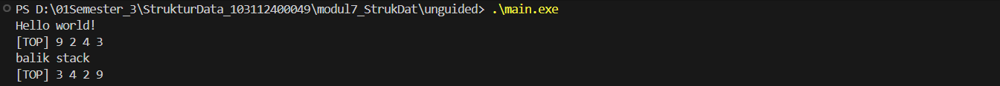
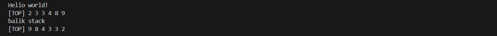
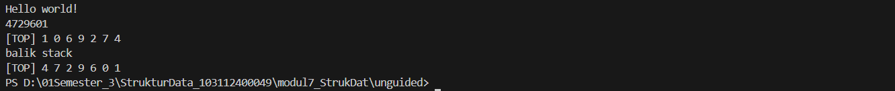

# <h1 align="center">LAPORAN PRAKTIKUM MODUL 7 <br> STACK</h1>
<p align="center">HISYAM NURDIATMOKO - 103112400049</p>

## Dasar Teori

### STACK

Struktur data stack adalah sebuah konsep yang operasinya menyerupai tumpukan fisik. Prinsip fundamental yang dianutnya adalah LIFO (Last In First Out), yang berarti elemen yang terakhir dimasukkan akan menjadi elemen pertama yang dapat diakses atau dikeluarkan. Akses data pada stack sangat terbatas, karena hanya bisa dilakukan pada elemen paling awal atau yang biasa disebut "Top". Secara visual, bentuk stack menyerupai list linear di mana elemen-elemen saling terhubung.

Implementasi stack dapat dilakukan melalui dua pendekatan utama: representasi pointer dan representasi tabel (array). Dalam representasi pointer, komponen-komponennya pada dasarnya serupa dengan singly linked list. Sedangkan pada representasi tabel, stack diimplementasikan menggunakan array dengan indeks dan memiliki kapasitas tumpukan yang terbatas. Perbedaan utama antara keduanya terletak pada cara pendeklarasian struktur datanya dan manajemen memori, di mana representasi tabel tidak memerlukan manajemen memori khusus seperti alokasi dan dealokasi.

Ada dua operasi utama yang menjadi ciri khas stack, yaitu Push dan Pop. Operasi Push adalah proses menyisipkan elemen baru ke dalam tumpukan, yang fungsinya setara dengan operasi insert first pada list. Sebaliknya, operasi Pop adalah proses pengambilan data dari tumpukan, yang serupa dengan operasi delete first pada list linear, karena elemen yang diakses selalu yang berada di posisi teratas. Selain dua operasi utama tersebut, terdapat beberapa fungsi primitif dasar seperti createStack() untuk inisialisasi, isEmpty() untuk pengecekan kondisi kosong, serta fungsi-fungsi lain yang mendukung operasional stack.

## Guided

### Guided 1

#### stack.cpp

```cpp
#include <iostream>
using namespace std;

struct Node
{
    int data;
    Node *next;
};

bool isEmpty(Node *top)
{
    return top == nullptr;
}

void push(Node *&top, int data)
{
    Node *newNode = new Node();
    newNode->data = data;
    newNode->next = top;
    top = newNode;
}

int pop(Node *&top)
{
    if (isEmpty(top))
    {
        cout << "Stack kosong, tidak bisa pop!" << endl;
        return 0;
    }

    int poppedData = top->data;
    Node *temp = top;
    top = top->next;

    delete temp;
    return poppedData;
}

void show(Node *top)
{
    if (isEmpty(top))
    {
        cout << "Stack kosong." << endl;
        return;
    }

    cout << "TOP -> ";
    Node *temp = top;

    while (temp != nullptr)
    {
        cout << temp->data << " -> ";
        temp = temp->next;
    }

    cout << "NULL" << endl;
}

int main()
{
    Node *stack = nullptr;

    push(stack, 10);
    push(stack, 20);
    push(stack, 30);

    cout << "Menampilkan isi stack:" << endl;
    show(stack);

    cout << "Pop: " << pop(stack) << endl;

    cout << "Menampilkan sisa stack:" << endl;
    show(stack);

    return 0;
}
```

> Output
> 

program c++ ini adalah implementasi struktur data stack menggunakan linked list dalam bahasa C++. Program mendefinisikan fungsi-fungsi dasar stack seperti push untuk menambahkan elemen ke atas tumpukan, pop untuk mengambil elemen teratas, isEmpty untuk memeriksa apakah stack kosong, dan show untuk menampilkan seluruh isi stack. Pada fungsi main, program mendemonstrasikan cara kerja stack dengan memasukkan tiga angka (10, 20, 30), menampilkannya, kemudian mengeluarkan satu elemen teratas (30), dan menampilkan sisa isi stack

## Unguided

### Latihan 

code untuk nomor 1 sampai 3

#### stack.h

```cpp
#ifndef STACK_H_INCLUDED
#define STACK_H_INCLUDED
#include <iostream>

typedef int infotype;

struct Stack {
    infotype info[20];
    int top;
};

void createStack(Stack &S);
void push(Stack &S, infotype x);
infotype pop(Stack &S);
void printInfo(Stack S);
void balikStack(Stack &S);
void pushAscending(Stack &S, infotype x);
void getInputStream(Stack &S);

#endif
```

#### stack.cpp

```cpp
#include "stack.h"
#include <iostream>
using namespace std;

void createStack(Stack &S) {
    S.top = 0;
}

bool isEmpty(Stack S) {
    return S.top == 0;
}

bool isFull(Stack S) {
    return S.top == 20;
}

void push(Stack &S, infotype x) {
    if (!isFull(S)) {
        S.top++;
        S.info[S.top] = x;
    }
}

infotype pop(Stack &S) {
    infotype x = -1;
    if (!isEmpty(S)) {
        x = S.info[S.top];
        S.top--;
    }
    return x;
}

void printInfo(Stack S) {
    cout << "[TOP] ";
    if (!isEmpty(S)) {
        for (int i = S.top; i >= 1; i--) {
            cout << S.info[i] << " ";
        }
    }
    cout << endl;
}

void balikStack(Stack &S) {
    Stack temp;
    createStack(temp);
    while (!isEmpty(S)) {
        push(temp, pop(S));
    }
    S = temp;
}

void pushAscending(Stack &S, infotype x) {
    Stack temp;
    createStack(temp);
    while (!isEmpty(S) && S.info[S.top] < x) {
        push(temp, pop(S));
    }
    push(S, x);
    while (!isEmpty(temp)) {
        push(S, pop(temp));
    }
}

void getInputStream(Stack &S) {
    char c;
    while (cin.get(c) && c != '\n') {
        if (c >= '0' && c <= '9') {
            push(S, c - '0');
        }
    }
}
```

#### main.cpp

```cpp
#include <iostream>
#include "stack.h"
using namespace std;

int main() {
    cout << "Hello world!" << endl;
    Stack S1;
    createStack(S1);
    push(S1, 3);
    push(S1, 4);
    push(S1, 8);
    pop(S1);
    push(S1, 2);
    push(S1, 3);
    pop(S1);
    push(S1, 9);
    printInfo(S1);
    cout << "balik stack" << endl;
    balikStack(S1);
    printInfo(S1);
    cout << endl;

    cout << "Hello world!" << endl;
    Stack S2;
    createStack(S2);
    pushAscending(S2, 3);
    pushAscending(S2, 4);
    pushAscending(S2, 8);
    pushAscending(S2, 2);
    pushAscending(S2, 3);
    pushAscending(S2, 9);
    printInfo(S2);
    cout << "balik stack" << endl;
    balikStack(S2);
    printInfo(S2);
    cout << endl;

    cout << "Hello world!" << endl;
    Stack S3;
    createStack(S3);
    getInputStream(S3);
    printInfo(S3);
    cout << "balik stack" << endl;
    balikStack(S3);
    printInfo(S3);

    return 0;
}
```

#### 1. Buatlah ADT Stack menggunakan ARRAY sebagai berikut di dalam file “stack.h”:

```
Type infotype : integer
Type Stack <
    info : array [20] of integer
    top : integer
>
procedure CreateStack( input/output S : Stack )
procedure push(input/output S : Stack,
    input x : infotype)
function pop(input/output t S : Stack )
    → infotype
procedure printInfo( input S : Stack )
procedure balikStack(input/output S : Stack )
```
Buatlah implementasi ADT Stack menggunakan Array pada file “stack.cpp” dan “main.cpp”

```
int main()
{
    cout << "Hello world!" <<
endl;
    Stack S;
    createStack(S);
    Push(S,3);
    Push(S,4);
    Push(S,8);
    pop(S)
    Push(S,2);
    Push(S,3);
    pop(S);
    Push(S,9);
    printInfo(S);
    cout<<"balik stack"<<endl;
    balikStack(S);
    printInfo(S);
    return 0;
}
```

> Output nomor 1
> 

#### 2. Tambahkan prosedur pushAscending( in/out S : Stack, in x : integer).

```
int main()
{
    cout << "Hello world!" << endl;
    Stack S;
    createStack(S);
    pushAscending(S,3);
    pushAscending(S,4);
    pushAscending(S,8);
    pushAscending(S,2);
    pushAscending(S,3);
    pushAscending(S,9);
    printInfo(S);
    cout<<"balik stack"<<endl;
    balikStack(S);
    printInfo(S);
    return 0;
}

```

> Output nomor 2
> 

#### 3. Tambahkan prosedur getInputStream( in/out S : Stack ). 
Prosedur akan terus membaca dan menerima input user dan memasukkan setiap input ke dalam stack hingga user menekan tombol enter. 
Contoh: gunakan cin.get() untuk mendapatkan inputan user.

```
int main()
{
    cout << "Hello world!" << endl;
    Stack S;
    createStack(S);
    getInputStream(S);
    printInfo(S);
    cout<<"balik stack"<<endl;
    balikStack(S);
    printInfo(S);
    return 0;
}
```

> Output nomor 3
> 

program c++ unguided 1 sampai 3 ini adalah implementasi lengkap dari struktur data stack menggunakan array (representasi tabel) dalam C++, yang terbagi menjadi tiga file. File stack.h mendefinisikan struktur Stack dan prototipe fungsi-fungsinya. File stack.cpp berisi implementasi dari fungsi-fungsi tersebut, termasuk operasi dasar seperti push dan pop, serta fungsi tambahan seperti balikStack untuk membalik urutan elemen, pushAscending untuk memasukkan data secara terurut, dan getInputStream untuk membaca input dari pengguna. Terakhir, file main.cpp bertindak sebagai program utama yang mendemonstrasikan penggunaan semua fungsi tersebut pada tiga stack yang berbeda

## Referensi

Modul 7: STACK

https://www.geeksforgeeks.org/stack-data-structure/. Diakses pada 31 Oktober 2025


