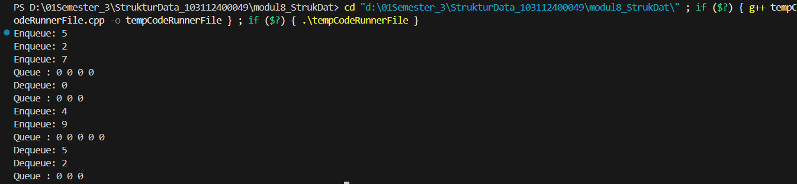
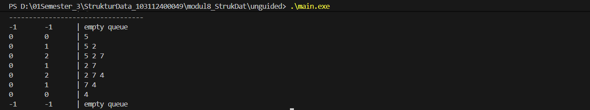
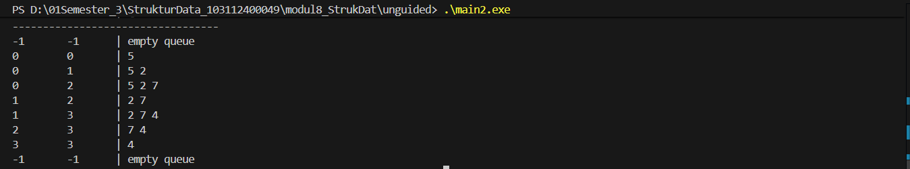
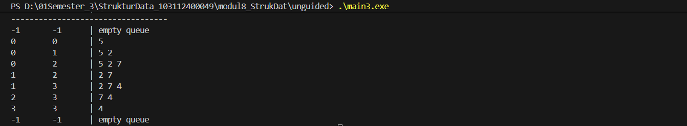

# <h1 align="center">LAPORAN PRAKTIKUM MODUL 8 <br> QUEUE (BAGIAN KEDUA)</h1>
<p align="center">HISYAM NURDIATMOKO - 103112400049</p>

## Dasar Teori

### QUEUE

Queue merupakan struktur data yang dapat diumpamakan seperti sebuah antrean , misalnya antrean pada loket pembelian tiket Kereta Api. Prinsip dasar yang digunakan dalam Queue adalah FIFO (First In, First Out). Prinsip ini berarti bahwa data atau orang yang pertama kali masuk ke dalam antrean adalah yang akan pertama kali mendapatkan pelayanan atau diakses , dan yang terakhir masuk akan mendapatkan layanan yang terakhir pula.

Dalam implementasinya menggunakan bahasa C, struktur Queue dapat menggunakan tipe data array (tabel) maupun linked list. Queue dapat diterapkan baik dalam Singly linked list maupun Doubly linked list. Implementasi Queue dalam bentuk linked list pada dasarnya tidak jauh berbeda dengan operasi list biasa, bahkan cenderung lebih sederhana. Sesuai dengan sifat FIFO, operasi pada Queue memiliki dua operasi utama, yaitu operasi penyisipan (Insert atau Enqueue) dan operasi pengambilan (Delete atau Dequeue). Pada implementasi linked list, proses insert (Enqueue) selalu dilakukan pada bagian Tail (belakang list) , sedangkan proses delete (Dequeue) hanya dilakukan pada bagian Head (depan list).

Selain linked list, Queue juga dapat direpresentasikan menggunakan tabel atau array. Perbedaan mendasar antara kedua representasi ini adalah pada manajemen memori dan kapasitas antrean. Representasi tabel (array) memiliki jumlah Queue yang terbatas dan tidak ada manajemen memori, sedangkan representasi pointer (linked list) memiliki jumlah Queue tak-terbatas dan terdapat manajemen memori.

Implementasi Queue menggunakan tabel memiliki beberapa alternatif. Alternatif pertama adalah dengan HEAD selalu di-set sama dengan 1 (jika Queue tidak kosong) dan hanya TAIL yang bergerak. Namun, algoritma ini tidak efisien saat penghapusan elemen, karena memerlukan pergeseran semua elemen yang ada di dalam antrean. Alternatif kedua adalah HEAD dan TAIL sama-sama bergerak; HEAD "maju" saat terjadi penghapusan. Algoritma ini lebih efisien , namun dapat menimbulkan keadaan "penuh semu" (pseudo-full) ketika TAIL telah mencapai indeks maksimal (IMax), yang kemudian memerlukan aksi pergeseran elemen. Alternatif ketiga, yang sering disebut sebagai "circular buffer", mengatasi masalah ini dengan membuat HEAD dan TAIL "berputar". Jika TAIL atau HEAD mencapai IdxMax, maka successor-nya (penerusnya) adalah indeks 1. Algoritma ini dianggap efisien karena tidak lagi memerlukan pergeseran elemen.

## Guided

### Guided Queue

#### queue.cpp

```cpp
#include <iostream>
using namespace std;

#define MAX 5 // ukuran maksimal queue

// Struktur Queue
struct Queue {
    int data[MAX];
    int head;
    int tail;
};

// Membuat antrean kosong
void createQueue(Queue &Q) {
    Q.head = -1;
    Q.tail = -1;
}

bool isEmpty(Queue Q) {
    return (Q.head == -1 && Q.tail == -1);
}

bool isFull(Queue Q) {
    return (Q.tail == MAX - 1);
}

// Menampilkan isi antrian
void printQueue(Queue Q) {
    if (isEmpty(Q)) {
        cout << "Queue kosong!" << endl;
    } else {
        cout << "Queue : ";
        for (int i = Q.head; i <= Q.tail; i++) {
            cout << Q.data[i] << " ";
        }
        cout << endl;
    }
}

void enqueue(Queue &Q, int x) {
    if (isFull(Q)) {
        cout << "Queue penuh! Tidak bisa menambah data." << endl;
    } else {
        if (isEmpty(Q)) {
            Q.head = Q.tail = 0;
        } else {
            Q.tail++;
        }
        Q.data[Q.tail] = x;
        cout << "Enqueue: " << x << endl;
    }
}

void dequeue(Queue &Q) {
    if (isEmpty(Q)) {
        cout << "Queue kosong! Tidak ada data yang dihapus." << endl;
    } else {
        cout << "Dequeue: " << Q.data[Q.head] << endl;
        // Jika hanya 1 elemen
        if (Q.head == Q.tail) {
            Q.head = Q.tail = -1;
        } else {
            // Geser semua elemen ke kiri
            for (int i = Q.head; i < Q.tail; i++) {
                Q.data[i] = Q.data[i + 1];
            }
            Q.tail--;
        }
    }
}

int main() {
    Queue Q;
    enqueue(Q, 5);
    enqueue(Q, 2);
    enqueue(Q, 7);
    printQueue(Q);

    dequeue(Q);
    printQueue(Q);

    enqueue(Q, 4);
    enqueue(Q, 9);
    printQueue(Q);

    dequeue(Q);
    dequeue(Q);
    printQueue(Q);

    return 0;
}
```

> Output
> 

Guided Queue ini adalah program C++ yang mengimplementasikan struktur data Queue menggunakan representasi array (tabel) dengan ukuran maksimal 5 elemen. Program ini secara spesifik menggunakan metode yang dijelaskan dalam Alternatif 1 pada modul Anda, di mana head (setelah elemen pertama masuk) selalu dianggap berada di indeks 0. Fungsi enqueue menambahkan elemen ke posisi tail, dan tail bertambah. Fungsi dequeue mengambil elemen dari head (indeks 0), dan kemudian menggeser semua elemen sisa di dalam antrean satu posisi ke kiri. Ini adalah implementasi yang fungsional, namun, seperti yang disebutkan di modul Anda, bisa menjadi tidak efisien karena operasi pergeseran elemen.

## Unguided

### Soal 1

1. Buatlah ADT Queue menggunakan ARRAY sebagai berikut di dalam file “queue.h”:
```
Type infotype: integer
Type Queue: <
    info : array [5] of infotype {index array dalam C++
    dimulai dari 0}
    head, tail : integer
>
procedure CreateQueue (input/output Q: Queue)
function isEmptyQueue (Q: Queue) → boolean
function isFullQueue (Q: Queue) → boolean
procedure enqueue (input/output Q: Queue, input x: infotype)
function dequeue (input/output Q: Queue) → infotype
procedure printInfo (input Q: Queue)
```
Buatlah implementasi ADT Queue pada file “queue.cpp” dengan menerapkan mekanisme queue Alternatif 1 (head diam, tail bergerak).
```
int main() {
    cout << "Hello World" << endl;
    Queue Q;
    createQueue(Q);
    
    cout<<"----------------------"<<endl;
    cout<<" H - T \t | Queue info"<<endl;
    cout<<"----------------------"<<endl;
    printInfo(Q);
    enqueue(Q,5); printInfo(Q);
    enqueue(Q,2); printInfo(Q);
    enqueue(Q,7); printInfo(Q);
    dequeue(Q); printInfo(Q);
    enqueue(Q,4); printInfo(Q);
    dequeue(Q); printInfo(Q);
    dequeue(Q); printInfo(Q);

    return 0;
}
```

queue.h
```cpp
#ifndef QUEUE_H
#define QUEUE_H

#include <iostream>
using namespace std;

#define MAX 5

typedef int infotype;

struct Queue {
    infotype info[MAX];
    int head;
    int tail;
};

void createQueue(Queue &Q);
bool isEmptyQueue(Queue Q);
bool isFullQueue(Queue Q);
void enqueue(Queue &Q, infotype x);
void dequeue(Queue &Q);
void printInfo(Queue Q);

#endif 
```

queue.cpp (alternatif 1)
```
#include "queue.h"

void createQueue(Queue &Q) {
    Q.head = -1;
    Q.tail = -1;
}

bool isEmptyQueue(Queue Q) {
    return (Q.head == -1 && Q.tail == -1);
}

bool isFullQueue(Queue Q) {
    return (Q.tail == MAX - 1);
}

void enqueue(Queue &Q, infotype x) {
    if (isFullQueue(Q)) {
        cout << "queue penuh, tidak bisa menambah data" << endl;
    } else {
        if (isEmptyQueue(Q)) {
            Q.head = 0;
        }
        Q.tail++;
        Q.info[Q.tail] = x;
    }
}

void dequeue(Queue &Q) {
    if (isEmptyQueue(Q)) {
        cout << "queue kosong" << endl;
    } else {
        if (Q.head == Q.tail) {
            createQueue(Q);
        } else {
            for (int i = Q.head; i < Q.tail; i++) {
                Q.info[i] = Q.info[i + 1];
            }
            Q.tail--;
        }
    }
}

void printInfo(Queue Q) {
    cout << Q.head << " \t " << Q.tail << " \t | ";
    if (isEmptyQueue(Q)) {
        cout << "empty queue" << endl;
    } else {
        for (int i = Q.head; i <= Q.tail; i++) {
            cout << Q.info[i] << " ";
        }
        cout << endl;
    }
}
```

main.cpp
```
#include <iostream>
#include "queue.h"

using namespace std;

int main() {
    Queue Q;
    
    cout << "H \t T \t | Queue info" << endl;
    cout << "----------------------------------" << endl;

    createQueue(Q);
    printInfo(Q);

    enqueue(Q, 5);
    printInfo(Q);

    enqueue(Q, 2);
    printInfo(Q);

    enqueue(Q, 7);
    printInfo(Q);

    dequeue(Q);
    printInfo(Q);

    enqueue(Q, 4);
    printInfo(Q);

    dequeue(Q);
    printInfo(Q);

    dequeue(Q);
    printInfo(Q);
    
    dequeue(Q);
    printInfo(Q);

    return 0;
}
```

> Output
> 

Program soal 1 ini adalah program C++ yang mengimplementasikan struktur data Queue menggunakan representasi array (tabel) dengan ukuran maksimal 5 elemen. Program ini secara spesifik menggunakan metode yang dijelaskan dalam Alternatif 1 pada modul Anda, di mana head (setelah elemen pertama masuk) selalu dianggap berada di indeks 0. Fungsi enqueue menambahkan elemen ke posisi tail, dan tail bertambah. Fungsi dequeue mengambil elemen dari head (indeks 0), dan kemudian menggeser semua elemen sisa di dalam antrean satu posisi ke kiri. Ini adalah implementasi yang fungsional, namun, seperti yang disebutkan di modul Anda, bisa menjadi tidak efisien karena operasi pergeseran elemen.

### Soal 2

Buatlah implementasi ADT Queue pada file “queue.cpp” dengan menerapkan mekanisme
queue Alternatif 2 (head bergerak, tail bergerak).

untuk file header (queue.h) dan program utama (main.cpp) sama dengan nomor 1 yang berbeda hanya file queue.cpp

queue.h
```cpp
#ifndef QUEUE_H
#define QUEUE_H

#include <iostream>
using namespace std;

#define MAX 5

typedef int infotype;

struct Queue {
    infotype info[MAX];
    int head;
    int tail;
};

void createQueue(Queue &Q);
bool isEmptyQueue(Queue Q);
bool isFullQueue(Queue Q);
void enqueue(Queue &Q, infotype x);
void dequeue(Queue &Q);
void printInfo(Queue Q);

#endif 
```

queue.cpp (alternatif 2)
```
#include "queue.h"

void createQueue(Queue &Q) {
    Q.head = -1;
    Q.tail = -1;
}

bool isEmptyQueue(Queue Q) {
    return (Q.head == -1);
}

bool isFullQueue(Queue Q) {
    return (Q.tail == MAX - 1);
}

void enqueue(Queue &Q, infotype x) {
    if (isFullQueue(Q)) {
        if (Q.head > 0) {
            for (int i = Q.head; i <= Q.tail; i++) {
                Q.info[i - Q.head] = Q.info[i];
            }
            Q.tail = Q.tail - Q.head;
            Q.head = 0;
            
            Q.tail++;
            Q.info[Q.tail] = x;
        } else {
            cout << "queue kosong, tidak bisa menambah data" << endl;
        }
    } else {
        if (isEmptyQueue(Q)) {
            Q.head = 0;
        }
        Q.tail++;
        Q.info[Q.tail] = x;
    }
}

void dequeue(Queue &Q) {
    if (isEmptyQueue(Q)) {
        cout << "queue kosong" << endl;
    } else {
        if (Q.head == Q.tail) {
            createQueue(Q);
        } else {
            Q.head++;
        }
    }
}

void printInfo(Queue Q) {
    cout << Q.head << " \t " << Q.tail << " \t | ";
    
    if (isEmptyQueue(Q)) {
        cout << "empty queue" << endl;
    } else {
        for (int i = Q.head; i <= Q.tail; i++) {
            cout << Q.info[i] << " ";
        }
        cout << endl;
    }
}
```

main.cpp
```
#include <iostream>
#include "queue.h"

using namespace std;

int main() {
    Queue Q;
    
    cout << "H \t T \t | Queue info" << endl;
    cout << "----------------------------------" << endl;

    createQueue(Q);
    printInfo(Q);

    enqueue(Q, 5);
    printInfo(Q);

    enqueue(Q, 2);
    printInfo(Q);

    enqueue(Q, 7);
    printInfo(Q);

    dequeue(Q);
    printInfo(Q);

    enqueue(Q, 4);
    printInfo(Q);

    dequeue(Q);
    printInfo(Q);

    dequeue(Q);
    printInfo(Q);
    
    dequeue(Q);
    printInfo(Q);

    return 0;
}
```

> Output
> 

Program C++ soal 2 ini mengimplementasikan Alternatif 2 dari modul Anda, di mana head dan tail sama-sama bergerak. Logika kuncinya adalah pada dequeue, yang kini sangat efisien karena hanya memajukan head (Q.head++) tanpa menggeser seluruh elemen. Sebagai konsekuensinya, enqueue harus menangani kondisi "penuh semu" (pseudo-full), yaitu ketika tail mencapai akhir array namun di bagian awal masih ada ruang kosong. Fungsi enqueue Anda mengatasi ini dengan melakukan pergeseran elemen kembali ke awal array, tetapi hanya jika kondisi "penuh semu" itu terjadi dan elemen baru akan ditambahkan.

### Soal 3

Buatlah implementasi ADT Queue pada file “queue.cpp” dengan menerapkan mekanisme
queue Alternatif 3 (head dan tail berputar).

untuk file header (queue.h) dan program utama (main.cpp) sama dengan nomor 1 yang berbeda hanya file queue.cpp

queue.h
```cpp
#ifndef QUEUE_H
#define QUEUE_H

#include <iostream>
using namespace std;

#define MAX 5

typedef int infotype;

struct Queue {
    infotype info[MAX];
    int head;
    int tail;
};

void createQueue(Queue &Q);
bool isEmptyQueue(Queue Q);
bool isFullQueue(Queue Q);
void enqueue(Queue &Q, infotype x);
void dequeue(Queue &Q);
void printInfo(Queue Q);

#endif 
```

queue.cpp (alternatif 3)
```
#include "queue.h"

void createQueue(Queue &Q) {
    Q.head = -1;
    Q.tail = -1;
}

bool isEmptyQueue(Queue Q) {
    return (Q.head == -1);
}

bool isFullQueue(Queue Q) {
    return ((Q.tail + 1) % MAX == Q.head);
}

void enqueue(Queue &Q, infotype x) {
    if (isFullQueue(Q)) {
        cout << "queue penuh, tidak bisa menambah data" << endl;
    } else {
        if (isEmptyQueue(Q)) {
            Q.head = 0;
        }
        Q.tail = (Q.tail + 1) % MAX;
        Q.info[Q.tail] = x;
    }
}

void dequeue(Queue &Q) {
    if (isEmptyQueue(Q)) {
        cout << "queue kosong" << endl;
    } else {
        if (Q.head == Q.tail) {
            createQueue(Q);
        } else {
            Q.head = (Q.head + 1) % MAX;
        }
    }
}

void printInfo(Queue Q) {
    cout << Q.head << " \t " << Q.tail << " \t | ";
    
    if (isEmptyQueue(Q)) {
        cout << "empty queue" << endl;
    } else {
        int i = Q.head;
        while (true) {
            cout << Q.info[i] << " ";
            if (i == Q.tail) {
                break;
            }
            i = (i + 1) % MAX;
        }
        cout << endl;
    }
}
```

main.cpp
```
#include <iostream>
#include "queue.h"

using namespace std;

int main() {
    Queue Q;
    
    cout << "H \t T \t | Queue info" << endl;
    cout << "----------------------------------" << endl;

    createQueue(Q);
    printInfo(Q);

    enqueue(Q, 5);
    printInfo(Q);

    enqueue(Q, 2);
    printInfo(Q);

    enqueue(Q, 7);
    printInfo(Q);

    dequeue(Q);
    printInfo(Q);

    enqueue(Q, 4);
    printInfo(Q);

    dequeue(Q);
    printInfo(Q);

    dequeue(Q);
    printInfo(Q);
    
    dequeue(Q);
    printInfo(Q);

    return 0;
}
```

> Output
> 

Program C++ soal 3 ini mengimplementasikan Alternatif 3 (circular buffer) dari modul Anda, yang merupakan metode paling efisien. Inti dari logika ini adalah penggunaan operator modulo (% MAX) baik pada fungsi enqueue maupun dequeue. Saat tail atau head mencapai akhir array, mereka secara otomatis "berputar" kembali ke indeks 0. Desain ini secara elegan menyelesaikan masalah "penuh semu" dari Alternatif 2 dan sepenuhnya menghilangkan kebutuhan untuk pergeseran elemen yang tidak efisien. Fungsi isFullQueue dan printInfo juga telah disesuaikan untuk menangani logika perputaran ini dengan benar.

## Referensi

Modul 8: QUEUE [Modul Praktikum]. Telkom University, Bandung.


